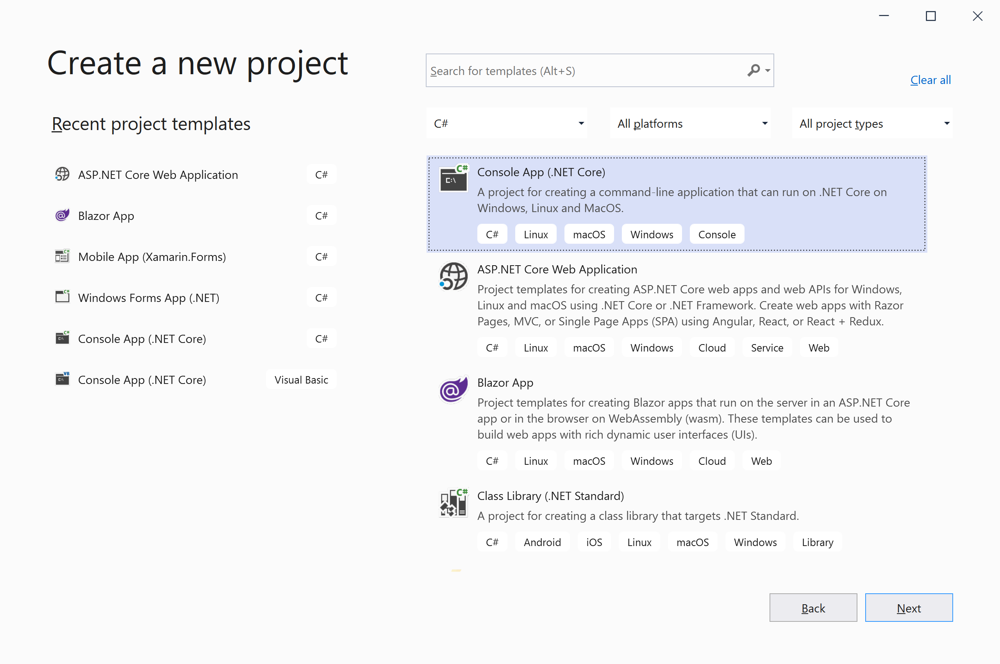
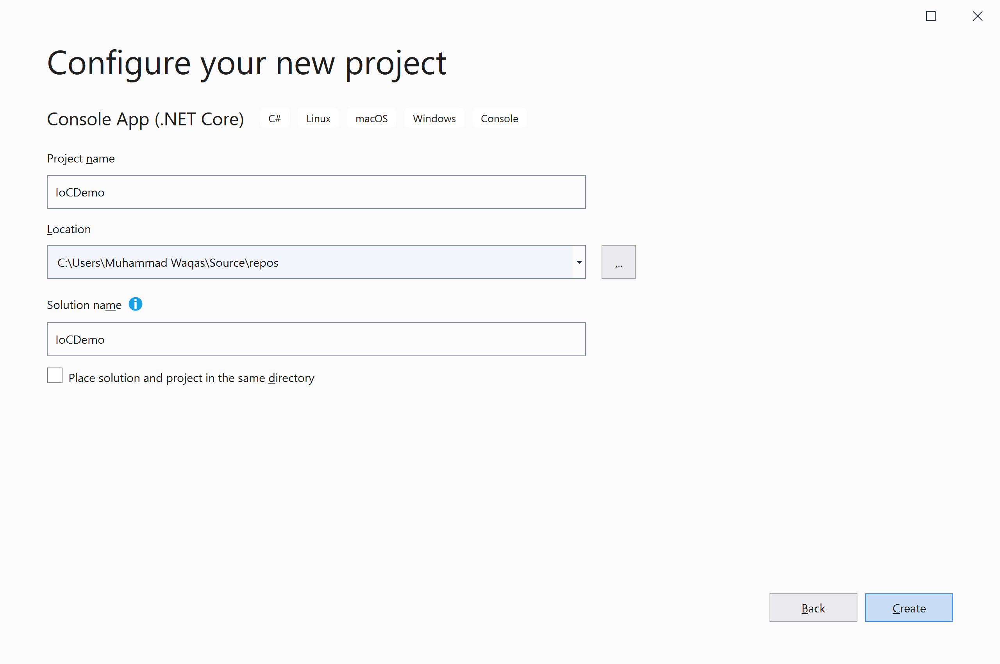

# Create Application

First, let's create a .NET Core console application project in Visual Studio.  We will use this project to explore the inversion of control in the subsequent articles.

The easiest way to create a .NET Core console application is to open Visual Studio and create a C# web project using the **Console App (.NET Core)** template.



Click the **Next** button, and it will open the **Configure your new project** page.



Enter the name of the project **IocDemo**; you can also change the **Location** and **Solution name**. Click the **Create** button, and it will create a project.

Let's say we want to implement logging in our application. To make it simple we are going to target a text file for logging. 

In the console application project, let's add a class file named `FileLogger.cs` and add the following code.

```csharp
using System;
using System.Collections.Generic;
using System.Text;

namespace IoCDemo
{
    public class FileLogger
    {
        public void Log(string message)
        {
            Console.WriteLine("Inside Log method of FileLogger.");
            LogToFile(message);
        }
        private void LogToFile(string message)
        {
            Console.WriteLine("Method: LogToFile, Text: {0}", message);
        }
    }
}

```

Let's add one more class file named `CustomerService.cs` and add the following code.

```csharp
using System;
using System.Collections.Generic;
using System.Text;

namespace IoCDemo
{
    public class CustomerService
    {
        private readonly FileLogger _fileLogger = new FileLogger();
        public void Log(string message)
        {
            _fileLogger.Log(message);
        }
    }
}
```

There is nothing wrong with the above implementation, but it has a limitation that we can only log the data to a text file. You can't in any way log data to other data sources or different log targets.
