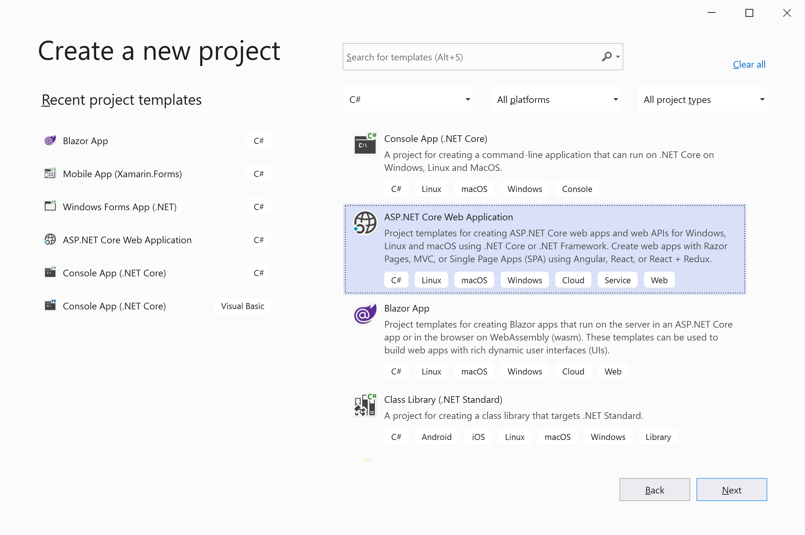
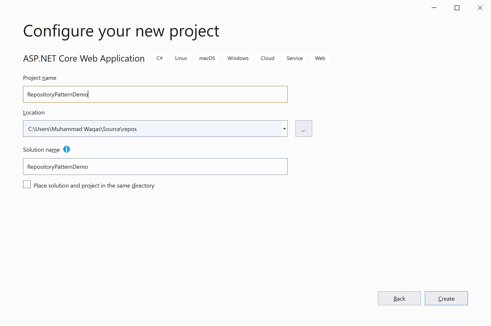
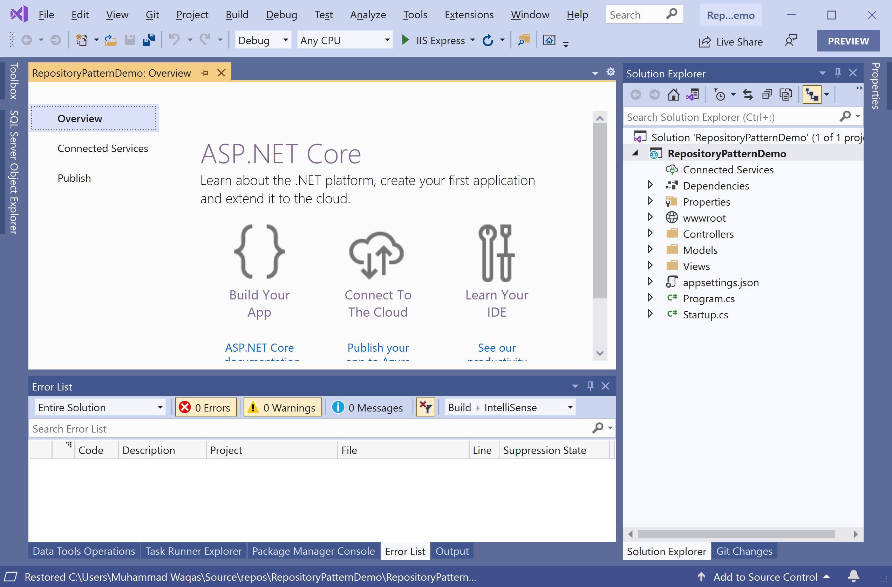
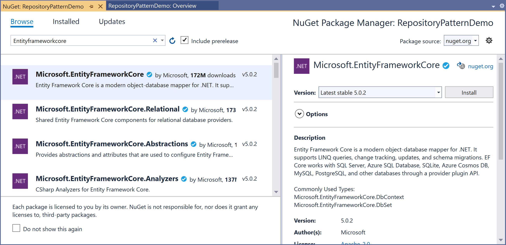
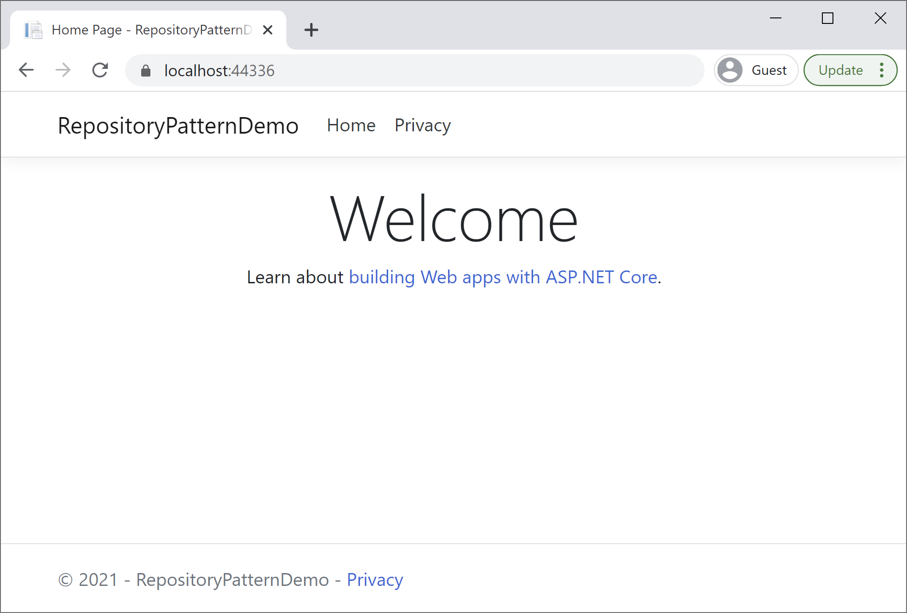

# Create Application

In this article, we will discuss how to create ASP.NET Core 5.0 MVC web applications using Entity Framework Core. Before creating your application, you must install the latest [.Net Core SDK](https://dotnet.microsoft.com/download).

## Create ASP.NET MVC Application

The easiest way to create an ASP.NET Core Web Application is to open Visual Studio and create a C# web project using the **ASP.NET Core Web Application** template. 



Click the **Next** button, and it will open the **Configure your new project** page.



Enter the name of the project **RepositoryPatternDemo**; you can also change the **Location** and **Solution name**. Click the **Create** button, and it will open the **Create a new ASP.NET Core web application** page.


Select **ASP.NET Core 5.0** and the **ASP.NET Core Web App (Model-View-Controller)** template, and ensure **Authentication** is set to **No Authentication**. Click the **Create** button, and it will create a project containing the following files.



## Install Entity Framework Core

To add Entity Framework Core support to a project, install the database provider that you want to target. We will use SQL Server, and the provider package is `Microsoft.EntityFrameworkCore.SqlServer`.

In the **Package Manager Console** window, enter the following commands.

```csharp
PM> Install-Package Microsoft.EntityFrameworkCore
PM> Install-Package Microsoft.EntityFrameworkCore.SqlServer
```

You can also install **Entity Framework Core** by selecting the project in **Solution Explorer**. Right-click on your project and select **Manage Nuget Packages...**.



Search for dapper and install the latest version by pressing the install button. You are now ready to start your application. Let's run your application and make sure everything is working fine.


