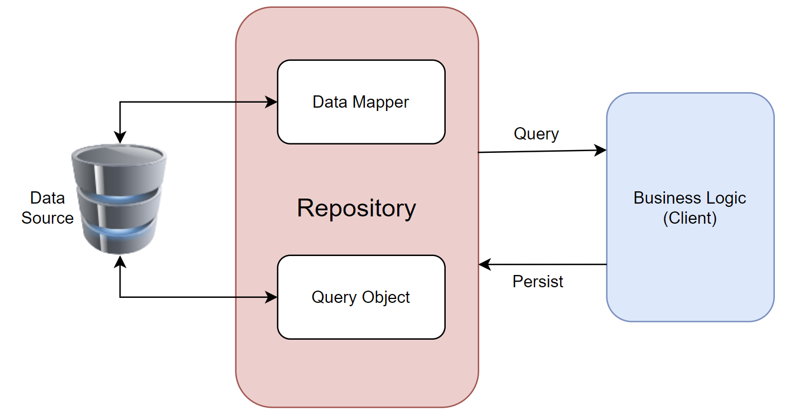

# Overview

In most of the applications, you will see that the business logic accesses data from data stores. To access the data directly, you can face any of the following problems.

 - Duplicated code
 - A higher potential for programming errors
 - Weak typing of the business data
 - Difficulty in centralizing data-related policies such as caching
 - An inability to easily test the business logic in isolation from external dependencies

Design patterns are used to solve recurring problems in your applications, and the Repository pattern is one of the most widely used design patterns.

## What is the Repository Pattern?

A repository mediates between the domain and data mapping layers such as Entity Framework, Dapper, etc. It allows you to pull records out of datasets, and then have those records to work on acting like an in-memory domain object collection.

 - It is a way to implement data access by encapsulating the set of objects persisted in a data store and the operations performed over them, providing a more object-oriented view of the persistence layer.
 - It also supports achieving a clean separation and one-way dependency between the domain and data mapping layers.
 - Repository pattern C# is mostly used where we need to modify the data before passing to the next stage.

## Why Repository Pattern C#?

### Increase Testability 

Repository systems are good for testing and one reason being that you can use Dependency Injection. 

 - Basically, you create an interface for your repository, and you reference the interface for it when you are making the object. 
 - Then you can later make a fake object using moq for instance, which implements that interface. 
 - Using something like StructureMap you can then bind the proper type to that interface. Boom you've just taken a dependence out of the equation and replaced it with something testable.

### Easily Swapped out with various data stores without changing the API 

For example, in one instance, you may need to retrieve data from the database. In other cases, you may need to retrieve something from a third-party API, or perhaps there's some other place from which you need to retrieve data. Regardless, the idea behind the repository pattern is that whatever sits behind it doesn't matter so long as the API it provides works for the layer of the application calling into it.
