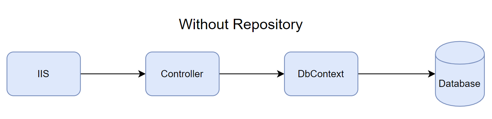

# The Repository and Unit of Work Patterns

The repository and unit of work patterns are intended to create an abstraction layer between the data access layer and the business logic layer of an application. Implementing these patterns can help insulate your application from changes in the data store and facilitate automated unit testing or test-driven development (TDD).

The following illustration shows the relationships between the controller and context classes without using the repository or unit of work pattern at all.

The following illustration shows the relationships between the controller and context classes when using the repository or unit of work pattern.

## Advantages

You can achieve one or more of the following objectives when using the repository pattern.

 - To maximize the amount of code that can be tested with automation and to isolate the data layer to support unit testing.
 - Access the data source from many locations and apply centrally managed, consistent access rules, and logic.
 - To implement and centralize a caching strategy for the data source.
 - To improve the code's maintainability and readability by separating business logic from data or service access logic.
 - To use business entities that are strongly typed so that you can identify problems at compile time instead of at the run time.
 - To associate a behavior with the related data. For example, you want to calculate fields or enforce complex relationships or business rules between the data elements within an entity.
 - To apply a domain model to simplify complex business logic.

