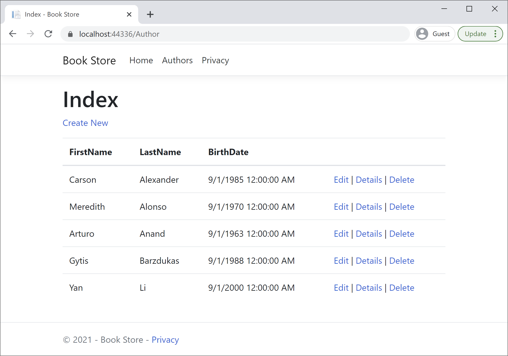

# Update Author Controller to Use the Repository

In `AuthorController.cs`, replace the code currently in the class with the following code.

```csharp
using System;
using System.Collections.Generic;
using System.Linq;
using System.Threading.Tasks;
using Microsoft.AspNetCore.Mvc;
using Microsoft.AspNetCore.Mvc.Rendering;
using Microsoft.EntityFrameworkCore;
using RepositoryPatternDemo.DAL;
using RepositoryPatternDemo.Models;

namespace RepositoryPatternDemo.Controllers
{
    public class AuthorController : Controller
    {
        private IAuthorRepository repository;

        public AuthorController(BookStore context)
        {
            repository = new AuthorRepository(context);
        }

        // GET: Author
        public async Task<IActionResult> Index()
        {
            return View(await repository.GetAuthors());
        }

        // GET: Author/Details/5
        public async Task<IActionResult> Details(int? id)
        {
            if (id == null)
            {
                return NotFound();
            }

            var author = await repository.GetAuthorById((int)id);
            if (author == null)
            {
                return NotFound();
            }

            return View(author);
        }

        // GET: Author/Create
        public IActionResult Create()
        {
            return View();
        }

        // POST: Author/Create
        // To protect from overposting attacks, enable the specific properties you want to bind to.
        // For more details, see http://go.microsoft.com/fwlink/?LinkId=317598.
        [HttpPost]
        [ValidateAntiForgeryToken]
        public async Task<IActionResult> Create([Bind("AuthorId,FirstName,LastName,BirthDate")] Author author)
        {
            if (ModelState.IsValid)
            {
                await repository.InsertAuthor(author);
                return RedirectToAction(nameof(Index));
            }
            return View(author);
        }

        // GET: Author/Edit/5
        public async Task<IActionResult> Edit(int? id)
        {
            if (id == null)
            {
                return NotFound();
            }

            var author = await repository.GetAuthorById((int)id);
            if (author == null)
            {
                return NotFound();
            }
            return View(author);
        }

        // POST: Author/Edit/5
        // To protect from overposting attacks, enable the specific properties you want to bind to.
        // For more details, see http://go.microsoft.com/fwlink/?LinkId=317598.
        [HttpPost]
        [ValidateAntiForgeryToken]
        public async Task<IActionResult> Edit(int id, [Bind("AuthorId,FirstName,LastName,BirthDate")] Author author)
        {
            if (id != author.AuthorId)
            {
                return NotFound();
            }

            if (ModelState.IsValid)
            {
                try
                {
                    await repository.UpdateAuthor(author);
                }
                catch (DbUpdateConcurrencyException)
                {
                    if (!AuthorExists(author.AuthorId))
                    {
                        return NotFound();
                    }
                    else
                    {
                        throw;
                    }
                }
                return RedirectToAction(nameof(Index));
            }
            return View(author);
        }

        // GET: Author/Delete/5
        public async Task<IActionResult> Delete(int? id)
        {
            if (id == null)
            {
                return NotFound();
            }

            var author = await repository.GetAuthorById((int)id);
            if (author == null)
            {
                return NotFound();
            }

            return View(author);
        }

        // POST: Author/Delete/5
        [HttpPost, ActionName("Delete")]
        [ValidateAntiForgeryToken]
        public async Task<IActionResult> DeleteConfirmed(int id)
        {
            var author = await repository.GetAuthorById(id);

            await repository.DeleteAuthor(id);
            return RedirectToAction(nameof(Index));
        }

        private bool AuthorExists(int id)
        {
            return repository.IsAuthorExists(id);
        }
    }
}
```

The controller now declares a class variable for an object that implements the `IAuthorRepository` interface instead of the context class.

```csharp
private IAuthorRepository repository;

public AuthorController(BookStore context)
{
    repository = new AuthorRepository(context);
}
```

You can see that in the CRUD methods, the repository is now called instead of the context.

To get all authors, we have used the `GetAuthors` method.

```csharp
await repository.GetAuthors();
```

Use the `GetAuthorById` method to get an author by `id`.

```csharp
var author = await repository.GetAuthorById((int)id);
```

To **insert** an author, use the `InsertAuthor` method.

```csharp
await repository.InsertAuthor(author);
```

To **delete** an author, use the `DeleteAuthor` method.

```csharp
await repository.DeleteAuthor(id);
```

To **update** an author, use the `UpdateAuthor` method.

```csharp
await repository.UpdateAuthor(author);
```

Press `Ctrl+F5` to run the project, click the **Authors** tab to see the test data.



The pages look and work the same as it did before you changed the code to use the repository.
