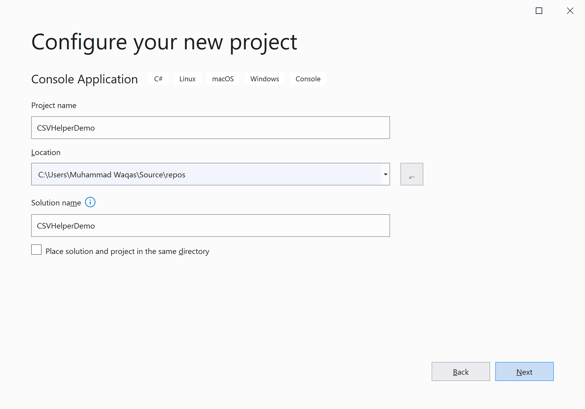
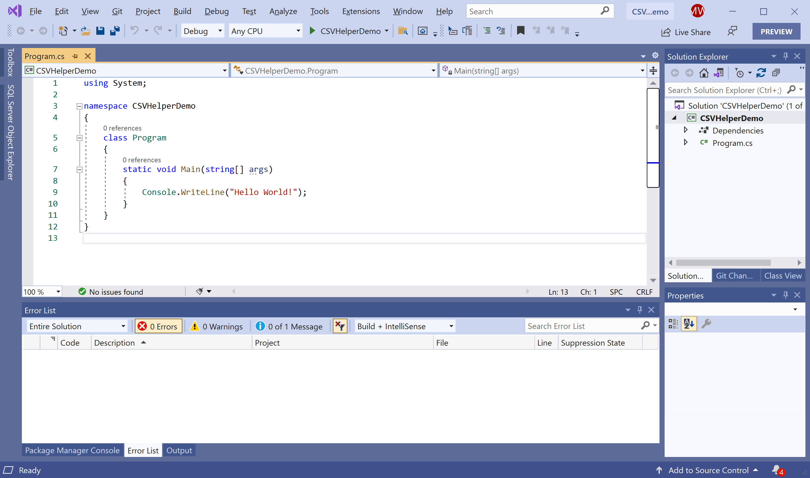
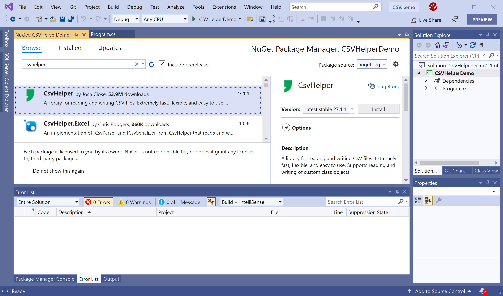
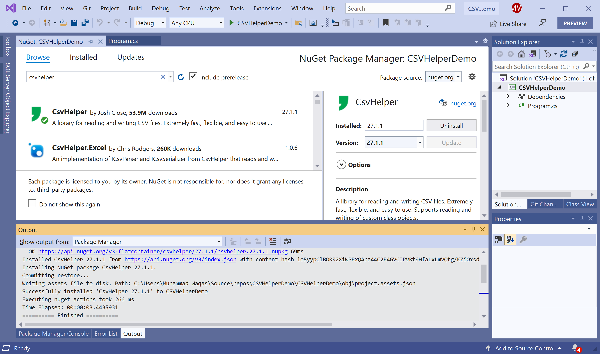

# Getting Started

## What is CSV?

A CSV stands for comma-separated values, a CSV file is a text file that uses a comma to separate values. Each line of the file is a data record. 

 - In a CSV file, each record consists of one or more fields, separated by commas. 
 - It typically stores tabular data in a plain text file. 
 - Each line will have the same number of fields.
 
**CsvHelper** is a NuGet library that helps you to read and write CSV files. 

 - It is extremely efficient, flexible, and very easy to use. 
 - It also supports reading and writing of custom class objects.

## Installation

You can easily install it from the **Package Manager Console** window by running the following command.

```csharp
PM> Install-Package CsvHelper
```

## Environment Setup

To start using the **CsvHelper** in your application, you will need to install the [CsvHelper](https://www.nuget.org/packages/CsvHelper) NuGet package.

Let's open the Visual Studio and create a new project.


Select the **Create a new project** option.


Choose **C#** as language, **Windows** as a platform, and **Console** as the project type. In the template pane, select **Console Application** and click the **Next** button.



Enter the project name, you can change the location and solution name, but we will leave it and click on the **Next** button.  


On the **Additional Information** dialog, select the target framework and then click on the **Create** button.  



You can see a new console application project is created. Now, to install a **CsvHelper**, right-click on the project in **Solution Explorer**, and select **Manage NuGet Packages...**



Select the **Browse** tab and search for **CsvHelper** and install the latest version by pressing the **Install** button. 



Once **CsvHelper** has been successfully installed. You are now ready to start your application.
