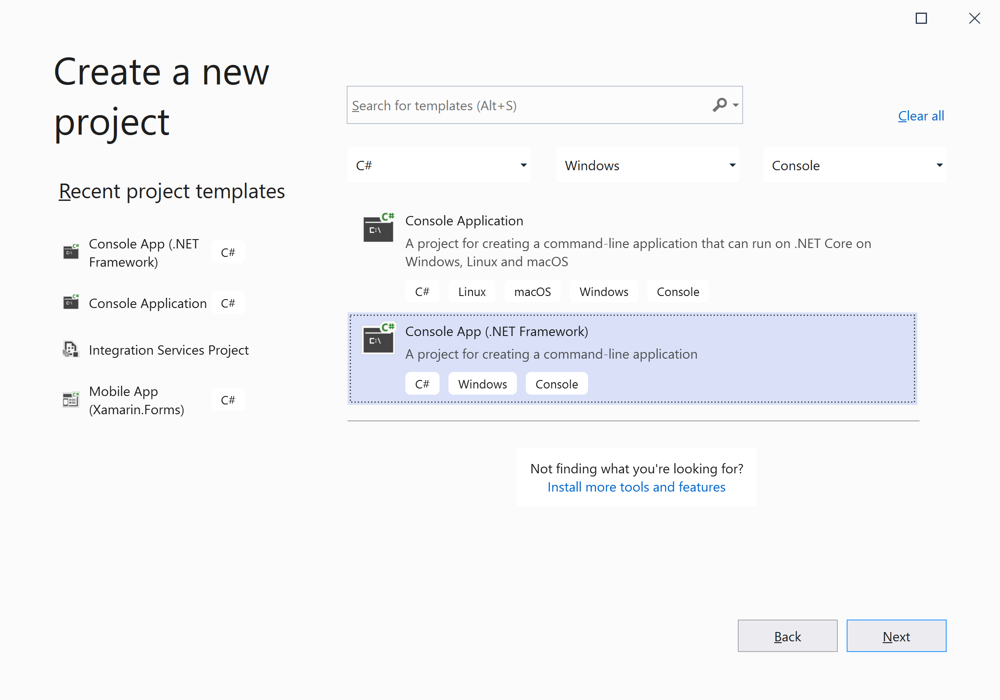
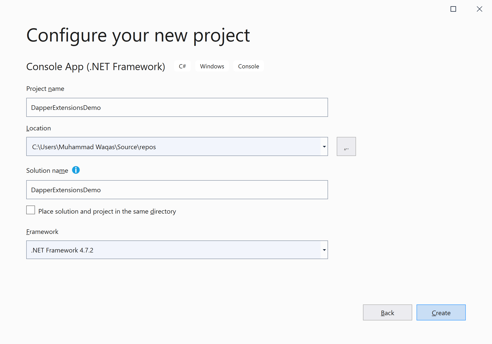
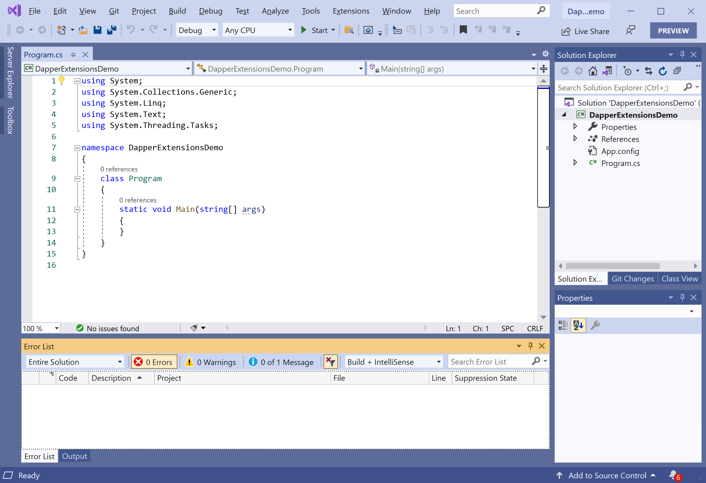
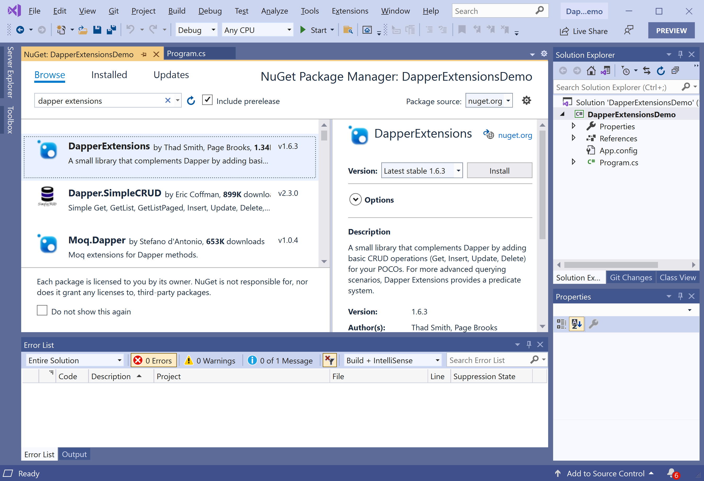
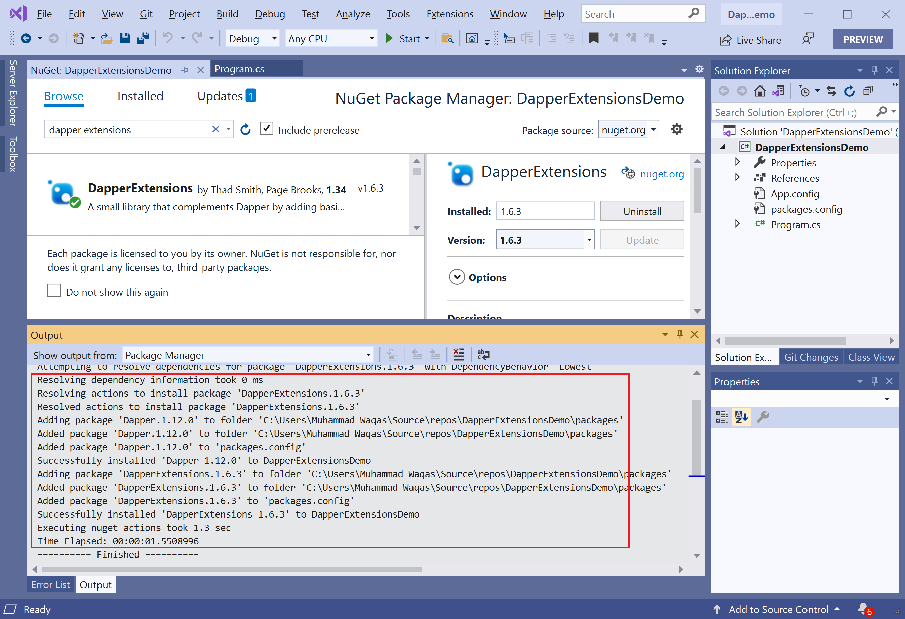

# Environment Setup

To start using the **Dapper Extensions** in your application. You will need to install the [Dapper Extensions](https://www.nuget.org/packages/DapperExtensions) NuGet package.

So let's open the Visual Studio and create a new project.

Select the **Create a new project** option.

Choose **C#** as language, **Windows** as a platform, and **Console** as the project type. In the template pane, select **Console App (.NET Framework)** and click the **Next** button.

Enter the project name, you can change the location and solution name, but we will leave it and click on the **Create** button.  

You can see a new console application project is created. Now to install a **Dapper Extensions**, right-click on the **Solution Explorer** project, and select **Manage NuGet Packages...**

Select the **Browse** tab and search for **Dapper Extensions** and install the latest version by pressing the **Install** button. 

Once **Dapper Extensions** has been successfully installed. You are now ready to start your application.
