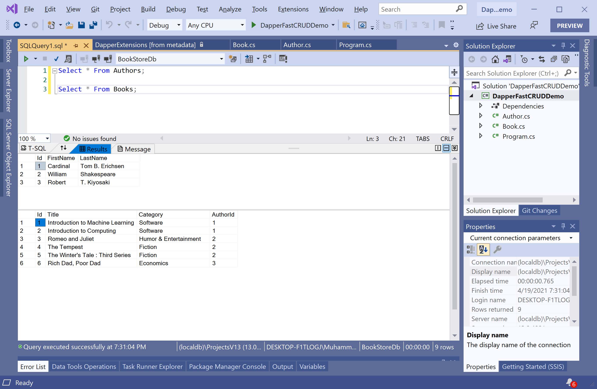

# Read Data

Most of the applications would perform the basic operation to retrieve data from the database and display the results. The **Dapper.FastCrud** library provides `Get` and `Find` extension methods to retrieve data from the database.

We have two tables in the database that contains the following data.



To retrieve the data from the database using **Dapper.FastCrud**, let's create two classes called `Author` and `Book`.

Here is the implementation of the `Author` class.

```csharp
using System;
using System.Collections.Generic;
using System.Linq;
using System.Text;
using System.Threading.Tasks;

namespace DapperFastCRUDDemo
{
    public class Author
    {
        public int Id { get; set; }
        public string FirstName { get; set; }
        public string LastName { get; set; }
        public List<Book> Books { get; set; }
    }
}
```

The following is the implementation of the `Book` class.

```csharp
using System;
using System.Collections.Generic;
using System.Linq;
using System.Text;
using System.Threading.Tasks;

namespace DapperFastCRUDDemo
{
    public class Book
    {
        public int Id { get; set; }
        public string Title { get; set; }
        public string Category { get; set; }
        public int AuthorId { get; set; }
    }
}
```

In the `Program` class, define the static variable, which contains the connection string of the database.

```csharp
static string ConnectionString = @"Data Source=(localdb)\ProjectsV13;Initial Catalog=BookStoreDb;Integrated Security=True;";
```

The first step is to create a member of type `IDbConnection` with the `SqlConnection` by passing the connection string.

```csharp
private static List<Author> GetAllAuthors()
{
    using (IDbConnection db = new SqlConnection(ConnectionString))
    {
        List<Author> authors = db.Find<Author>().ToList();

        return authors;
    }
}
```

The `Find` method retrieves all the records from the database. To retrieve a single record, you can use the `Get` method and specify the primary key (`id`) as a parameter as shown below. 

```csharp
private static Author GetAuthor(int id)
{
    using (IDbConnection db = new SqlConnection(ConnectionString))
    {
        Author author = db.Get<Author>(new Author { Id = id });

        return author;
    }
}
```

Let's call the above two methods from the `Main` method.

```csharp
static void Main(string[] args)
{
    Author author1 = GetAuthor(2);
    Console.WriteLine(author1.FirstName + " " + author1.LastName);

    List<Author> authors = GetAllAuthors();

    foreach (var author in authors)
    {
        Console.WriteLine(author.FirstName + " " + author.LastName);
    }
}
```

Let's execute the above code, and you will see the following output.

```csharp
William Shakespeare
Cardinal Tom B. Erichsen
William Shakespeare
Robert T. Kiyosaki
```

