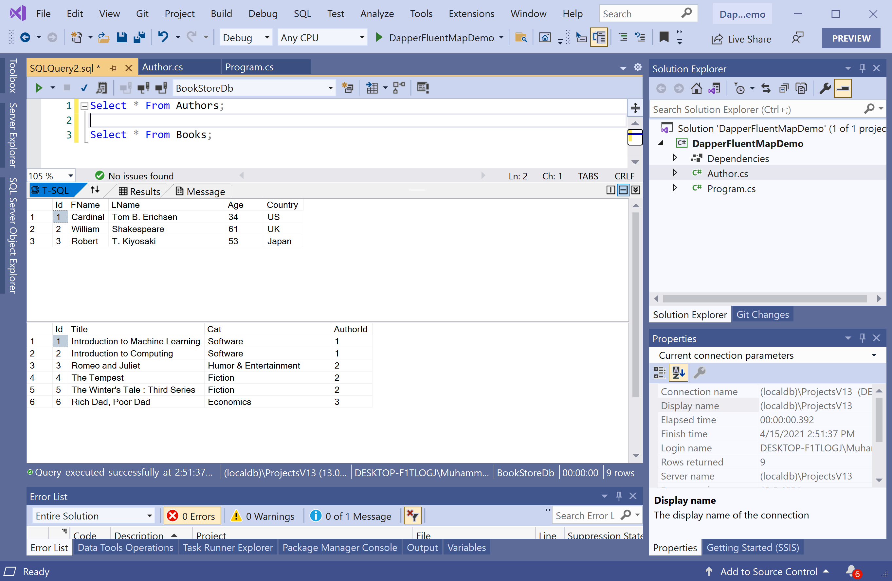

# Manual Mapping

The **Dapper.FluentMap** library provides the `EntityMap<TEntity>` class which allows you manually to map property names to the column names in the database. As you know that we have two tables in the database that contains the following data.



Now let's create two classes called `Author` and `Book`. Here is the implementation of the `Author` class.

```csharp
using System;
using System.Collections.Generic;
using System.Linq;
using System.Text;
using System.Threading.Tasks;

namespace DapperFluentMapDemo
{
    public class Author
    {
        public int Id { get; set; }
        public string FirstName { get; set; }
        public string LastName { get; set; }
        public string FullName
        {
            get
            {
                return FirstName + " " + LastName;
            }
        }
        public int Age { get; set; }
        public string Country { get; set; }
        public List<Book> Books { get; set; }
    }
}
```

The following is the implementation of the `Book` class.

```csharp
using System;
using System.Collections.Generic;
using System.ComponentModel.DataAnnotations.Schema;
using System.Linq;
using System.Text;
using System.Threading.Tasks;

namespace DapperFluentMapDemo
{
    public class Book
    {
        public int Id { get; set; }
        public string Title { get; set; }
        public string Category { get; set; }
        public int AuthorId { get; set; }
    }
}
```

If you look at the columns in the database and the respective properties in the model classes. You will see that few properties are not matching with columns such as `strFirstName`, `strLastName` and `strCountry` in the `Authors` table and `strTitle` and `strCategory` in the `Books` table.

Now to map all the columns in the `Authors` table with the corresponding properties in the `Author` class, let's create a class called `AuthorMap` and derived it from the `EntityMap<Author>` class.

```csharp
using Dapper.FluentMap.Mapping;
using System;
using System.Collections.Generic;
using System.Linq;
using System.Text;
using System.Threading.Tasks;

namespace DapperFluentMapDemo
{
    public class AuthorMap : EntityMap<Author>
    {
        public AuthorMap()
        {
            Map(a => a.FirstName)
                .ToColumn("strFirstName");

            Map(a => a.LastName)
                .ToColumn("strLastName");

            Map(a => a.Country)
                .ToColumn("strCountry");

            Map(a => a.FullName)
                .Ignore();
        }
    }
}
``` 

When you derive a class from `EntityMap<TEntity>`, the constructor gives you access to the `Map` method, which allows you to specify to which database column should be mapped to a certain property of `TEntity`.

Similarly, create another class and defined it for `Book` class, as shown below.

```csharp
using System;
using System.Collections.Generic;
using System.Linq;
using System.Text;
using System.Threading.Tasks;
using Dapper.FluentMap.Mapping;

namespace DapperFluentMapDemo
{
    public class BookMap : EntityMap<Book>
    {
        public BookMap()
        {
            Map(b => b.Title)
                .ToColumn("strTitle");

            Map(b => b.Category)
                .ToColumn("strCategory");
        }
    }
}
```

We have defined all the required mappings, now we need to initialize our mappings at the start of the application.

```csharp
FluentMapper.Initialize(config =>
{
    config.AddMap(new AuthorMap());
    config.AddMap(new BookMap());
});
```

We can now perform any database operations using Dapper as shown below.

```csharp
static void Main(string[] args)
{
    FluentMapper.Initialize(config =>
    {
        config.AddMap(new AuthorMap());
        config.AddMap(new BookMap());
    });

    Author author = GetAuthorAndTheirBooks(2);

    Console.WriteLine("{0} ({1})", author.FullName, author.Country);

    foreach (var book in author.Books)
    {
        Console.WriteLine("\t Title: {0} \t  Category: {1}", book.Title, book.Category);
    }
}

private static Author GetAuthorAndTheirBooks(int id)
{
    string sql =
        "SELECT * FROM Authors WHERE Id = @Id;" +
        "SELECT * FROM Books WHERE AuthorId = @Id;";

    using (IDbConnection db = new SqlConnection(ConnectionString))
    {
        using (var results = db.QueryMultiple(sql, new { Id = id }))
        {
            var author = results.Read<Author>().SingleOrDefault();
            var books = results.Read<Book>().ToList();

            if (author != null && books != null)
            {
                author.Books = books;
            }

            return author;
        }
    }
}
```

Let's execute the above code, and you will see the following output.

```csharp
William Shakespeare (UK)
         Title: Romeo and Juliet          Category: Humor & Entertainment
         Title: The Tempest       Category: Fiction
         Title: The Winter's Tale : Third Series          Category: Fiction
```
