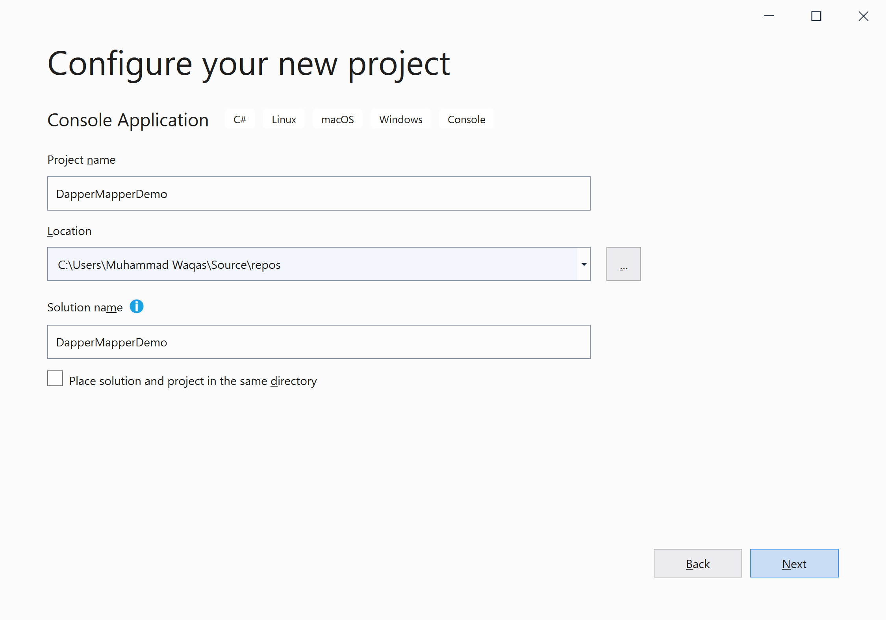
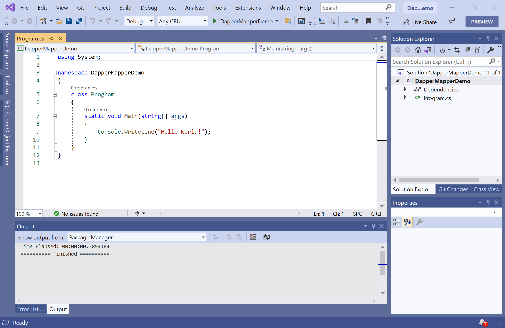
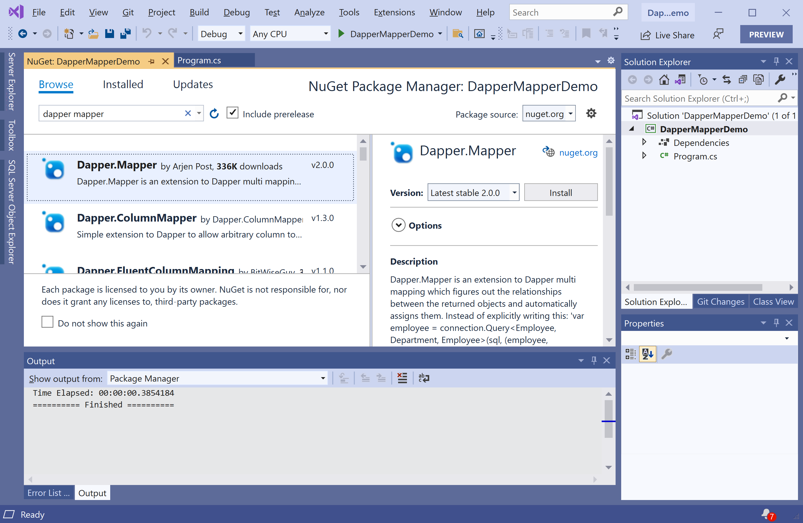

# Getting Started

**Dapper.Mapper** is a small NuGet library that extends and simplifies the multi mapping functionality of Dapper. 

 - It allows you to map a single row to multiple objects. 
 - It also automatically figures out the relationships between the returned objects and assigns them.

## Installation

To start using the **Dapper.Mapper** in your application. You will need to install the [Dapper.Mapper](https://www.nuget.org/packages/Dapper.Mapper) NuGet package.

So let's open the Visual Studio and create a new project.

Select the **Create a new project** option.

Choose **C#** as language, **Windows** as a platform, and **Console** as the project type. In the template pane, select **Console App (.NET Framework)** and click the **Next** button.

Enter the project name, you can change the location and solution name, but we will leave it and click on the **Create** button.  

You can see a new console application project is created. Now to install a **Dapper.Mapper**, right-click on the **Solution Explorer** project, and select **Manage NuGet Packages...**

Select the **Browse** tab and search for **Dapper.Mapper** and install the latest version by pressing the **Install** button. 

Once **Dapper.Mapper** has been successfully installed. 

You are now ready to start your application.
