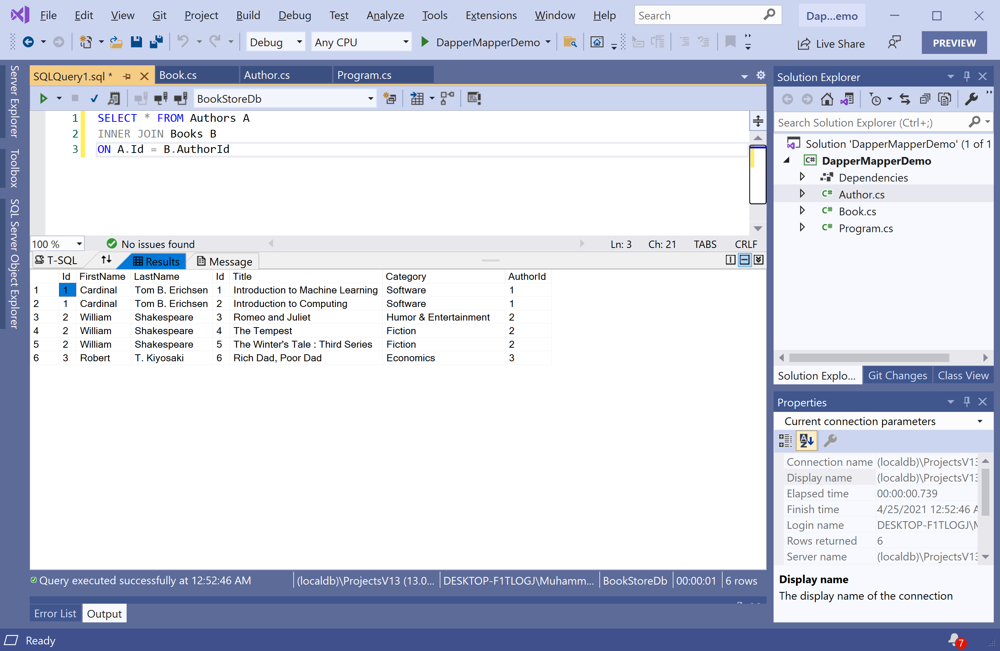

# Multi Mapping

In Dapper, multi mapping is a useful feature that you can use when you have a one-to-one or one-to-many relationship between objects, and you want to load all objects with a single query eagerly. 

 - Let's consider our example where we have a one-to-many relationship between an `Author` and its `Book`. 
 - Instead of having to do two select statements, one for the `Authors` and one for the `Books`, we can also use one simple SQL Statement. 

Let's look into the following SQL query which is a straightforward SQL query using `INNER JOIN` which is joining the authors and the books on the `AuthorId` field. 

```csharp
SELECT * FROM Authors A
INNER JOIN Books B
ON A.Id = B.AuthorId
```

When you execute the above query, you will see all their information, such as `FirstName`, `LastName`, `Title`, `Category`, etc.



This is a typical result of an SQL `INNER JOIN`. Now let's see how we can incorporate this into the C#. 

```csharp
private static void GetAuthorWithBooks()
{
    string sql = "SELECT * FROM Authors A INNER JOIN Books B ON A.Id = B.AuthorId";

    using (IDbConnection db = new SqlConnection(ConnectionString))
    {
        var authorDictionary = new Dictionary<int, Author>();

        var authors = db.Query<Author, Book, Author>(
            sql,
            (author, book) =>
            {
                Author authorEntry;

                if (!authorDictionary.TryGetValue(author.Id, out authorEntry))
                {
                    authorEntry = author;
                    authorEntry.Books = new List<Book>();
                    authorDictionary.Add(authorEntry.Id, authorEntry);
                }

                authorEntry.Books.Add(book);
                return authorEntry;
            },
            splitOn: "Id")
        .Distinct()
        .ToList();

        foreach (var author in authors)
        {
            Console.WriteLine(author.FirstName + " " + author.LastName);

            foreach (var book in author.Books)
            {
                Console.WriteLine("\t Title: {0} \t  Category: {1}", book.Title, book.Category);
            }
        }
    }
}
```

If you are using Dapper, then you will have to write the mapping explicitly, as shown above. But **Dapper.Mapper** can handle the relationships between the returned objects automatically.

```csharp
private static List<Author> GetAuthorWithBooksUsingMapper()
{
    string sql = "SELECT * FROM Authors A INNER JOIN Books B ON A.Id = B.AuthorId";

    using (IDbConnection db = new SqlConnection(ConnectionString))
    {
        var authors = db.Query<Author, Book>(sql).ToList();

        return authors;
    }
}
```

Let's call the `GetAuthorWithBooksUsingMapper` method in the `Main` method.

```csharp
static void Main(string[] args)
{
    var authors = GetAuthorWithBooksUsingMapper();
    
    foreach (var author in authors)
    {
        Console.WriteLine(author.FirstName + " " + author.LastName);

        foreach (var book in author.Books)
        {
            Console.WriteLine("\t Title: {0} \t  Category: {1}", book.Title, book.Category);
        }
    }
}
```

Let's execute the above code, and you will see the following output.

```csharp
Cardinal Tom B. Erichsen
         Title: Introduction to Machine Learning          Category: Software
         Title: Introduction to Computing         Category: Software
William Shakespeare
         Title: Romeo and Juliet          Category: Humor & Entertainment
         Title: The Tempest       Category: Fiction
         Title: The Winter's Tale : Third Series          Category: Fiction
Robert T. Kiyosaki
         Title: Rich Dad, Poor Dad        Category: Economics
```
