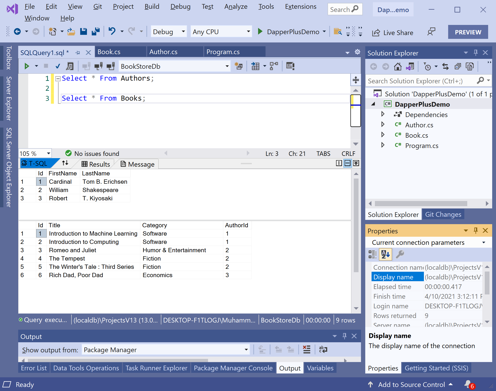

# Database Setup

To use **Dapper Plus**, we need to create a database first, and then we will perform various database operations using the dapper plus library.

The SQL `CREATE DATABASE` statement is used to create a new SQL database.

```csharp
USE [master]
GO

CREATE DATABASE [BookStoreDb]

GO

USE [BookStoreDb]

GO

CREATE TABLE [dbo].[Authors](
	[Id] [int] IDENTITY(1,1) NOT NULL,
	[FirstName] [nvarchar](450) NULL,
	[LastName] [nvarchar](450) NULL,
 CONSTRAINT [PK_Authors] PRIMARY KEY CLUSTERED 
(
	[Id] ASC
)WITH (PAD_INDEX = OFF, STATISTICS_NORECOMPUTE = OFF, IGNORE_DUP_KEY = OFF, ALLOW_ROW_LOCKS = ON, ALLOW_PAGE_LOCKS = ON) ON [PRIMARY]
) ON [PRIMARY]
GO

CREATE TABLE [dbo].[Books](
	[Id] [int] IDENTITY(1,1) NOT NULL,
	[Title] [nvarchar](450) NULL,
	[Category] [nvarchar](max) NULL,
	[AuthorId] [int] NOT NULL,
 CONSTRAINT [PK_Books] PRIMARY KEY CLUSTERED 
(
	[Id] ASC
)WITH (PAD_INDEX = OFF, STATISTICS_NORECOMPUTE = OFF, IGNORE_DUP_KEY = OFF, ALLOW_ROW_LOCKS = ON, ALLOW_PAGE_LOCKS = ON) ON [PRIMARY]
) ON [PRIMARY] TEXTIMAGE_ON [PRIMARY]
GO
```

It will create a `BookStoreDb` database that contains two tables. Now we need to insert some data into these tables, which can be used later. 

The following SQL statements insert new records in the **Authors** and **Books** tables.

```csharp
USE [BookStoreDb]

GO

INSERT INTO Authors(FirstName, LastName) VALUES ('Cardinal','Tom B. Erichsen');
INSERT INTO Authors(FirstName, LastName) VALUES ('William','Shakespeare');
INSERT INTO Authors(FirstName, LastName) VALUES ('Robert','T. Kiyosaki');

INSERT INTO Books(Title, Category, AuthorId) VALUES ('Introduction to Machine Learning', 'Software', 1);
INSERT INTO Books(Title, Category, AuthorId) VALUES ('Introduction to Computing', 'Software', 1);
INSERT INTO Books(Title, Category, AuthorId) VALUES ('Romeo and Juliet', 'Humor & Entertainment', 2);
INSERT INTO Books(Title, Category, AuthorId) VALUES ('The Tempest', 'Fiction', 2);
INSERT INTO Books(Title, Category, AuthorId) VALUES ('The Winter''s Tale : Third Series', 'Fiction', 2);
INSERT INTO Books(Title, Category, AuthorId) VALUES ('Rich Dad, Poor Dad', 'Economics', 3);
```

Let's try the following queries to test the data in the database.

```csharp
Select * From Authors;

Select * From Books;
```

Let's click on the **Execute** button, and you will see the results of the above queries.



Let's create two classes called `Author` and `Book`.

Here is the implementation of the `Author` class.

```csharp
using System;
using System.Collections.Generic;
using System.Linq;
using System.Text;
using System.Threading.Tasks;

namespace DapperPlusDemo
{
    public class Author
    {
        public int Id { get; set; }
        public string FirstName { get; set; }
        public string LastName { get; set; }
        public List<Book> Books { get; set; }
    }
}

```

The following is the implementation of the `Book` class.

```csharp
using System;
using System.Collections.Generic;
using System.Linq;
using System.Text;
using System.Threading.Tasks;

namespace DapperPlusDemo
{
    public class Book
    {
        public int Id { get; set; }
        public string Title { get; set; }
        public string Category { get; set; }
        public int AuthorId { get; set; }
    }
}
```

In the `Program` class, define the static variable, which contains the connection string of the database.

```csharp
static string ConnectionString = @"Data Source=(localdb)\ProjectsV13;Initial Catalog=BookStoreDb;Integrated Security=True;";
```

By default, **Dapper Plus** library maps entity names to the table if both are the same, but here you can see that we have entities called `Author` and `Book` and the tables name are `Authors` and `Books`. 

So let's map the entity to the table using the `DapperPlusManager`

```csharp
DapperPlusManager.Entity<Author>().Table("Authors").Identity(x => x.Id);
DapperPlusManager.Entity<Book>().Table("Books").Identity(x => x.Id);
```
