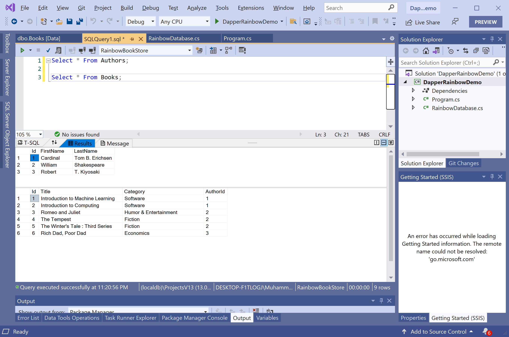

# Read Data

Most of the applications would perform the basic operation to retrieve data from the database and display the results. 

The **Dapper.Rainbow** library provides `All()`, `First()`, and `Get(id)` extension methods to retrieve data from the database and populate data in your object model.

As you know that we have two tables in the database that contains the following data.



To retrieve the data from the database using **Dapper.Rainbow**, let's create two classes called `Author` and `Book`.

Here is the implementation of the `Author` class.

```csharp
using System;
using System.Collections.Generic;
using System.Linq;
using System.Text;
using System.Threading.Tasks;

namespace DapperRainbowDemo
{
    class Author
    {
        public int Id { get; set; }
        public string FirstName { get; set; }
        public string LastName { get; set; }
    }
}
```

The following is the implementation of the `Book` class.

```csharp
using System;
using System.Collections.Generic;
using System.Linq;
using System.Text;
using System.Threading.Tasks;

namespace DapperRainbowDemo
{
    class Book
    {
        public int Id { get; set; }
        public string Title { get; set; }
        public string Category { get; set; }
        public int AuthorId { get; set; }
    }
}
```

Now we need to add tables for both `Author` and `Book` classes in our database class, as shown below.

```csharp
class RainbowDatabase : Database<RainbowDatabase>
{
    public Table<Author> Authors { get; set; }
    public Table<Book> Books { get; set; }
}
```

In the `Program` class, define the static variable, which contains the connection string of the database.

```csharp
static string ConnectionString = @"Data Source=(localdb)\ProjectsV13;Initial Catalog=RainbowBookStore;Integrated Security=True;";
```

The following example retrieves all the authors from the database using the `All()` method.

```csharp
private static List<Author> GetAllAuthors()
{
    using (DbConnection connection = new SqlConnection(ConnectionString))
    {
        var db = RainbowDatabase.Init(connection, commandTimeout: 2);

        List<Author> authors = db.Authors.All().ToList();

        return authors;
    }
}
```

If you want to retrieve any specific record from the database, you can use the `Get` method and pass the id as an argument.

```csharp
private static Author GetAuthor(int id)
{
    using (DbConnection connection = new SqlConnection(ConnectionString))
    {
        var db = RainbowDatabase.Init(connection, commandTimeout: 2);

        Author author = db.Authors.Get(id);

        return author;
    }
}
```
