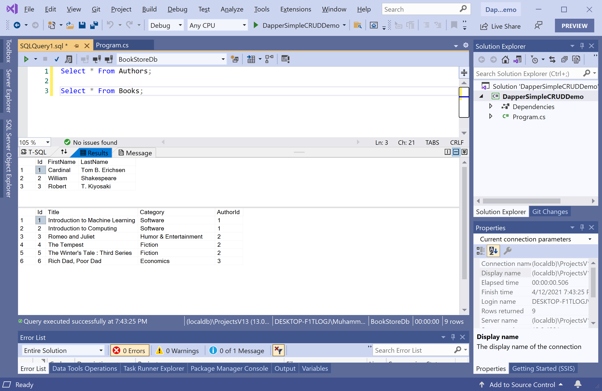

# Read Data

Most of the applications would perform the basic operation to retrieve data from the database and display the results. We have two tables in the database that contains the following data.



To retrieve the data from the database using **Dapper.Transaction**, let's create two classes called `Author` and `Book`.

Here is the implementation of the `Author` class.

```csharp
using System;
using System.Collections.Generic;
using System.Linq;
using System.Text;
using System.Threading.Tasks;

namespace DapperSimpleCRUDDemo
{
    public class Author
    {
        public int Id { get; set; }
        public string FirstName { get; set; }
        public string LastName { get; set; }
        public List<Book> Books { get; set; }
    }
}
```

The following is the implementation of the `Book` class.

```csharp
using System;
using System.Collections.Generic;
using System.Linq;
using System.Text;
using System.Threading.Tasks;

namespace DapperSimpleCRUDDemo
{
    public class Author
    {
        public int Id { get; set; }
        public string FirstName { get; set; }
        public string LastName { get; set; }
        public List<Book> Books { get; set; }
    }
}
```

In the `Program` class, define the static variable, which contains the connection string of the database.

```csharp
static string ConnectionString = @"Data Source=(localdb)\ProjectsV13;Initial Catalog=BookStoreDb;Integrated Security=True;";
```

The first step is to create a member of type `IDbConnection` with the `SqlConnection` by passing the connection string.

```csharp
private static List<Author> GetAllAuthors()
{
    using (IDbConnection db = new SqlConnection(ConnectionString))
    {
        List<Author> authors = db.GetList<Author>().ToList();
        return authors;
    }
}
```

The `GetList` extension method enables you to retrieve data from the database and populate data in your object model.

```csharp
static void Main(string[] args)
{
    List<Author> authors = GetAllAuthors();

    foreach (var author in authors)
    {
        Console.WriteLine(author.FirstName + " " + author.LastName);
    }
}
```

Let's execute the above code, and you will see the following error.


That is because we have a class called `Author` and the table name is `Àuthors` in the database. The class name and table must match which isn't the case here, so let's use the `Table` attribute to map the `Author` class to the `Authors` table.

```csharp
[Table("Authors")]
public class Author
{
    public int Id { get; set; }
    public string FirstName { get; set; }
    public string LastName { get; set; }
    public List<Book> Books { get; set; }
}
``` 

Similarly, specify the `Table` attribute in the `Book` class as well. Let's execute the above code again, and you will see the following output.

```csharp
Cardinal Tom B. Erichsen
William Shakespeare
Robert T. Kiyosakiy 
```

You can also specify the where conditions using the anonymous object and map the results to a strongly typed list.

```csharp
private static List<Book> GetAllBooks(string category)
{
    using (IDbConnection db = new SqlConnection(ConnectionString))
    {
        List<Book> books = db.GetList<Book>(new { Category = category }).ToList();
        return books;
    }
}
```

You can also specify the where clause and map the results to a strongly typed list.

```csharp
private static List<Book> GetAllBooks(string category)
{
    using (IDbConnection db = new SqlConnection(ConnectionString))
    {
        //List<Book> books = db.GetList<Book>(new { Category = category }).ToList();
        List<Book> books = db.GetList<Book>("where Category = @Category", new { Category = category }).ToList();
        
        return books;
    }
}
```

Let's pass the `"Fiction"` as a parameter as shown below.

```csharp
static void Main(string[] args)
{
    List<Book> fictionBooks = GetAllBooks("Fiction");

    foreach (var book in fictionBooks)
    {
        Console.WriteLine(book.Title);
    }
}
```

Let's execute the above code, and you will see the following books which are from fiction category.

```csharp
The Tempest
The Winter's Tale : Third Series
```

