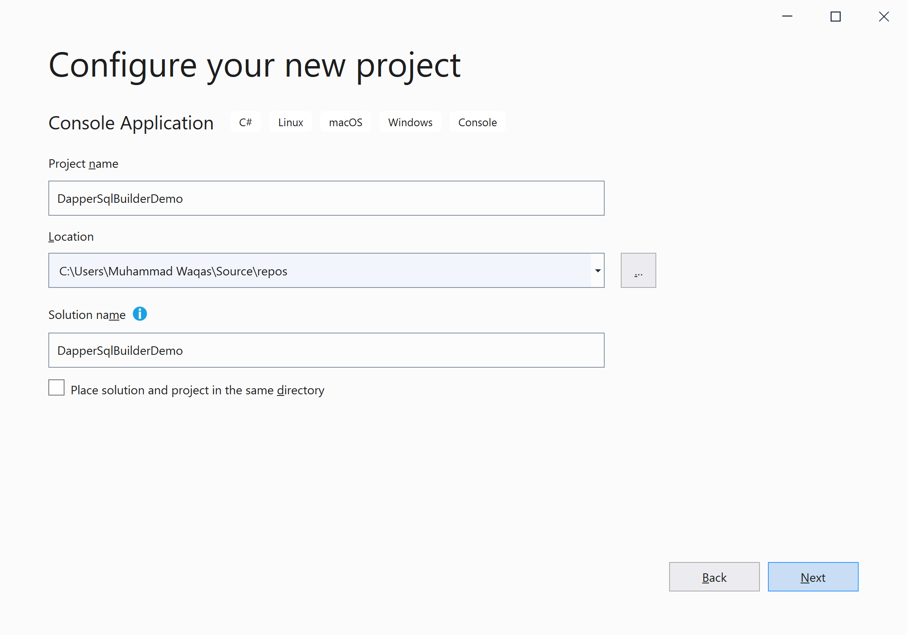
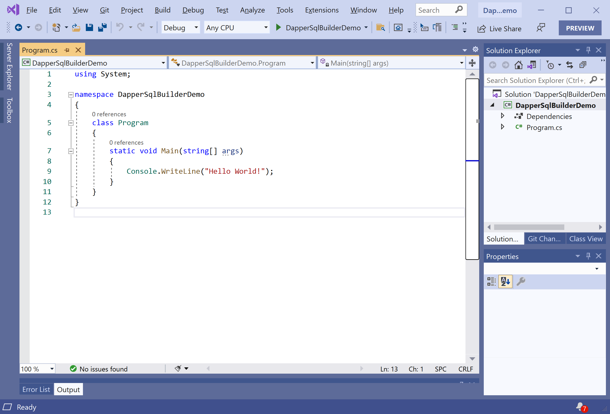
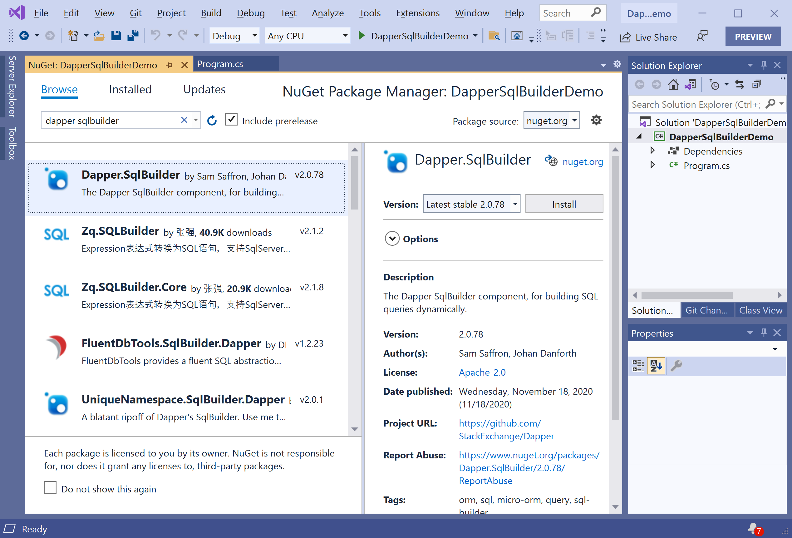
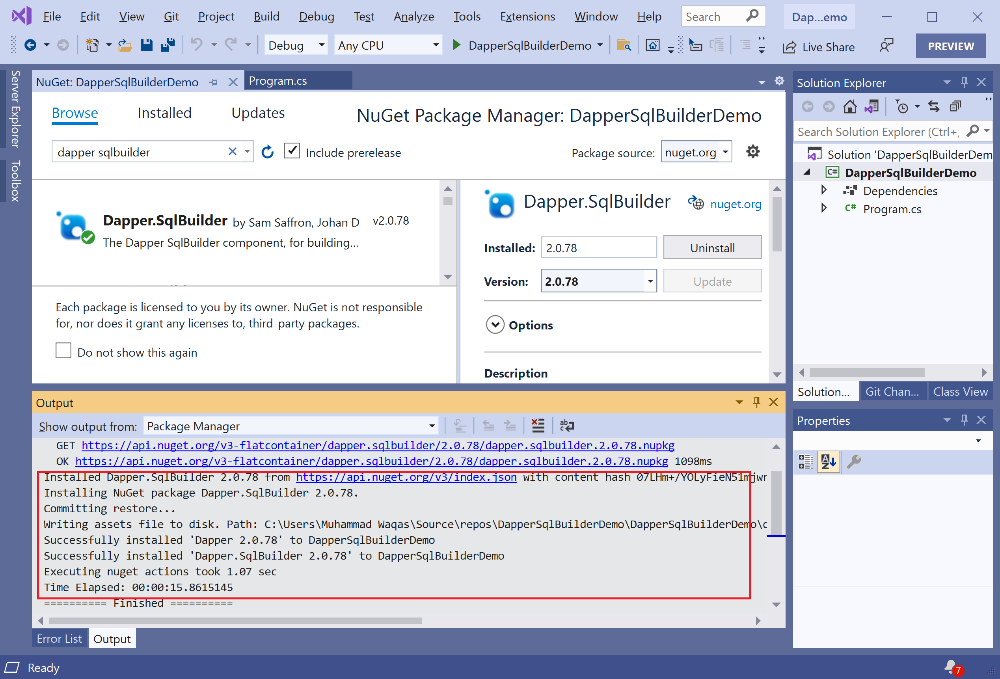

# Getting Started

**Dapper.SqlBuilder** is a small NuGet library that is designed to make dynamic SQL tasks easier. It is about building SQL, not getting or mapping data, so it should not be bound to any particular data-access implementation. 

## Setup

To start using the **Dapper.SqlBuilder** in your application. You will need to install the [Dapper.SqlBuilder](https://www.nuget.org/packages/Dapper.SqlBuilder) NuGet package.

So let's open the Visual Studio and create a new project.

Select the **Create a new project** option.

Choose **C#** as language, **Windows** as a platform, and **Console** as the project type. In the template pane, select **Console Application** and click the **Next** button.

Enter the project name, you can change the location and solution name, but we will leave it and click on the **Next** button.  

On the **Additional Information** dialog, select the target framework and then click on the **Create** button.

You can see a new console application project is created. Now, to install a **Dapper.SqlBuilder**, right-click on the **Solution Explorer** project, and select **Manage NuGet Packages...**

Select the **Browse** tab and search for **Dapper.SqlBuilder** and install the latest version by pressing the **Install** button. 

Once **Dapper.SqlBuilder** has been successfully installed. You are now ready to start your application.
