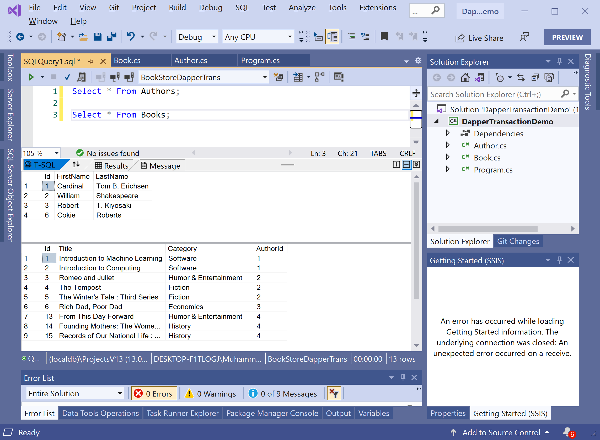

# Insert Data

Inserting data into the database is one of the CRUD operations that act on an individual row by inserting a row. There are various ways to insert new records into the database using Dapper ORM.

You can easily insert a single new record by writing an `INSERT` statement with parameters for each column you want to set.

```csharp
private static void InsertSingleAuthor()
{
    using (IDbConnection connection = new SqlConnection(ConnectionString))
    {
        connection.Open();

        using (var transaction = connection.BeginTransaction())
        {
            Author author = new Author()
            {
                FirstName = "Cokie",
                LastName = "Roberts"
            };

            string sqlQuery = "INSERT INTO Authors (FirstName, LastName) VALUES(@FirstName, @LastName)";

            int rowsAffected = transaction.Execute(sqlQuery, author);
        }
    }
}
```

It a simple SQL insert statement on the `Authors` table. There are the columns and their values corresponding to parameters. 

The `Execute` extension method of Dapper is used to insert a record. You can also use the `Execute` method to insert multiple authors.

```csharp
private static void InsertMultipleBooks()
{
    using (IDbConnection connection = new SqlConnection(ConnectionString))
    {
        connection.Open();

        using (var transaction = connection.BeginTransaction())
        {
            string sqlQuery = "INSERT INTO Books (Title, Category, AuthorId) VALUES(@Title, @Category, @AuthorId)";

            int rowsAffected = transaction.Execute(sqlQuery,
                new[]
                {
                    new Book {Title = "From This Day Forward", Category = "Humor & Entertainment", AuthorId = 4},
                    new Book {Title = "Founding Mothers: The Women Who Raised Our Nation", Category = "History", AuthorId = 4},
                    new Book {Title = "Records of Our National Life : The National Archives", Category = "History", AuthorId = 4}
                }
            );
        }
    }
}
```

Let's execute the above code and if you retrieve all the authors and books from the database, you will see that the new records are added at the end.


