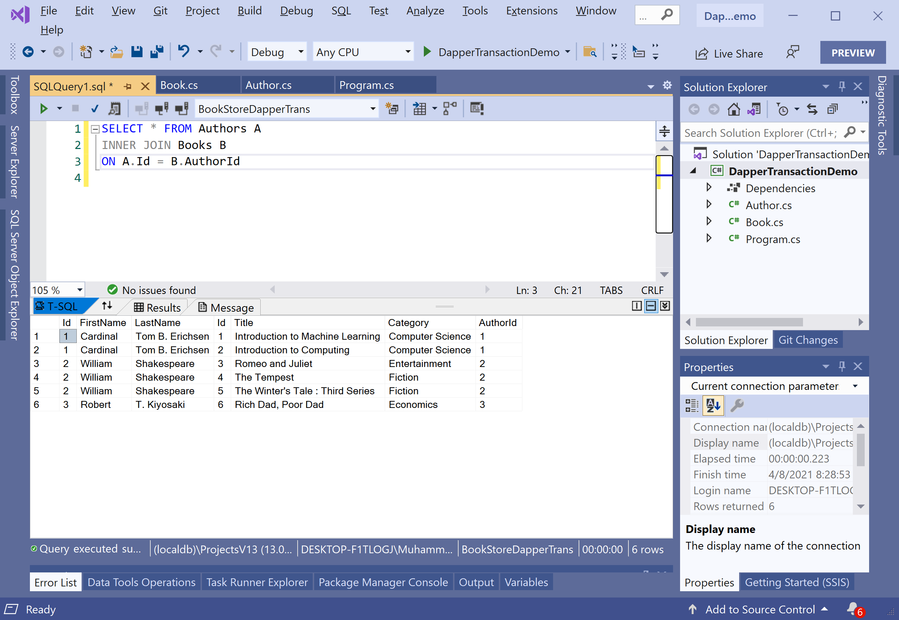

# Multi Mapping

In **Dapper.Transaction**, multi mapping is a useful feature that you can use when you have a one-to-one or one-to-many relationship between objects, and you want to load all objects with a single query eagerly. 

 - Let's consider our example where we have a one-to-many relationship between an `Author` and its `Book`. 
 - Instead of having to do two select statements, one for the `Authors` and one for the `Books`, as we have used previously, we can also use one simple SQL Statement. 

Let's look into the following SQL query which is a straightforward SQL query using `INNER JOIN` joining the authors and the books on the `AuthorId` field. 

```csharp
SELECT * FROM Authors A
INNER JOIN Books B
ON A.Id = B.AuthorId
```

When you execute the above query, you will see all their information, such as `FirstName`, `LastName`, `Title`, `Category`, etc.



This is a typical result of an SQL `INNER JOIN`. Now let's see how we can incorporate this into the C#. 

```csharp
private static List<Author> GetAuthorWithBooks()
{
    string sql = "SELECT * FROM Authors A INNER JOIN Books B ON A.Id = B.AuthorId";

    using (IDbConnection connection = new SqlConnection(ConnectionString))
    {
        connection.Open();

        using (var transaction = connection.BeginTransaction())
        {
            var authorDictionary = new Dictionary<int, Author>();

            var authors = transaction.Query<Author, Book, Author>(
                sql,
                (author, book) =>
                {
                    Author authorEntry;

                    if (!authorDictionary.TryGetValue(author.Id, out authorEntry))
                    {
                        authorEntry = author;
                        authorEntry.Books = new List<Book>();
                        authorDictionary.Add(authorEntry.Id, authorEntry);
                    }

                    authorEntry.Books.Add(book);
                    return authorEntry;
                },
                splitOn: "Id")
            .Distinct()
            .ToList();

            return authors;
        }
    }
}
```

In the `Query` method, you can see that there are three generic types. 

 - The first type represents the first object that you're mapping to, and that is `Author`. 
 - The second type, in this case `Book`, represents the child object. 
 - The third type represents the return type, which happens to be `Author` again, which makes sense because `Author` is the parent. 

The temporary dictionary will store `Id` along with the author entity. Then inside the lambda, it will check to see if we have already seen this author or not.

Let's call the `GetAuthorAndTheirBooks` method in the `Main` method.

```csharp
static void Main(string[] args)
{
    List<Author> authors = GetAuthorWithBooks();

    foreach (var author in authors)
    {
        Console.WriteLine(author.FirstName + " " + author.LastName);

        foreach (var book in author.Books)
        {
            Console.WriteLine("\t Title: {0} \t  Category: {1}", book.Title, book.Category);
        }
    }
}
```

Let's execute the above code, and you will see the following output.

```csharp
Cardinal Tom B. Erichsen
         Title: Introduction to Machine Learning          Category: Computer Science
         Title: Introduction to Computing         Category: Computer Science
William Shakespeare
         Title: Romeo and Juliet          Category: Entertainment
         Title: The Tempest       Category: Fiction
         Title: The Winter's Tale : Third Series          Category: Fiction
Robert T. Kiyosaki
         Title: Rich Dad, Poor Dad        Category: Economics
```
