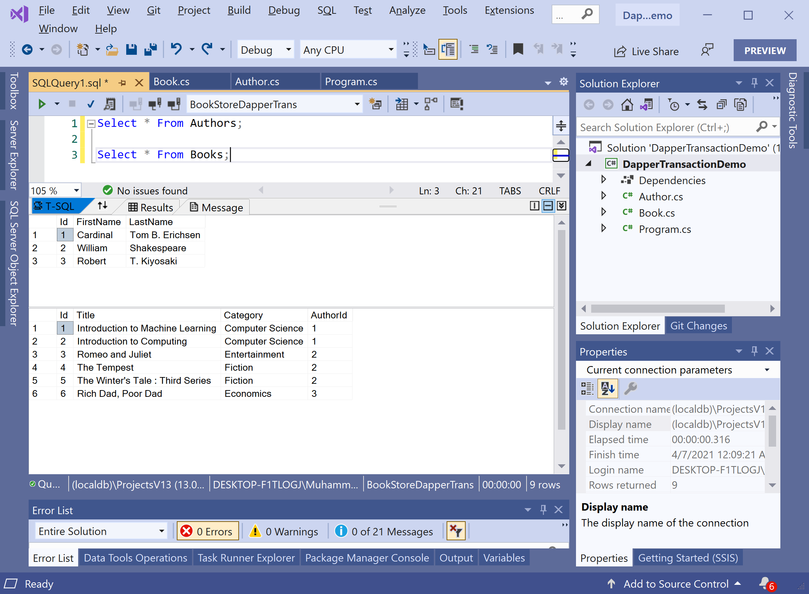

# Related Data

So far, we have performed operations on a single row. But what if you need to deal with more complex objects that have parent-child relationships. Let's consider our example, we have a one-to-many relationship between an `Author` and `Book`.  A single author can have many books. 

If you look at the `Author` class, you can see a list of books. 

```csharp
using System;
using System.Collections.Generic;
using System.Linq;
using System.Text;
using System.Threading.Tasks;

namespace DapperTransactionDemo
{
    class Author
    {
        public int Id { get; set; }
        public string FirstName { get; set; }
        public string LastName { get; set; }
        public List<Book> Books { get; set; }
    }
}
```

In an `Authors` tabl, you can see on the first row **William Shakespeare** has an `Id = 2`. 



If you look in the `Books` table, you can see that there are three different rows that have an `AuthorId` of 2. So **William Shakespeare** has written multiple books. 

So let's retrieve the authors from a database and their respective books using the `QueryMultiple` extension method. It can execute multiple queries within the same command and map results.

```csharp
private static Author GetAuthorAndTheirBooks(int id)
{
    string sql =
        "SELECT * FROM Authors WHERE Id = @Id;" +
        "SELECT * FROM Books WHERE AuthorId = @Id;";

    using (IDbConnection connection = new SqlConnection(ConnectionString))
    {
        connection.Open();

        using (var transaction = connection.BeginTransaction())
        {
            using (var results = transaction.QueryMultiple(sql, new { Id = id }))
            {
                var author = results.Read<Author>().SingleOrDefault();
                var books = results.Read<Book>().ToList();

                if (author != null && books != null)
                {
                    author.Books = books;                            
                }

                return author;
            }
        }
    }
}
```

You can see that first, we have specified two different `SELECT` statements, the first one for the individual author and the second one for the author's books. 

 - The `QueryMultiple` is an extension method that returns multiple result sets in the query results of type `GridReader`. 
 - Then we simply need to call the `Read` method on that object multiple times to get the author record and then for books. 

Let's call the `GetAuthorAndTheirBooks` method in the `Main` method.

```csharp
static void Main(string[] args)
{
    Author author = GetAuthorAndTheirBooks(2);

    Console.WriteLine(author.FirstName + " " + author.LastName);

    foreach (var book in author.Books)
    {
        Console.WriteLine("\t Title: {0} \t Category: {1}", book.Title, book.Category);
    }
}
```

Let's execute the above code, and you will see the following output.

```csharp
William Shakespeare
         Title: Romeo and Juliet          Category: Entertainment
         Title: The Tempest       Category: Fiction
         Title: The Winter's Tale : Third Series          Category: Fiction
```
