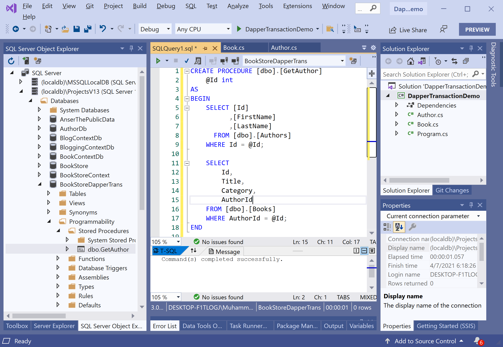

# Stored Procedures

So far, we have specified all of our SQL in code directly. But what if you want to use stored procedures for your data access layer? That is perfectly fine and **Dapper.Transaction** can work seamlessly with stored procedures. 

Let's consider the following stored procedure.

```csharp
CREATE PROCEDURE [dbo].[GetAuthor]
	@Id int
AS
BEGIN
	SELECT [Id]
		  ,[FirstName]
		  ,[LastName]
	  FROM [dbo].[Authors]
	WHERE Id = @Id;

	SELECT 
		Id,
		Title,
		Category,
		AuthorId
	FROM [dbo].[Books] 
	WHERE AuthorId = @Id;

END
```

Now execute the above-stored procedure in **SQL Query** editor.



Let's write a method to call the above-stored procedure. We will still use the `QueryMultiple` method just like we did before. Instead of specifying inline SQL with two different statements, we will specify the stored procedure's name and pass in an `Id` as a parameter. 

```csharp
private static Author GetAuthorAndTheirBooksSP(int id)
{
    string sql = "GetAuthor";

    using (IDbConnection connection = new SqlConnection(ConnectionString))
    {
        connection.Open();

        using (var transaction = connection.BeginTransaction())
        {
            using (var results = transaction.QueryMultiple(sql, new { Id = id }, commandType: CommandType.StoredProcedure))
            {
                var author = results.Read<Author>().SingleOrDefault();
                var books = results.Read<Book>().ToList();

                if (author != null && books != null)
                {
                    author.Books = books;
                }

                return author;
            }
        }
    }
}
```

You also need to specify `commandType: CommandType.StoredProcedure` as a third parameter. You can see that it is almost identical to how we had it before. 

Now call the `GetAuthorAndTheirBooks` method in the `Main` method.

```csharp
static void Main(string[] args)
{
    Author author = GetAuthorAndTheirBooksSP(2);

    Console.WriteLine(author.FirstName + " " + author.LastName);
    
    foreach (var book in author.Books)
    {
        Console.WriteLine("\t Title: {0} \t Category: {1}", book.Title, book.Category);
    }
}
```

Let's execute the above code, and you will see the following output.

```csharp
William Shakespeare
         Title: Romeo and Juliet          Category: Entertainment
         Title: The Tempest       Category: Fiction
         Title: The Winter's Tale : Third Series          Category: Fiction
```
