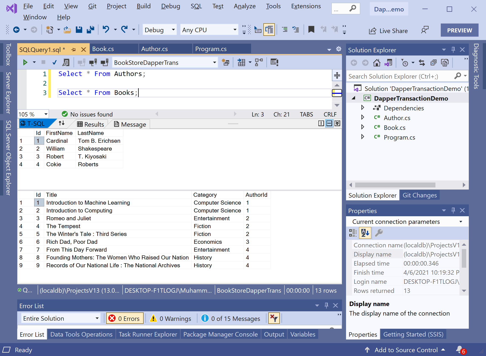

# Update Data

Updating an existing entity is similar to inserting a new one. All we need is a SQL statement containing an `UPDATE` statement that sets the appropriate columns. We also want to make sure we include a `WHERE` clause limiting the update only to the row with the specified `Id`.

You can easily update a single row by writing an `UPDATE` statement with parameters for each column you want to update.

```csharp
private static void UpdateSingleBook()
{
    string sql = "UPDATE Books SET Category = @Category WHERE Id = @Id;";

    using (IDbConnection connection = new SqlConnection(ConnectionString))
    {
        connection.Open();

        using (var transaction = connection.BeginTransaction())
        {
            int rowsAffected = transaction.Execute(sql, new { Id = 1, Category = "Computer Science" });
        }
    }
}
```

It a simple SQL `UPDATE` statement on the `Books` table. There are the columns and their values corresponding to parameters. 

The `Execute` extension method of **Dapper.Transaction** is used to update a record. You can also use the `Execute` method to update multiple books.

```csharp
private static void UpdateMultipleBooks()
{
    string sql = "UPDATE Books SET Category = @Category WHERE Id = @Id;";

    using (IDbConnection connection = new SqlConnection(ConnectionString))
    {
        connection.Open();

        using (var transaction = connection.BeginTransaction())
        {
            int rowsAffected = transaction.Execute(sql,
                new[]
                {
                    new { Id = 2, Category = "Computer Science" },
                    new { Id = 3, Category = "Entertainment" },
                    new { Id = 7, Category = "Entertainment" }
                }
            );
        }
    }
}
```

Let's execute the above code and if you retrieve all the books from the database, you will see that the above-mentioned books are updated.



