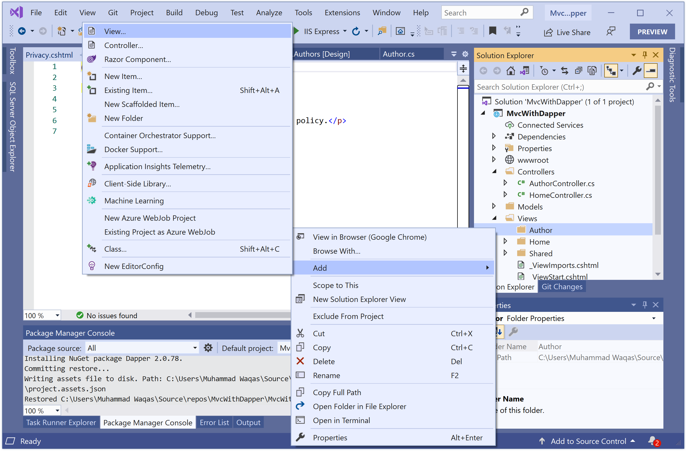
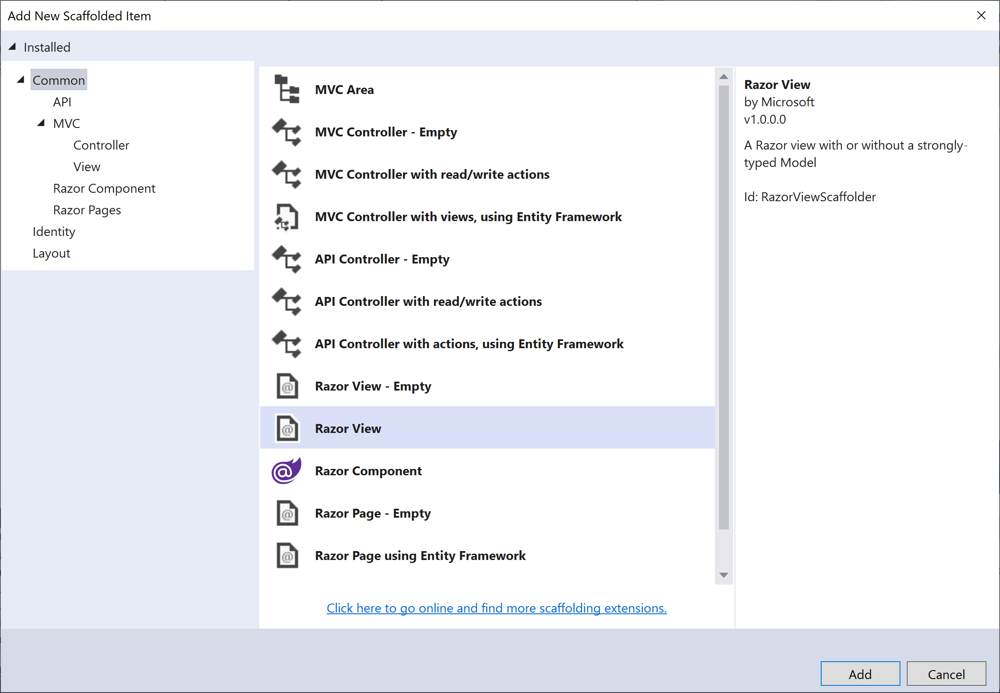

# Views

## What is View?

In the Model-View-Controller (MVC) pattern, the view handles the application's data presentation and user interaction. 

 - A view is an HTML template with embedded Razor markup. 
 - Razor markup is interacts with HTML markup to produce a webpage that's sent to the client.
 - In ASP.NET Core MVC, views are `.cshtml` files that use the C# programming language in Razor markup. 
 - Usually, view files are grouped into folders named for each controller. The folders are stored in a **Views** folder at the root of the application.

Now, we need to create all the required views for an `AuthorController`. Let's add a folder inside the **Views** folder and call it **Author**.


Add the `Index.cshtml` file by right-clicking on **Author** folder.



Select **Add > Views...** option, and it will open the **Add New Scaffolded Item** dialog.



Select the **Razor View** in the middle page and click the **Add** button.


On the **Add Razor View** dialog, enter `Index` in the **View name** field, select `List` from the **Template** and choose `Author (MvcWithDapper.Models)` from **Model class**. 

Click the **Add** button, and you will see the following code is added automatically for you in the `Index.cshtml` file.

```csharp
@model IEnumerable<MvcWithDapper.Models.Author>

@{
    ViewData["Title"] = "Index";
}

<h1>Index</h1>

<p>
    <a asp-action="Create">Create New</a>
</p>
<table class="table">
    <thead>
        <tr>
            <th>
                @Html.DisplayNameFor(model => model.AuthorId)
            </th>
            <th>
                @Html.DisplayNameFor(model => model.FirstName)
            </th>
            <th>
                @Html.DisplayNameFor(model => model.LastName)
            </th>
            <th>
                @Html.DisplayNameFor(model => model.Address)
            </th>
            <th>
                @Html.DisplayNameFor(model => model.City)
            </th>
            <th>
                @Html.DisplayNameFor(model => model.PostalCode)
            </th>
            <th>
                @Html.DisplayNameFor(model => model.Country)
            </th>
            <th></th>
        </tr>
    </thead>
    <tbody>
@foreach (var item in Model) {
        <tr>
            <td>
                @Html.DisplayFor(modelItem => item.AuthorId)
            </td>
            <td>
                @Html.DisplayFor(modelItem => item.FirstName)
            </td>
            <td>
                @Html.DisplayFor(modelItem => item.LastName)
            </td>
            <td>
                @Html.DisplayFor(modelItem => item.Address)
            </td>
            <td>
                @Html.DisplayFor(modelItem => item.City)
            </td>
            <td>
                @Html.DisplayFor(modelItem => item.PostalCode)
            </td>
            <td>
                @Html.DisplayFor(modelItem => item.Country)
            </td>
            <td>
                @Html.ActionLink("Edit", "Edit", new { /* id=item.PrimaryKey */ }) |
                @Html.ActionLink("Details", "Details", new { /* id=item.PrimaryKey */ }) |
                @Html.ActionLink("Delete", "Delete", new { /* id=item.PrimaryKey */ })
            </td>
        </tr>
}
    </tbody>
</table>
```

Uncomment the `id` in the `ActionLink` method and specify the primary key of the model class.

```csharp
<td>
    @Html.ActionLink("Edit", "Edit", new { id = item.AuthorId }) |
    @Html.ActionLink("Details", "Details", new {  id = item.AuthorId  }) |
    @Html.ActionLink("Delete", "Delete", new { id = item.AuthorId })
</td>
```

Now let's update the `Index` action method of `AuthorController` to fetch all the authors from the database as shown below.

```csharp
// GET: AuthorController
public ActionResult Index()
{
    string sqlAuthors = "SELECT * FROM Authors;";

    using (var connection = new SqlConnection("Data Source=(localdb)\\ProjectsV13;Initial Catalog=AuthorDb;Trusted_Connection=True;MultipleActiveResultSets=true"))
    {
        var authors = connection.Query<Author>(sqlAuthors).ToList();
        return View(authors);
    }
}
```

## Setup Menu Options

Open ***Views\Shared\\_Layout.cshtml***, and add menu entry for **Authors** after the **Home** menu option as shown below.

```csharp
<header>
    <nav class="navbar navbar-expand-sm navbar-toggleable-sm navbar-light bg-white border-bottom box-shadow mb-3">
        <div class="container">
            <a class="navbar-brand" asp-area="" asp-controller="Home" asp-action="Index">MvcWithDapper</a>
            <button class="navbar-toggler" type="button" data-toggle="collapse" data-target=".navbar-collapse" aria-controls="navbarSupportedContent"
                    aria-expanded="false" aria-label="Toggle navigation">
                <span class="navbar-toggler-icon"></span>
            </button>
            <div class="navbar-collapse collapse d-sm-inline-flex justify-content-between">
                <ul class="navbar-nav flex-grow-1">
                    <li class="nav-item">
                        <a class="nav-link text-dark" asp-area="" asp-controller="Home" asp-action="Index">Home</a>
                    </li>
                    <li class="nav-item">
                        <a class="nav-link text-dark" asp-area="" asp-controller="Author" asp-action="Index">Authors</a>
                    </li>
                    <li class="nav-item">
                        <a class="nav-link text-dark" asp-area="" asp-controller="Home" asp-action="Privacy">Privacy</a>
                    </li>
                </ul>
            </div>
        </div>
    </nav>
</header>
```

Press Ctrl+F5 to run the project, click the **Authors** tab to see the test data.


