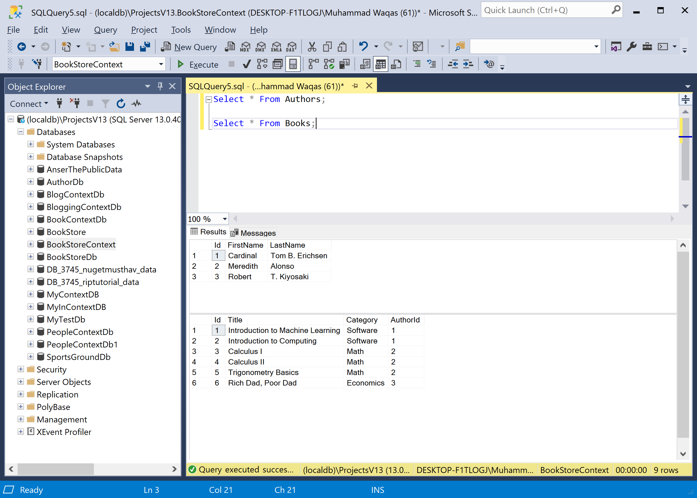

# Database Setup

To use Dapper, we need to create a database first and then we will perform various database operations using dapper.

The SQL `CREATE DATABASE` statement is used to create a new SQL database.

```csharp
USE [master]
GO

CREATE DATABASE [BookStoreContext]

GO

USE [BookStoreContext]

GO

CREATE TABLE [dbo].[Authors](
	[Id] [int] IDENTITY(1,1) NOT NULL,
	[FirstName] [nvarchar](450) NULL,
	[LastName] [nvarchar](450) NULL,
 CONSTRAINT [PK_Authors] PRIMARY KEY CLUSTERED 
(
	[Id] ASC
)WITH (PAD_INDEX = OFF, STATISTICS_NORECOMPUTE = OFF, IGNORE_DUP_KEY = OFF, ALLOW_ROW_LOCKS = ON, ALLOW_PAGE_LOCKS = ON) ON [PRIMARY]
) ON [PRIMARY]
GO

CREATE TABLE [dbo].[Books](
	[Id] [int] IDENTITY(1,1) NOT NULL,
	[Title] [nvarchar](450) NULL,
	[Category] [nvarchar](max) NULL,
	[AuthorId] [int] NOT NULL,
 CONSTRAINT [PK_Books] PRIMARY KEY CLUSTERED 
(
	[Id] ASC
)WITH (PAD_INDEX = OFF, STATISTICS_NORECOMPUTE = OFF, IGNORE_DUP_KEY = OFF, ALLOW_ROW_LOCKS = ON, ALLOW_PAGE_LOCKS = ON) ON [PRIMARY]
) ON [PRIMARY] TEXTIMAGE_ON [PRIMARY]
GO
```

It will create a `BookStoreContext` database that contains two tables. Now we need to insert some data into these tables which can be used later. 

The following SQL statements insert new records in the **Authors** and **Books** tables.

```csharp
USE [BookStoreContext]

GO

INSERT INTO Authors(FirstName, LastName) VALUES ('Cardinal','Tom B. Erichsen');
INSERT INTO Authors(FirstName, LastName) VALUES ('Meredith','Alonso');
INSERT INTO Authors(FirstName, LastName) VALUES ('Robert','T. Kiyosaki');

INSERT INTO Books(Title, Category, AuthorId) VALUES ('Introduction to Machine Learning', 'Software', 1);
INSERT INTO Books(Title, Category, AuthorId) VALUES ('Introduction to Computing', 'Software', 1);
INSERT INTO Books(Title, Category, AuthorId) VALUES ('Calculus I', 'Math', 2);
INSERT INTO Books(Title, Category, AuthorId) VALUES ('Calculus II', 'Math', 2);
INSERT INTO Books(Title, Category, AuthorId) VALUES ('Trigonometry Basics', 'Math', 2);
INSERT INTO Books(Title, Category, AuthorId) VALUES ('Rich Dad, Poor Dad', 'Economics', 3);
```

Let's try the following queries to test the data in the database.

```csharp
Select * From Authors;

Select * From Books;
```

Let's click on the **Execute** button and you will see the results of the above queries


