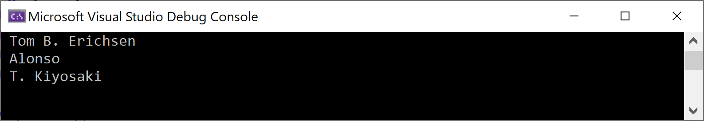
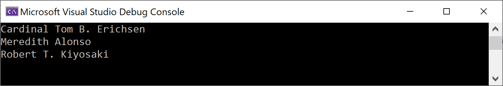

# Map Column Names with Class Properties

In some cases, you will find that your class properties don't match your column names precisely. Let me show you how to address that if and when you encounter it. For example, in `Author` class, let's change `FirstName` to `FName`

```csharp
class Author
{
    public int Id { get; set; }
    public string FName { get; set; }
    public string LastName { get; set; }
}
```

We know it is called `FirstName` in the database, but we have changed the property name to `FName` to make it something different. As a result of making this change, let's see what it looks like when running it.

```csharp
static void Main(string[] args)
{
    IDbConnection db = new SqlConnection(@"Data Source=(localdb)\ProjectsV13;Initial Catalog=BookStoreContext;Integrated Security=True;");

    List<Author> authors = db.Query<Author>("SELECT * FROM Authors").ToList();

    foreach (var author in authors)
    {
        Console.WriteLine(author.FName + " " + author.LastName);
    }
}
```

Now you will see that only the last name is printed on the console. 



But we no longer see the first name property even though it is in the database. Let's change the query from `SELECT *` and use aliases to change the column name for the `FirstName`. 

```csharp
static void Main(string[] args)
{
    IDbConnection db = new SqlConnection(@"Data Source=(localdb)\ProjectsV13;Initial Catalog=BookStoreContext;Integrated Security=True;");

    List<Author> authors = db.Query<Author>("SELECT Id, FirstName FName, LastName FROM Authors").ToList();

    foreach (var author in authors)
    {
        Console.WriteLine(author.FName + " " + author.LastName);
    }
}
```

Now you can see in the query, we are querying the `FirstName` column in the database and changing it to `FName` in the result set, and the other, we can fill in the rest of the existing column names. Let's run the application and see the results.



You can see now both `FirstName` and `LastName` are printed on the console. 
