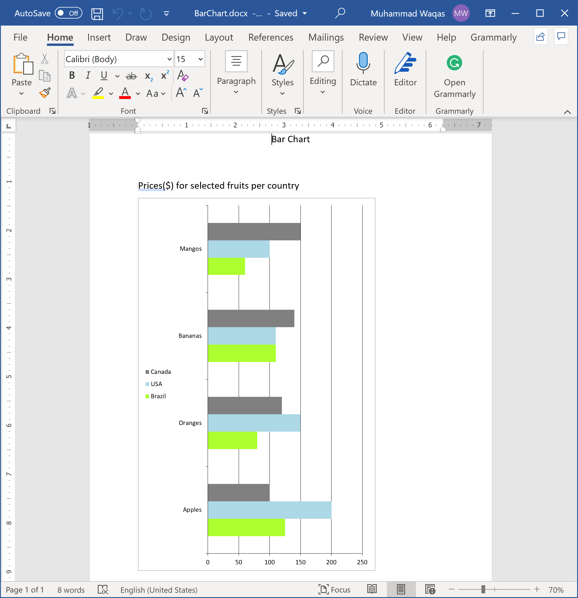
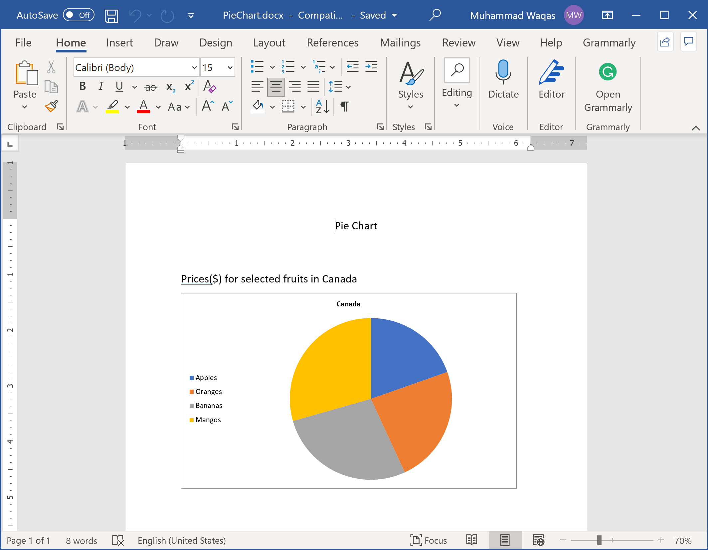

# Add Charts

A chart is a tool you can use to communicate data graphically. Including a chart in your document can allow your reader to see the meaning behind the numbers, and it can make showing comparisons and trends easier.

You can make a chart in Word if you have lots of data to chart. Let's consider we have the following data of fruits prices in different countries.

```csharp
class FruitsData
{
    public string Name { get; set; }
    public double Price { get; set; }

    public static List<FruitsData> CreateCanadaPrices()
    {
        var canada = new List<FruitsData>();
        canada.Add(new FruitsData() { Name = "Apples", Price = 100 });
        canada.Add(new FruitsData() { Name = "Oranges", Price = 120 });
        canada.Add(new FruitsData() { Name = "Bananas", Price = 140 });
        canada.Add(new FruitsData() { Name = "Mangos", Price = 150 });
        return canada;
    }

    public static List<FruitsData> CreateUSAPrices()
    {
        var usa = new List<FruitsData>();
        usa.Add(new FruitsData() { Name = "Apples", Price = 200 });
        usa.Add(new FruitsData() { Name = "Oranges", Price = 150 });
        usa.Add(new FruitsData() { Name = "Bananas", Price = 110 });
        usa.Add(new FruitsData() { Name = "Mangos", Price = 100 });
        return usa;
    }

    public static List<FruitsData> CreateBrazilPrices()
    {
        var brazil = new List<FruitsData>();
        brazil.Add(new FruitsData() { Name = "Apples", Price = 125 });
        brazil.Add(new FruitsData() { Name = "Oranges", Price = 80 });
        brazil.Add(new FruitsData() { Name = "Bananas", Price = 110 });
        brazil.Add(new FruitsData() { Name = "Mangos", Price = 60 });
        return brazil;
    }
}
```

**DocX** allows you to draw charts from the given data as shown in the following example.

```csharp
public static void BarChart()
{
    using (var document = DocX.Create(@"D:\BarChart.docx"))
    {
        // Add a title
        document.InsertParagraph("Bar Chart").FontSize(15d).SpacingAfter(50d).Alignment = Alignment.center;

        // Create a bar chart.
        var c = new BarChart();
        c.AddLegend(ChartLegendPosition.Left, false);
        c.BarDirection = BarDirection.Bar;
        c.BarGrouping = BarGrouping.Standard;
        c.GapWidth = 200;


        // Create the data.
        var canada = FruitsData.CreateCanadaPrices();
        var usa = FruitsData.CreateUSAPrices();
        var brazil = FruitsData.CreateBrazilPrices();

        // Create and add series
        var s1 = new Series("Brazil");
        s1.Color = Color.GreenYellow;
        s1.Bind(brazil, "Name", "Price");
        c.AddSeries(s1);

        var s2 = new Series("USA");
        s2.Color = Color.LightBlue;
        s2.Bind(usa, "Name", "Price");
        c.AddSeries(s2);

        var s3 = new Series("Canada");
        s3.Color = Color.Gray;
        s3.Bind(canada, "Name", "Price");
        c.AddSeries(s3);

        // Insert the chart into the document.
        document.InsertParagraph("Prices(M$) for selected fruits per country").FontSize(15).SpacingAfter(10d);
        document.InsertChart(c, 350f, 550f);

        document.Save();
    }
}
```

Now when you execute the above example, you will see that the word document is created that contains the bar chart.



You can also draw other charts like pie charts, line charts, etc. The following example creates a pie chart in a word document.

```csharp
public static void PieChart()
{
    using (var document = DocX.Create(@"D:\PieChart.docx"))
    {
        // Add a title
        document.InsertParagraph("Pie Chart").FontSize(15d).SpacingAfter(50d).Alignment = Alignment.center;

        // Create a pie chart.
        var c = new PieChart();
        c.AddLegend(ChartLegendPosition.Left, false);

        // Create the data.
        var brazil = FruitsData.CreateCanadaPrices();

        // Create and add series
        var s1 = new Series("Canada");
        s1.Bind(brazil, "Name", "Price");
        c.AddSeries(s1);

        // Insert chart into document
        document.InsertParagraph("Prices($) for selected fruits in Canada").FontSize(15).SpacingAfter(10d);
        document.InsertChart(c);

        document.Save();
    }
}
```

Now when you execute the above example, you will see that the word document is created that contains the pie chart.

