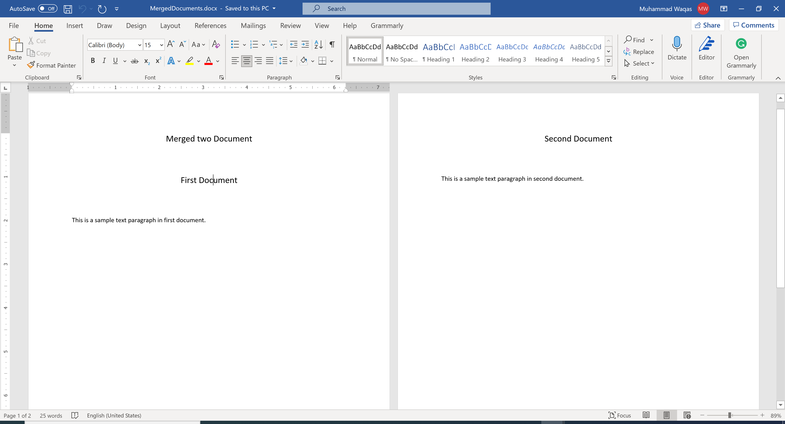

# Append Document

In most software applications sometimes you need to export a report with word or any other format and you may also need to merge multiple exported documents into a single document as per requirements.

 - To merge word documents, you need to collect contents from several documents and then put them into one. 
 - You will also need to put these documents in particular order to merge them according to contents of documents. 

**DocX** provides a easy and efficient way to merge two or more existing word documents.

Let's consider we have two word documents and we need to merge them into a single word document.

```csharp
public static void Example1()
{
    using (var document1 = DocX.Load(@"D:\one.docx"))
    {
        // Load the second document.
        using (var document2 = DocX.Load(@"D:\two.docx"))
        {
            // Add a title
            var t = document1.InsertParagraph(0, "Merged two Document", false);
            t.FontSize(15d);
            t.SpacingAfter(50d);
            t.Alignment = Alignment.center;

            document1.InsertDocument(document2, true);

            // Save this document to disk.
            document1.SaveAs(@"D:\MergedDocuments.docx");
        }
    }
}
```

As you can see in the above example, first it will load **one.docx** and then load **two.docx**

The second parameter of `InsertDocument()` specifies where to add the document content. When `true`, document is added at the end and when `false`, document is added at beginning.

Now when you execute the above example, you will see that the new word document is created that contains the data of both word documents.



