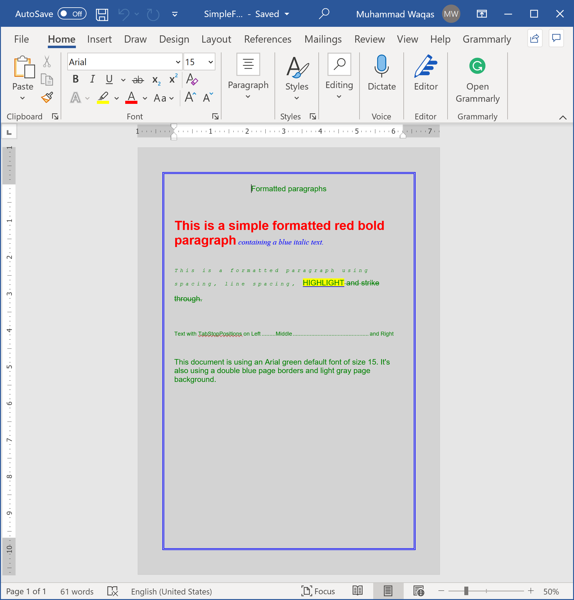

# Format Text

Formatted text can draw the reader's attention to specific parts of a document and emphasize important information. In Word, you have several options for adjusting text, including font, size, and color. You can also adjust the alignment of the text to change how it is displayed on the page.

**DocX** allows you to create, format, and position paragraphs as shown in the following example.

```csharp
public static void Example1()
{
    // Create a document.
    using (var document = DocX.Create(@"D:\SimpleFormattedParagraphs.docx"))
    {
        document.SetDefaultFont(new Xceed.Document.NET.Font("Arial"), 15d, Color.Green);
        document.PageBackground = Color.LightGray;
        document.PageBorders = new Borders(new Border(BorderStyle.Tcbs_double, BorderSize.five, 20f, Color.Blue));

        // Add a title
        document.InsertParagraph("Formatted paragraphs").FontSize(15d).SpacingAfter(50d).Alignment = Alignment.center;

        // Insert a Paragraph into this document.
        var p = document.InsertParagraph();

        // Append some text and add formatting.
        p.Append("This is a simple formatted red bold paragraph")
        .Font(new Xceed.Document.NET.Font("Arial"))
        .FontSize(25)
        .Color(Color.Red)
        .Bold()
        .Append(" containing a blue italic text.").Font(new Xceed.Document.NET.Font("Times New Roman")).Color(Color.Blue).Italic()
        .SpacingAfter(40);

        // Insert another Paragraph into this document.
        var p2 = document.InsertParagraph();

        // Append some text and add formatting.
        p2.Append("This is a formatted paragraph using spacing, line spacing, ")
        .Font(new Xceed.Document.NET.Font("Courier New"))
        .FontSize(10)
        .Italic()
        .Spacing(5)
        .SpacingLine(22)
        .Append("highlight").Highlight(Highlight.yellow).UnderlineColor(Color.Blue).CapsStyle(CapsStyle.caps)
        .Append(" and strike through.").StrikeThrough(StrikeThrough.strike)
        .SpacingAfter(40);

        // Insert another Paragraph into this document.
        var p3 = document.InsertParagraph();

        // Append some text with 2 TabStopPositions.
        p3.InsertTabStopPosition(Alignment.center, 216f, TabStopPositionLeader.dot)
        .InsertTabStopPosition(Alignment.right, 432f, TabStopPositionLeader.dot)
        .Append("Text with TabStopPositions on Left\tMiddle\tand Right")
        .FontSize(11d)
        .SpacingAfter(40);

        // Insert another Paragraph into this document.
        var p4 = document.InsertParagraph();
        p4.Append("This document is using an Arial green default font of size 15. It's also using a double blue page borders and light gray page background.")
          .SpacingAfter(40);

        // Save this document to disk.
        document.Save();
    }
}
```

When you execute the above example, you will see that a table is inserted in a word document.

 

