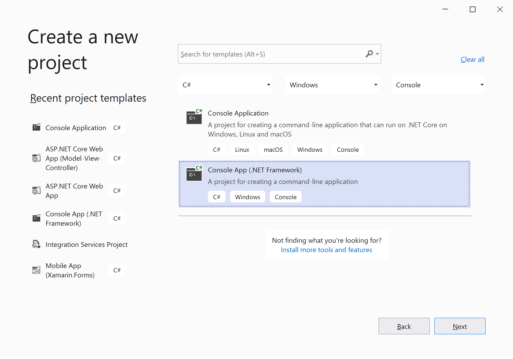
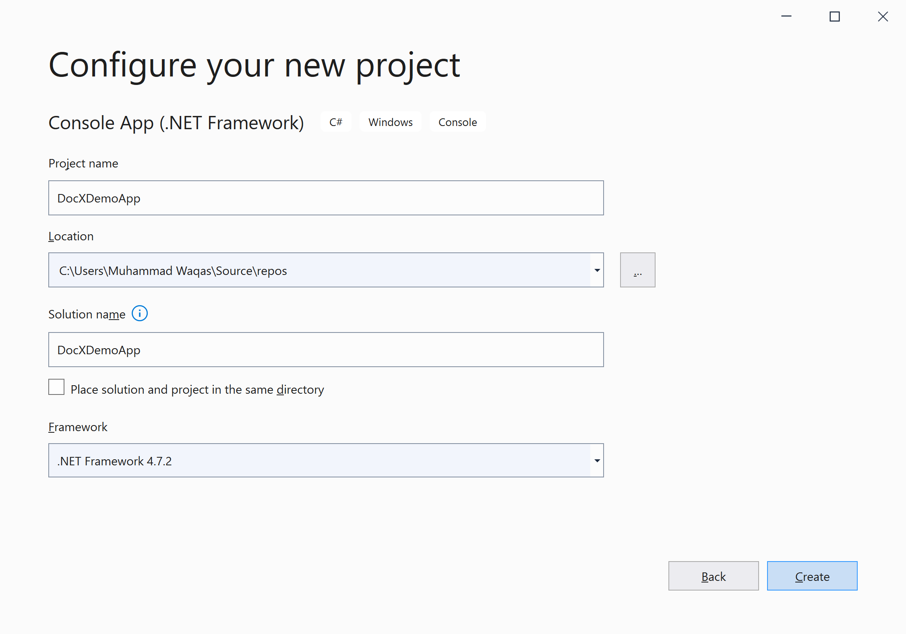
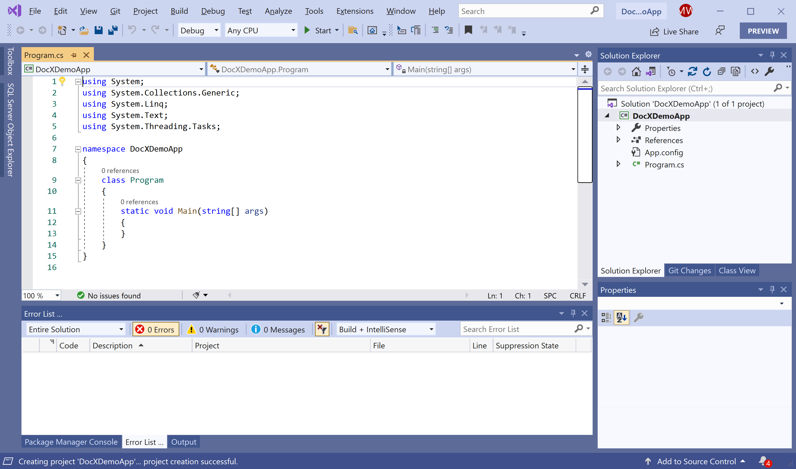
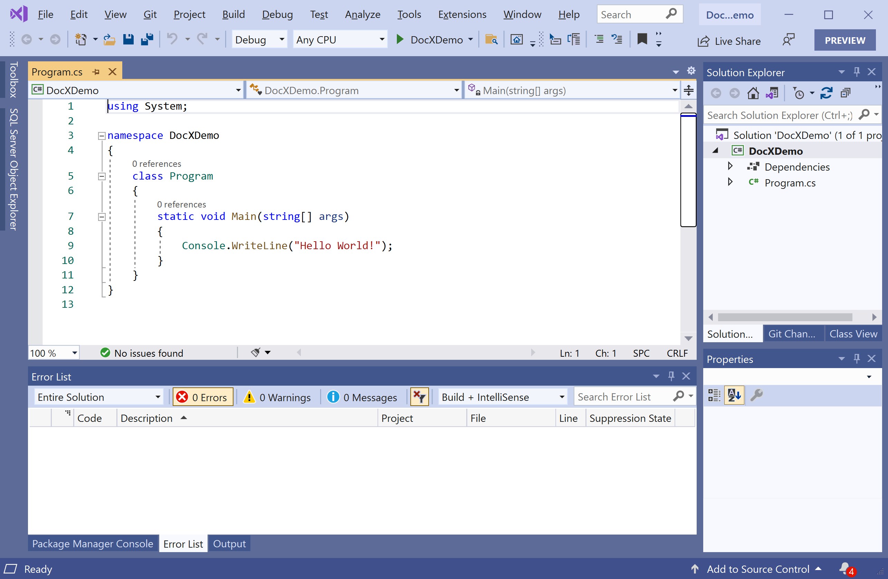
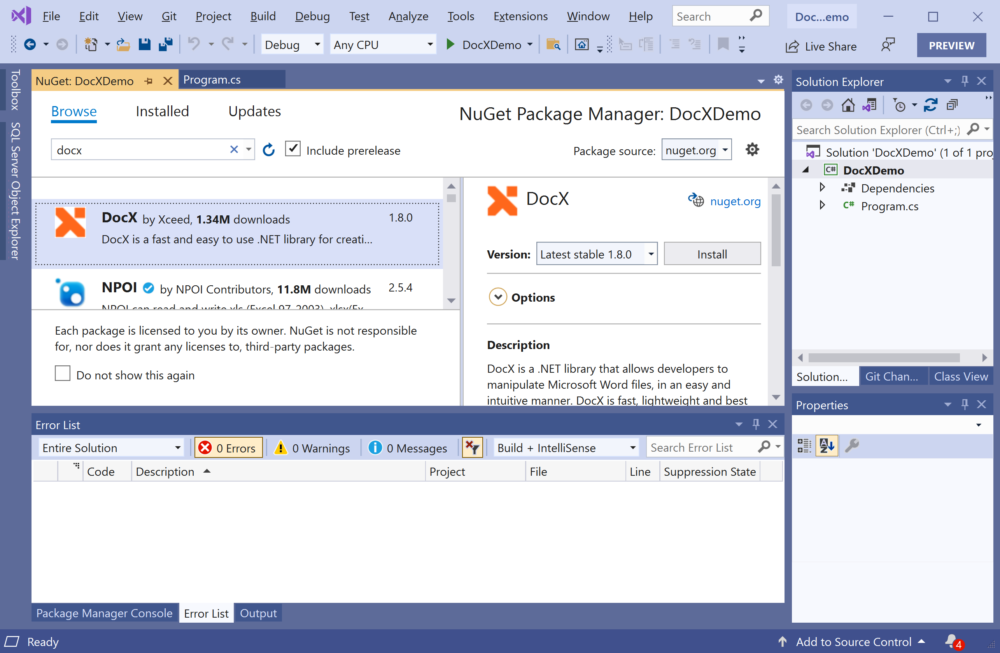

# Getting Started

**DocX** is a NuGet library that allows you to manipulate Word files, in a simple and easy manner. It is fast, lightweight and the most important advantage of using this library is that it does not require Microsoft Word or Office to be installed.

## Features

 - Create new Word documents
 - Modify Word documents
 - Supports *.docx format from Word 2007 and later
 - Modify multiple documents in parallel for better performance
 - Apply a template to a Word document
 - Join documents, recreate portions from one to another
 - Supports document protection with or without password
 - Set document margins and page 
 - Set line spacing, indentation, text direction, text alignment
 - Manage fonts and font sizes
 - Set text color, bold, underline, italic, strikethrough, highlighting
 - Set page numbering
 - Create sections

## Installation

You can easily install it from the **Package Manager Console** window by running the following command.

```csharp
PM> Install-Package DocX
```

## Environment Setup

To start using the **DocX** in your application, you will need to install the [DocX](https://www.nuget.org/packages/DocX) NuGet package.

Let's open the Visual Studio and create a new project.


Select the **Create a new project** option.



Choose **C#** as language, **Windows** as a platform, and **Console** as the project type. In the template pane, select **Console App (.NET Framework)** and click the **Next** button.



Enter the project name, you can change the location and solution name, but we will leave it and click on the **Next** button.  



You can see a new web application project is created. Now to install an **DocX**, right-click on the project in **Solution Explorer**, and select **Manage NuGet Packages...**



Select the **Browse** tab and search for **DocX** and install the latest version by pressing the **Install** button. 



Once **DocX** has been successfully installed. You are now ready to start your application.
