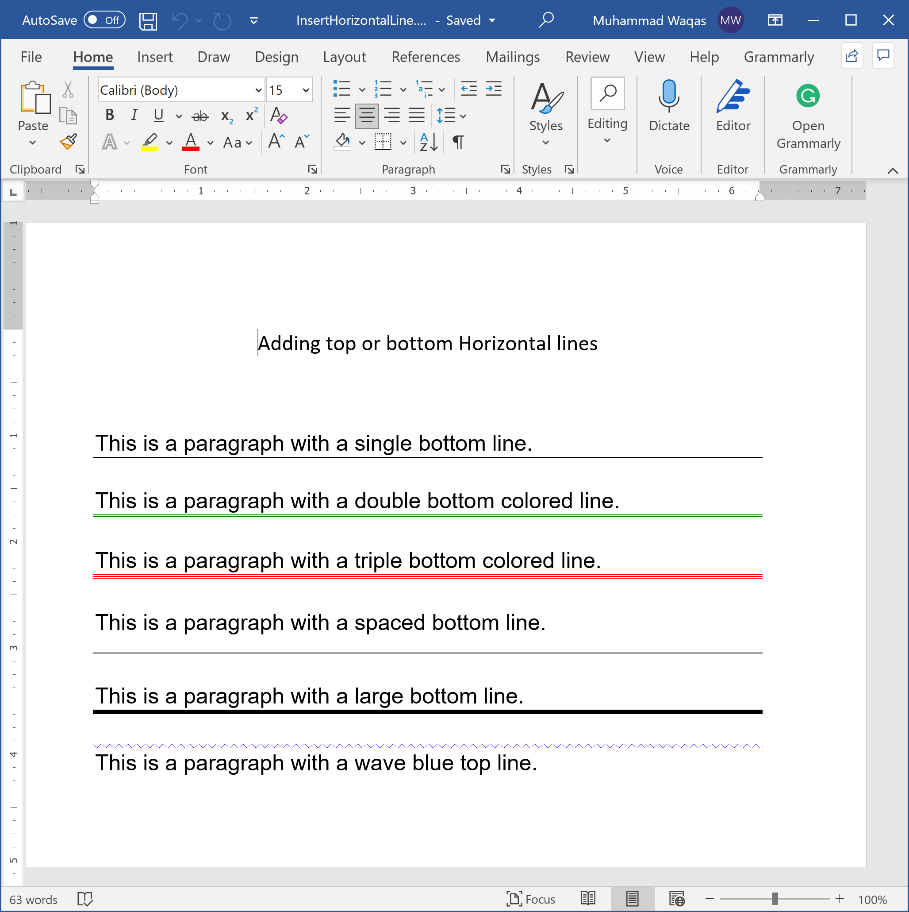

# Insert Line

Lines are a basic design element. In Microsoft Word, a horizontal or vertical line can divide a document and guide the flow of the text. You can insert a line in Word and format it in different ways to change a humble line into something more appealing.

Let's consider the following example that creates different kinds of horizontal lines.
 
```csharp
public static void Example1()
{
    using (var document = DocX.Create(@"D:\InsertHorizontalLine.docx"))
    {
        // Add a title
        document.InsertParagraph("Adding top or bottom Horizontal lines").FontSize(15d).SpacingAfter(50d).Alignment = Alignment.center;

        // Add a paragraph with a single line.
        var p = document.InsertParagraph();
        p.Append("This is a paragraph with a single bottom line.").Font(new Xceed.Document.NET.Font("Arial")).FontSize(15);
        p.InsertHorizontalLine(HorizontalBorderPosition.bottom, BorderStyle.Tcbs_single);
        p.SpacingAfter(20);

        // Add a paragraph with a double green line.
        var p2 = document.InsertParagraph();
        p2.Append("This is a paragraph with a double bottom colored line.").Font(new Xceed.Document.NET.Font("Arial")).FontSize(15);
        p2.InsertHorizontalLine(HorizontalBorderPosition.bottom, BorderStyle.Tcbs_double, 6, 1, Color.Green);
        p2.SpacingAfter(20);

        // Add a paragraph with a triple red line.
        var p3 = document.InsertParagraph();
        p3.Append("This is a paragraph with a triple bottom colored line.").Font(new Xceed.Document.NET.Font("Arial")).FontSize(15);
        p3.InsertHorizontalLine(HorizontalBorderPosition.bottom, BorderStyle.Tcbs_triple, 6, 1, Color.Red);
        p3.SpacingAfter(20);

        // Add a paragraph with a single spaced line.
        var p4 = document.InsertParagraph();
        p4.Append("This is a paragraph with a spaced bottom line.").Font(new Xceed.Document.NET.Font("Arial")).FontSize(15);
        p4.InsertHorizontalLine(HorizontalBorderPosition.bottom, BorderStyle.Tcbs_single, 6, 12);
        p4.SpacingAfter(20);

        // Add a paragraph with a single large line.
        var p5 = document.InsertParagraph();
        p5.Append("This is a paragraph with a large bottom line.").Font(new Xceed.Document.NET.Font("Arial")).FontSize(15);
        p5.InsertHorizontalLine(HorizontalBorderPosition.bottom, BorderStyle.Tcbs_single, 25);
        p5.SpacingAfter(60);

        // Add a paragraph with a wave blue top line.
        var p6 = document.InsertParagraph();
        p6.Append("This is a paragraph with a wave blue top line.").Font(new Xceed.Document.NET.Font("Arial")).FontSize(15);
        p6.InsertHorizontalLine(HorizontalBorderPosition.top, BorderStyle.Tcbs_wave, 6, 1, Color.FromArgb(0, 0, 255));
        p5.SpacingAfter(20);

        document.Save();
    }
}
```

Now when you execute the above example, you will see that the word document is created that contains horizontal lines.

 
