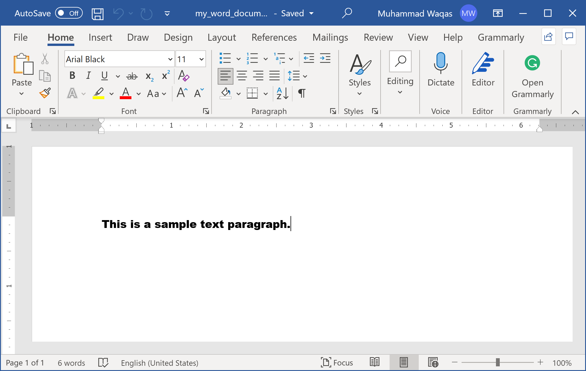
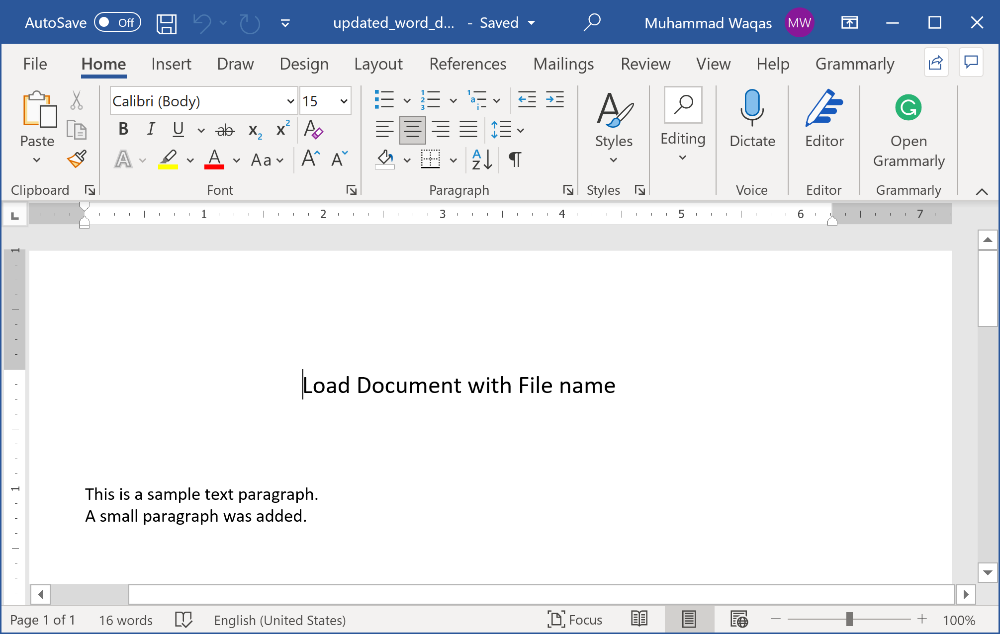
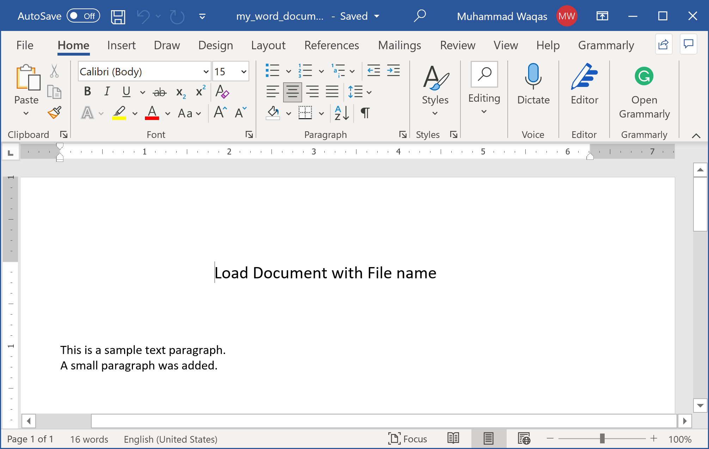

# Modify Document

When you are working with word files, you will not be creating new documents all the time. Sometimes, you will also need to edit the existing documents. **DocX** provides easy way to open the existing document and add changes to your document as needed.

Let's consider the following word document which we have created in the previous article.



Now we want to add some more content to this document as shown in the following example.

```csharp
public static void Example1()
{
    using (var doc = DocX.Load(@"D:\my_word_document.docx"))
    {
        // Add a title
        doc.InsertParagraph(0, "Load Document with File name", false).FontSize(15d).SpacingAfter(50d).Alignment = Alignment.center;

        // Insert a Paragraph into this document.
        var p = doc.InsertParagraph();

        // Append some text and add formatting.
        p.Append("A small paragraph was added.");

        doc.SaveAs(@"D:\updated_word_document.docx");
    }
}
```

In the above example, you will see that we have called `SaveAs()` method which save the changes to the new file.

When you execute the above example, you will see that the new word document is created that contains the following data.



If you want to save the changes to the same file, you can just call the `Save()` method as shown below.

```csharp
public static void Example2()
{
    using (var doc = DocX.Load(@"D:\my_word_document.docx"))
    {
        // Add a title
        doc.InsertParagraph(0, "Load Document with File name", false).FontSize(15d).SpacingAfter(50d).Alignment = Alignment.center;

        // Insert a Paragraph into this document.
        var p = doc.InsertParagraph();

        // Append some text and add formatting.
        p.Append("A small paragraph was added.");

        doc.Save();
    }
}
```

Now when you execute the above example, you will see that the new word document is created that contains the following data.


