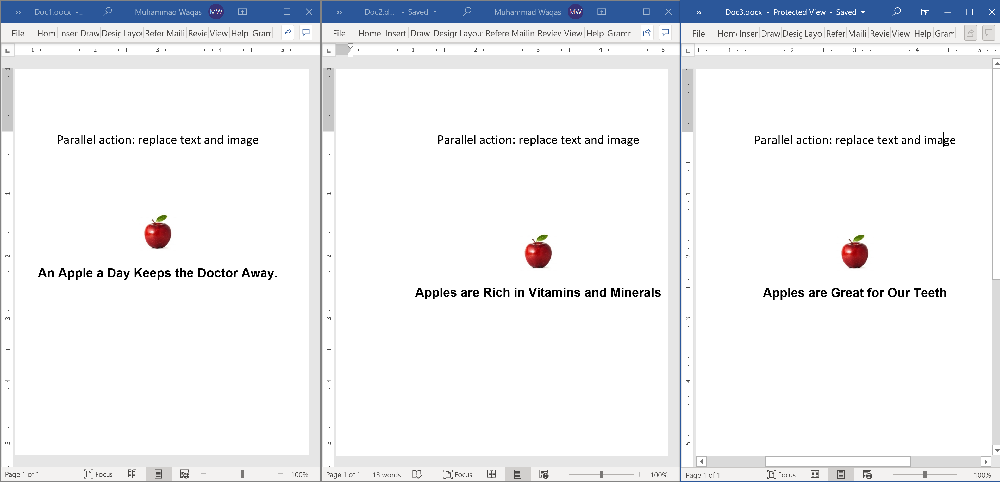
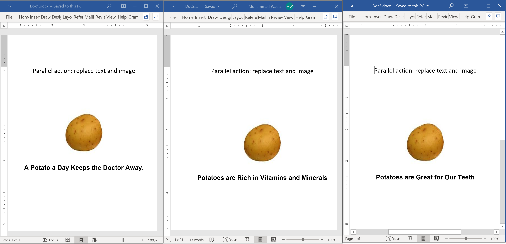

# Modify Multiple Documents in Parallel

**DocX** allows you to modify multiple documents in parallel for better performance. Let's consider the following three documents and each document contains an image and some text.

 

The following example replaces the text and image in parallel by using the `Parallel.ForEach`.

```csharp
public static void Example1()
{
    Console.WriteLine("\tDoParallelActions()");

    // Get the docx files from the directory.
    var inputDir = new DirectoryInfo(@"D:\");
    var inputFiles = inputDir.GetFiles("*.docx");

    // Loop through each document and do actions on them.
    Parallel.ForEach(inputFiles, f => Action(f));
}

private static void Action(FileInfo file)
{
    // Load the document.
    using (var document = DocX.Load(file.FullName))
    {
        // Replace texts in this document.
        document.ReplaceText("Apples", "Potatoes");
        document.ReplaceText("An Apple", "A Potato");

        // create the new image
        var newImage = document.AddImage(@"D:\potato.jpg");

        // Look in each paragraph and remove its first image to replace it with the new one.
        foreach (var p in document.Paragraphs)
        {
            var oldPicture = p.Pictures.FirstOrDefault();
            if (oldPicture != null)
            {
                oldPicture.Remove();
                p.AppendPicture(newImage.CreatePicture(112f, 112f));
            }
        }

        document.Save();
    }
}
```

When you execute the above example, you will see that all the word documents are updated.

 