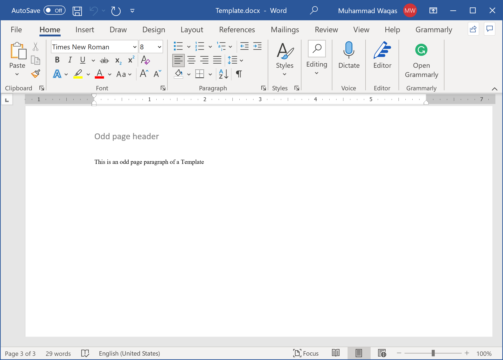
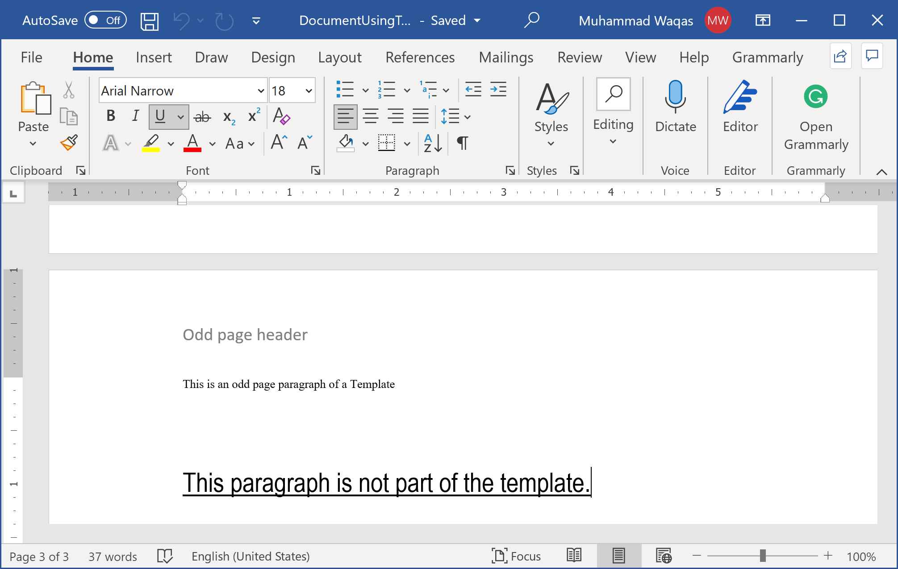

# Use Template

In most enterprises, word documents are widely generated automatically for creating a huge number of reports. Sometimes, the documents are created from scratch, but usually predefined templates are used to generate Word documents by populating the placeholders. 

**DocX** provides an easy and efficient way to generate a word document by using the predefined template.

Let's consider the following word template which contains some predefined content.



Now we want to generate a new word document that must contain data from the template as well as some additional data that will be added at run time as shown in the following example.

```csharp
public static void Example1()
{
    using (var document = DocX.Create(@"D:\DocumentUsingTemplate.docx"))
    {
        var templatePath = @"D:\Template.docx";

        document.ApplyTemplate(templatePath);

        // Add a paragraph at the end of the template.
        var t = document.InsertParagraph("This paragraph is not part of the template.");
        t.Font("Arial Narrow");
        t.FontSize(18d);
        t.UnderlineStyle(UnderlineStyle.singleLine);
        t.SpacingBefore(50d);

        // Save this document to disk.
        document.Save();
    }
}
```

As you can see in the above example, first it will create a **DocumentUsingTemplate.docx**, apply the predefine template **Template.docx** and then add a text paragraph at the end.

Now when you execute the above example, you will see that the new word document is created that contains the data from the template.

