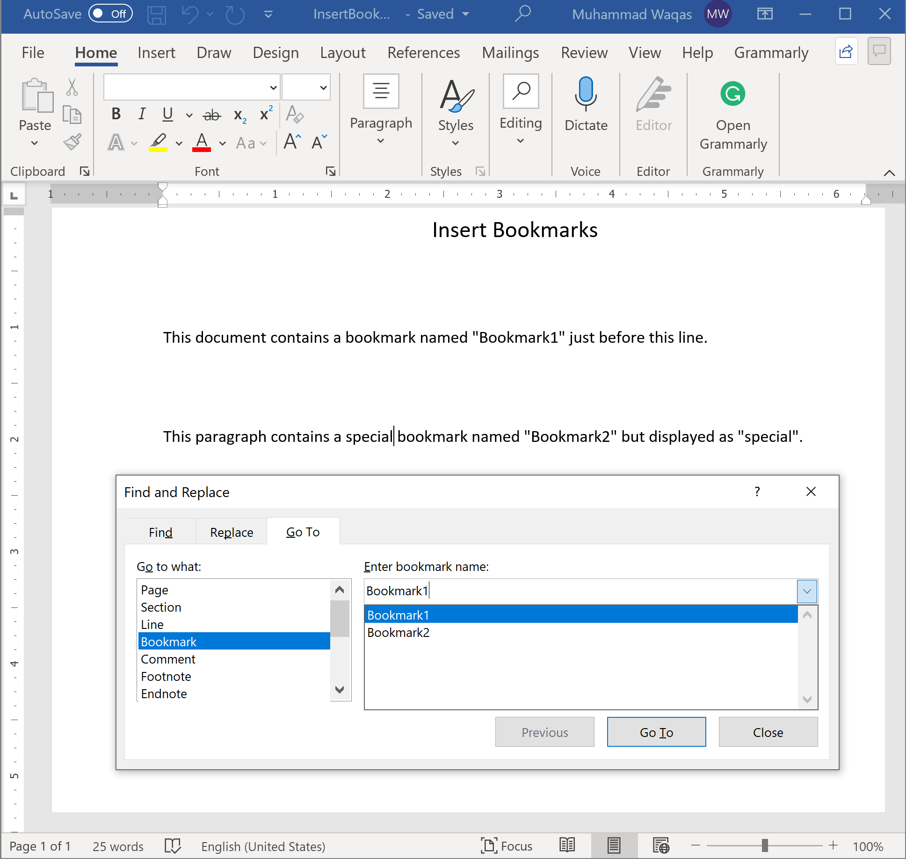

# Working with Bookmarks

A bookmark in Word works like a bookmark you might place in a book: it marks a place that you want to find again easily. You can enter as many bookmarks as you want in your document or Outlook message, and you can give each one a unique name so they’re easy to identify.

Let's consider the following example which inserts two bookmarks in a document.

```csharp
public static void Example1()
{
    // Create a document
    using (var document = DocX.Create(@"D:\InsertBookmarks.docx"))
    {
        // Add a title
        document.InsertParagraph("Insert Bookmarks").FontSize(15d).SpacingAfter(40d).Alignment = Alignment.center;

        // Insert a bookmark in the document.
        document.InsertBookmark("Bookmark1");

        // Add a paragraph
        var p = document.InsertParagraph("This document contains a bookmark named \"");
        p.Append(document.Bookmarks.First().Name);
        p.Append("\" just before this line.");
        p.SpacingAfter(50d);

        var _bookmarkName = "Bookmark2";
        var _displayedBookmarkName = "special";

        // Add another paragraph.
        var p2 = document.InsertParagraph("This paragraph contains a ");
        // Add a bookmark into the paragraph.
        p2.AppendBookmark(_bookmarkName);
        p2.Append(" bookmark named \"");
        p2.Append(document.Bookmarks.Last().Name);
        p2.Append("\" but displayed as \"" + _displayedBookmarkName + "\".");

        // Inserts the provided text at a bookmark location in this Paragraph.
        p2.InsertAtBookmark(_displayedBookmarkName, _bookmarkName);

        document.Save();
    }
}
```

When you execute the above example, you will see that bookmarks are added.

 
