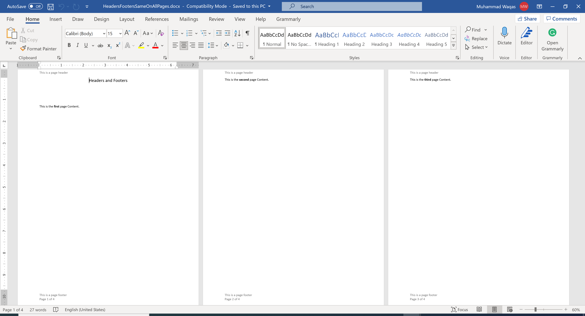
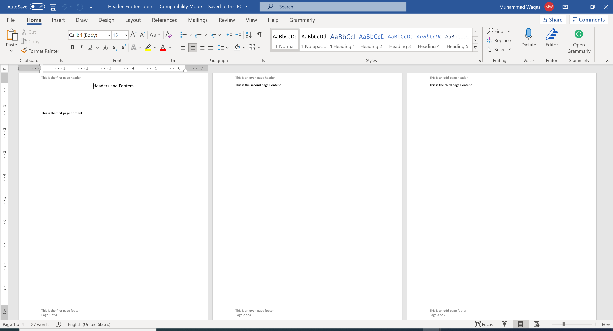

# Working with Headers and Footers

In a Word document, a header is the top margin of each page, and a footer is the bottom margin of each page. Headers and footers are useful for including material that you want to appear on every page of a document such as your name, the title of the document, or page numbers. 

**DocX** allows you to easily add headers and footers to your word document as shown in the following example.

```csharp
public static void Example1()
{
    using (var document = DocX.Create(@"D:\HeadersFootersSameOnAllPages.docx"))
    {
        // Add a title
        document.InsertParagraph("Headers and Footers").FontSize(15d).SpacingAfter(50d).Alignment = Alignment.center;

        // Insert a Paragraph in the first page of the document.
        var p1 = document.InsertParagraph("This is the ").Append("first").Bold().Append(" page Content.");
        p1.SpacingBefore(70d);
        p1.InsertPageBreakAfterSelf();

        // Insert a Paragraph in the second page of the document.
        var p2 = document.InsertParagraph("This is the ").Append("second").Bold().Append(" page Content.");
        p2.InsertPageBreakAfterSelf();

        // Insert a Paragraph in the third page of the document.
        var p3 = document.InsertParagraph("This is the ").Append("third").Bold().Append(" page Content.");
        p3.InsertPageBreakAfterSelf();

        // Insert a Paragraph in the third page of the document.
        var p4 = document.InsertParagraph("This is the ").Append("fourth").Bold().Append(" page Content.");

        // Add Headers and Footers to the document.
        document.AddHeaders();
        document.AddFooters();

        // Insert a Paragraph into the Header.
        document.Headers.Odd.InsertParagraph("This is a page header");

        // Insert a Paragraph and Page number into the Footer.
        document.Footers.Odd.InsertParagraph("This is a page footer");
        document.Footers.Odd.InsertParagraph("Page ").AppendPageNumber(PageNumberFormat.normal).Append(" of ").AppendPageCount(PageNumberFormat.normal);

        document.Save();
    }
}
```

When you execute the above example, you will see that the word document is created that contains the same headers and footers on all pages.



You can also specify different headers and footers on the First, Odd, and Even pages as shown in the following example.

```csharp
public static void Example2()
{
    using (var document = DocX.Create(@"D:\HeadersFooters.docx"))
    {
        // Add a title
        document.InsertParagraph("Headers and Footers").FontSize(15d).SpacingAfter(50d).Alignment = Alignment.center;

        // Insert a Paragraph in the first page of the document.
        var p1 = document.InsertParagraph("This is the ").Append("first").Bold().Append(" page Content.");
        p1.SpacingBefore(70d);
        p1.InsertPageBreakAfterSelf();

        // Insert a Paragraph in the second page of the document.
        var p2 = document.InsertParagraph("This is the ").Append("second").Bold().Append(" page Content.");
        p2.InsertPageBreakAfterSelf();

        // Insert a Paragraph in the third page of the document.
        var p3 = document.InsertParagraph("This is the ").Append("third").Bold().Append(" page Content.");
        p3.InsertPageBreakAfterSelf();

        // Insert a Paragraph in the third page of the document.
        var p4 = document.InsertParagraph("This is the ").Append("fourth").Bold().Append(" page Content.");

        // Add Headers and Footers to the document.
        document.AddHeaders();
        document.AddFooters();

        // Force the first page to have a different Header and Footer.
        document.DifferentFirstPage = true;

        // Force odd & even pages to have different Headers and Footers.
        document.DifferentOddAndEvenPages = true;

        // Insert a Paragraph into the first Header.
        document.Headers.First.InsertParagraph("This is the ").Append("first").Bold().Append(" page header");

        // Insert a Paragraph and Page number into the first Footer.
        document.Footers.First.InsertParagraph("This is the ").Append("first").Bold().Append(" page footer");
        document.Footers.First.InsertParagraph("Page ").AppendPageNumber(PageNumberFormat.normal).Append(" of ").AppendPageCount(PageNumberFormat.normal);

        // Insert a Paragraph into the even Header.
        document.Headers.Even.InsertParagraph("This is an ").Append("even").Bold().Append(" page header");

        // Insert a Paragraph and Page number into the even Footer.
        document.Footers.Even.InsertParagraph("This is an ").Append("even").Bold().Append(" page footer");
        document.Footers.Even.InsertParagraph("Page ").AppendPageNumber(PageNumberFormat.normal).Append(" of ").AppendPageCount(PageNumberFormat.normal);

        // Insert a Paragraph into the odd Header.
        document.Headers.Odd.InsertParagraph("This is an ").Append("odd").Bold().Append(" page header");

        // Insert a Paragraph and Page number into the odd Footer.
        document.Footers.Odd.InsertParagraph("This is an ").Append("odd").Bold().Append(" page footer");
        document.Footers.Odd.InsertParagraph("Page ").AppendPageNumber(PageNumberFormat.normal).Append(" of ").AppendPageCount(PageNumberFormat.normal);

        document.Save();
        Console.WriteLine("\tCreated: HeadersFooters.docx\n");
    }
}
```

Now when you execute the above example, you will see that the word document is created that contains different headers and footers on the First, Odd, and Even pages.


