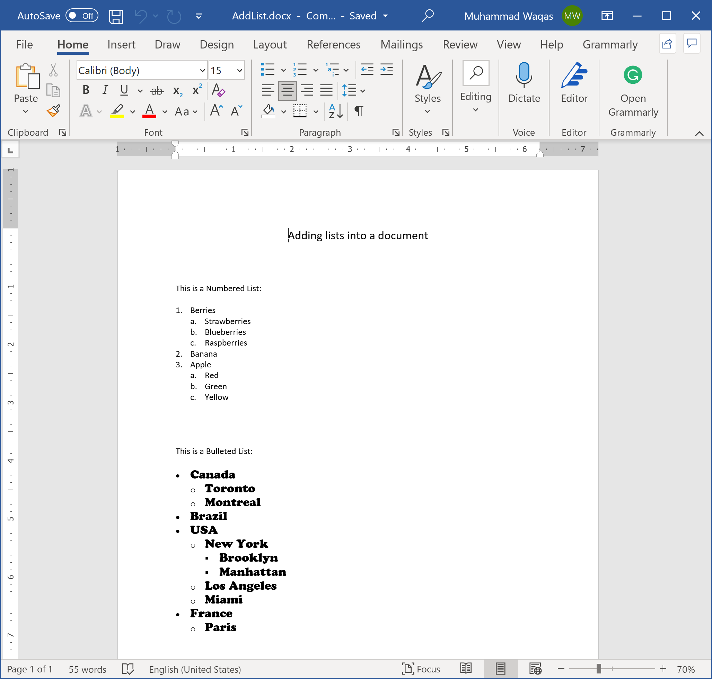

# Working With Lists

In Microsoft Word, a list is a series of items preceded by a bullet or number. You can apply bullets or numbers to a list, as well as modify the bullet type or numbering format to suit the requirements of the document.

Let's consider the following example that creates numbered and bulleted lists.
 
```csharp
public static void AddList()
{
    using (var document = DocX.Create(@"D:\AddList.docx"))
    {
        document.InsertParagraph("Adding lists into a document").FontSize(15d).SpacingAfter(50d).Alignment = Alignment.center;

        // Add a numbered list where the first ListItem is starting with number 1.
        var numberedList = document.AddList("Berries", 0, ListItemType.Numbered, 1);
        // Add Sub-items(level 1) to the preceding ListItem.
        document.AddListItem(numberedList, "Strawberries", 1);
        document.AddListItem(numberedList, "Blueberries", 1);
        document.AddListItem(numberedList, "Raspberries", 1);
        // Add an item (level 0)
        document.AddListItem(numberedList, "Banana");
        // Add an item (level 0)
        document.AddListItem(numberedList, "Apple");
        // Add Sub-items(level 1) to the preceding ListItem.
        document.AddListItem(numberedList, "Red", 1);
        document.AddListItem(numberedList, "Green", 1);
        document.AddListItem(numberedList, "Yellow", 1);

        // Add a bulleted list with its first item.
        var bulletedList = document.AddList("Canada", 0, ListItemType.Bulleted);
        // Add Sub-items(level 1) to the preceding ListItem.
        document.AddListItem(bulletedList, "Toronto", 1);
        document.AddListItem(bulletedList, "Montreal", 1);
        // Add an item (level 0)
        document.AddListItem(bulletedList, "Brazil");
        // Add an item (level 0)
        document.AddListItem(bulletedList, "USA");
        // Add Sub-items(level 1) to the preceding ListItem.
        document.AddListItem(bulletedList, "New York", 1);
        // Add Sub-items(level 2) to the preceding ListItem.
        document.AddListItem(bulletedList, "Brooklyn", 2);
        document.AddListItem(bulletedList, "Manhattan", 2);
        document.AddListItem(bulletedList, "Los Angeles", 1);
        document.AddListItem(bulletedList, "Miami", 1);
        // Add an item (level 0)
        document.AddListItem(bulletedList, "France");
        // Add Sub-items(level 1) to the preceding ListItem.
        document.AddListItem(bulletedList, "Paris", 1);

        // Insert the lists into the document.
        document.InsertParagraph("This is a Numbered List:\n");
        document.InsertList(numberedList);
        document.InsertParagraph().SpacingAfter(40d);
        document.InsertParagraph("This is a Bulleted List:\n");
        document.InsertList(bulletedList, new Xceed.Document.NET.Font("Cooper Black"), 15);

        document.Save();
    }
}
```

Now when you execute the above example, you will see that the word document is created that contains numbered and bulleted lists.

 