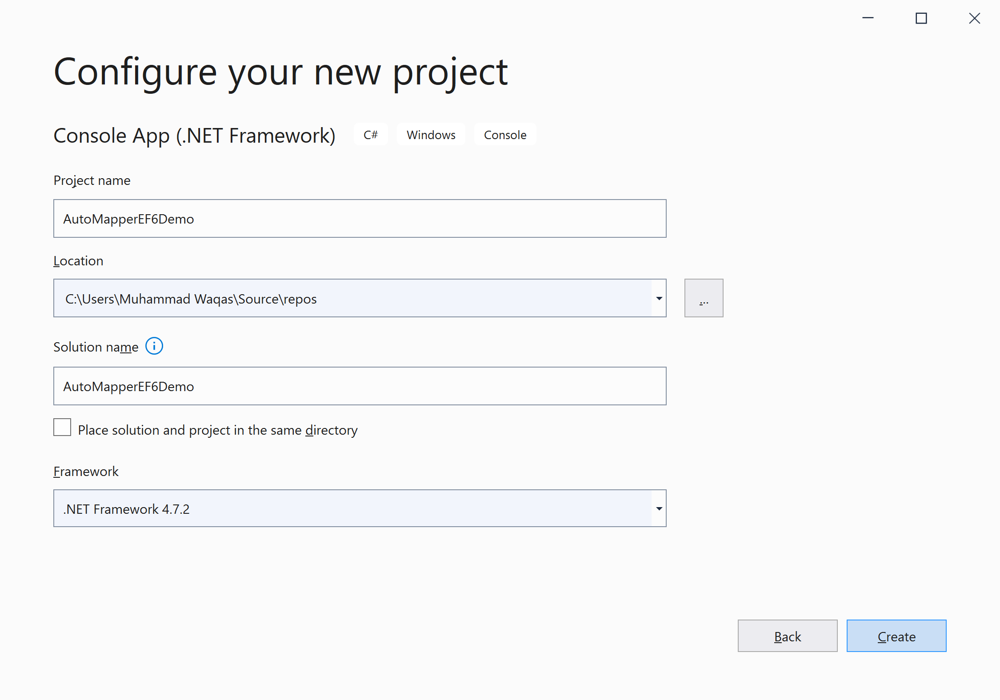
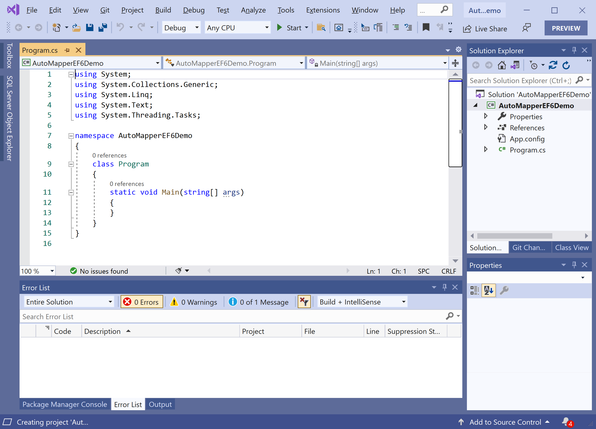
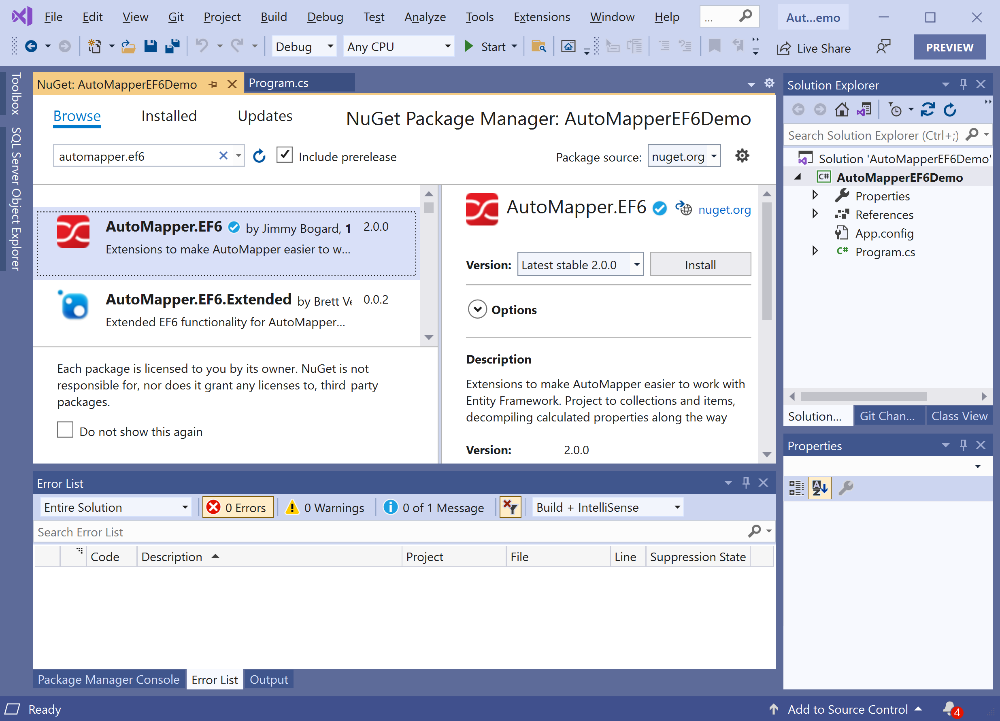
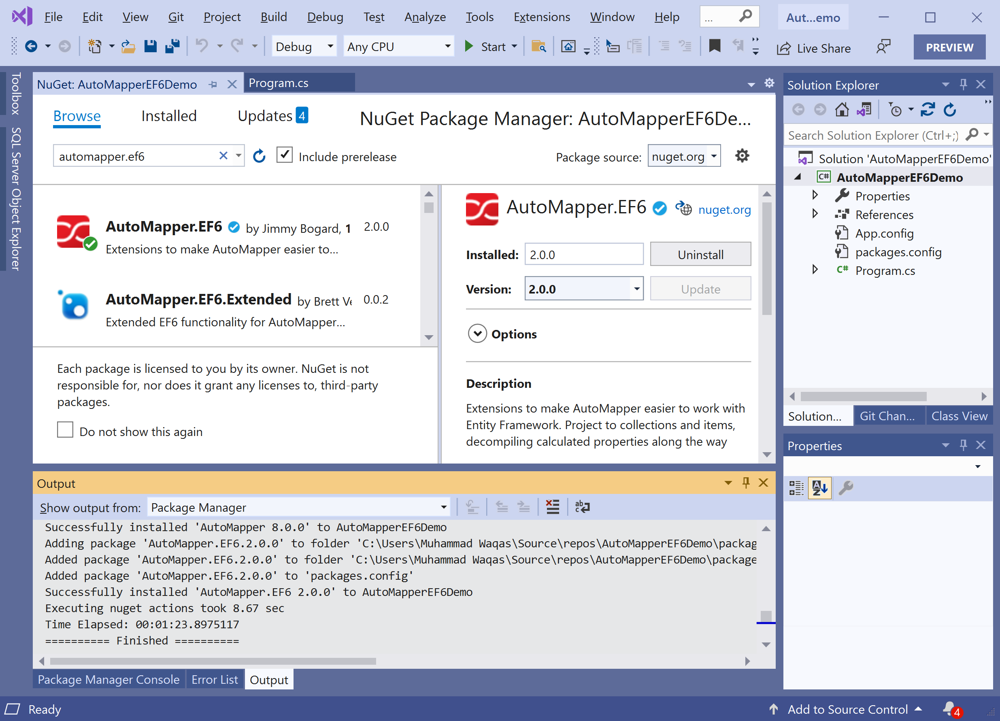

# Getting Started

## What is AutoMapper?

AutoMapper is a simple library that simplifies complex problems such as, mapping one object to another simply and easily without writing complex and boring code. 

**AutoMapper.EF6** is a NuGet library that provides some useful extensions for AutoMapper and EF6.

## Installation

You can easily install it from the **Package Manager Console** window by running the following command.

```csharp
PM> Install-Package AutoMapper.EF6
```

## Environment Setup

To start using the **AutoMapper.EF6** in your application, you will need to install the [AutoMapper.EF6](https://www.nuget.org/packages/AutoMapper.EF6) NuGet package.

Let's open the Visual Studio and create a new project.


Select the **Create a new project** option.


Choose **C#** as language, **Windows** as a platform, and **Console** as the project type. In the template pane, select **Console App (.NET Framework)** and click the **Next** button.



Enter the project name, you can change the location and solution name, but we will leave it and click on the **Next** button.  



You can see a new web application project is created. Now to install an **AutoMapper.EF6**, right-click on the project in **Solution Explorer**, and select **Manage NuGet Packages...**



Select the **Browse** tab and search for **AutoMapper.EF6** and install the latest version by pressing the **Install** button. 



Once **AutoMapper.EF6** has been successfully installed. You are now ready to start your application.
