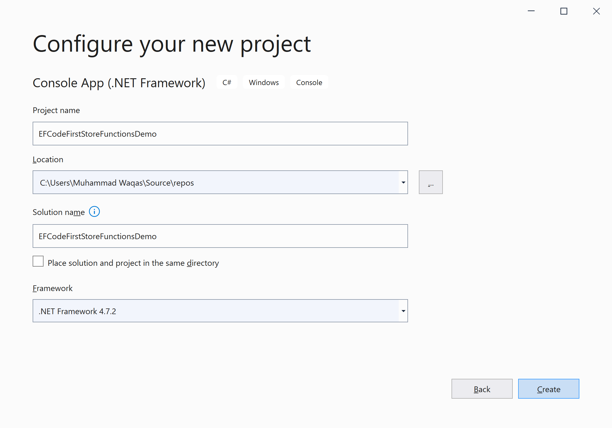
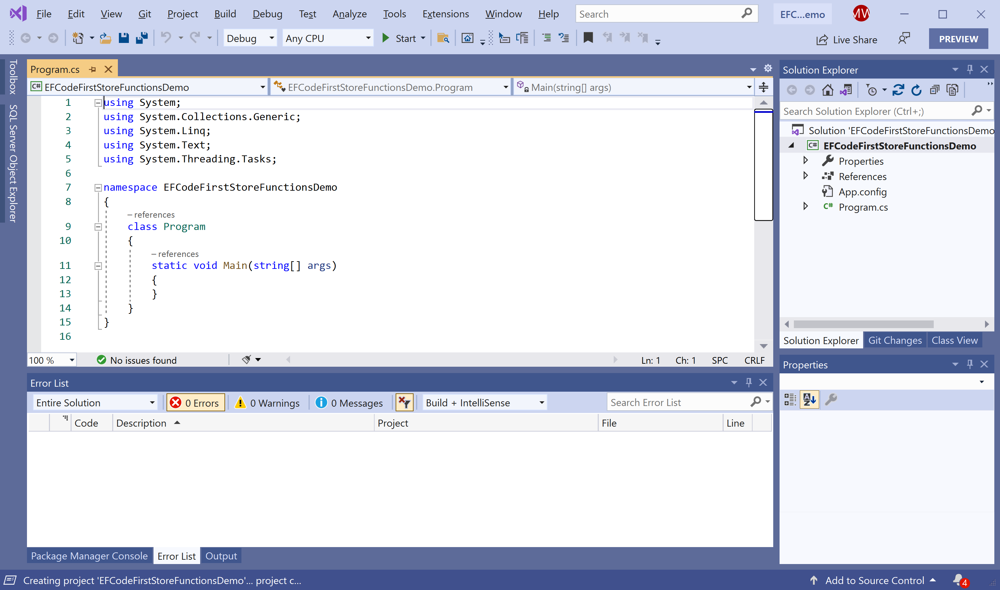
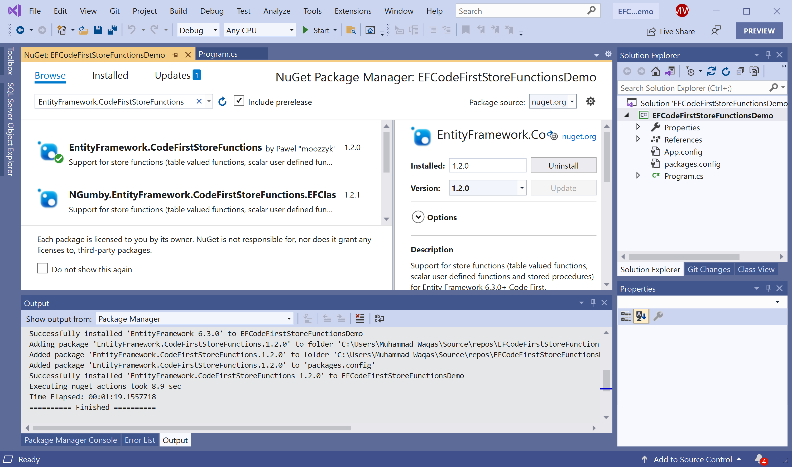

# Getting Started

When Entity Framework 6.1 was released, store functions such as, TVFs and Stored Procedures were only supported in Database First.

**EntityFramework.CodeFirstStoreFunctions** is a NuGet library that supports store functions like table valued functions, scalar user defined functions and stored procedures for Entity Framework Code First.

## Installation

You can easily install it from the **Package Manager Console** window by running the following command.

```csharp
PM> Install-Package EntityFramework.CodeFirstStoreFunctions
```

## Environment Setup

To start using the **EntityFramework.CodeFirstStoreFunctions** in your application, you will need to install the [EntityFramework.CodeFirstStoreFunctions](https://www.nuget.org/packages/EntityFramework.CodeFirstStoreFunctions) NuGet package.

Let's open the Visual Studio and create a new project.


Select the **Create a new project** option.


Choose **C#** as language, **Windows** as a platform, and **Console** as the project type. In the template pane, select **Console App (.NET Framework)** and click the **Next** button.



Enter the project name, you can change the location and solution name, but we will leave it and click on the **Next** button.  



You can see a new web application project is created. Now to install a **EntityFramework.CodeFirstStoreFunctions**, right-click on the project in **Solution Explorer**, and select **Manage NuGet Packages...**



Select the **Browse** tab and search for **EntityFramework.CodeFirstStoreFunctions** and install the latest version by pressing the **Install** button. 


Once **EntityFramework.CodeFirstStoreFunctions** has been successfully installed. You are now ready to start your application.
