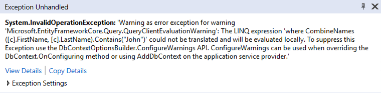

# Client vs Server Evaluation

Client vs. Server evaluation is a feature that makes it easier to write queries to the database because Entity Framework Core supports parts of the query being evaluated on the client and parts of it being pushed to the database. 

 - It is up to the database provider to determine which parts of the query will be evaluated in the database. 
 - Client/server evaluation enables queries to contain logic that cannot be evaluated in the database and must be evaluated after the data is retrieved into memory.
 - EF Core converts parts of the query into parameters, which it can evaluate on the client-side.

In the following example, a helper method is used to combine the first name and last name from a SQL Server database. 

```csharp
private static string CombineNames(string firstName, string lastName)
{
    return firstName + " " + lastName;
}
```

The SQL Server provider has no idea how this method is implemented, so it is not possible to translate it into SQL. All other aspects of the query are evaluated in the database, but combining the first name and last name through this method is performed on the client.

```csharp
var author = context.Authors
    .Where(a => a.AuthorId == 1)
    .Select(au => new
    {
        FullName = CombineNames(au.FirstName, au.LastName)
    }).FirstOrDefault();
```

## Unsupported client evaluation

Client/Server evaluation has some useful features, but in some cases, it can result in poor performance. In the following query, the helper method is now used in a filter, because this can't be performed in the database.


```csharp
var authors = context.Authors
    .Where(a => CombineNames(a.FirstName, a.LastName)
        .Contains("John"))
    .ToList();
```

All the data is pulled into memory, and then the filter is applied on the client. Depending on the amount of data, and how much of that data is filtered out, this could result in poor performance.

 - By default, EF Core logs a warning when client evaluation is performed. 
 - You can change the behavior in `DbContext.OnConfiguring` when client evaluation occurs to either throw an exception or ignore it.

```csharp
protected override void OnConfiguring(DbContextOptionsBuilder optionsBuilder)
{
    optionsBuilder.UseSqlServer(@"Data Source=(localdb)\ProjectsV13;Initial Catalog=AuthorDB;")
        .ConfigureWarnings(warnings => warnings.Throw(RelationalEventId.QueryClientEvaluationWarning));
}
```

Now the configuration is added in the `DbContext.OnConfiguring` to throw an exception. If a poorly performing query is found, it will throw the following exception with a warning.



## Explicit Client Evaluation

You may need to force into client evaluation explicitly in certain cases like following

The amount of data is small so that evaluating the client doesn't incur a huge performance penalty.
The LINQ operator being used has no server-side translation.
In such cases, you can explicitly opt into client evaluation by calling methods like `AsEnumerable` or `ToList` (`AsAsyncEnumerable` or `ToListAsync` for async). By using `AsEnumerable` you would be streaming the results, but using `ToList` would cause buffering by creating a list, which also takes additional memory. Though if you're enumerating multiple times, then storing results in a list helps more since there's only one query to the database. Depending on the particular usage, you should evaluate which method is more useful for the case.

```csharp
var authors = context.Authors
    .AsEnumerable()
    .Where(a => CombineNames(a.FirstName, a.LastName)
        .Contains("John"))
    .ToList();
```

