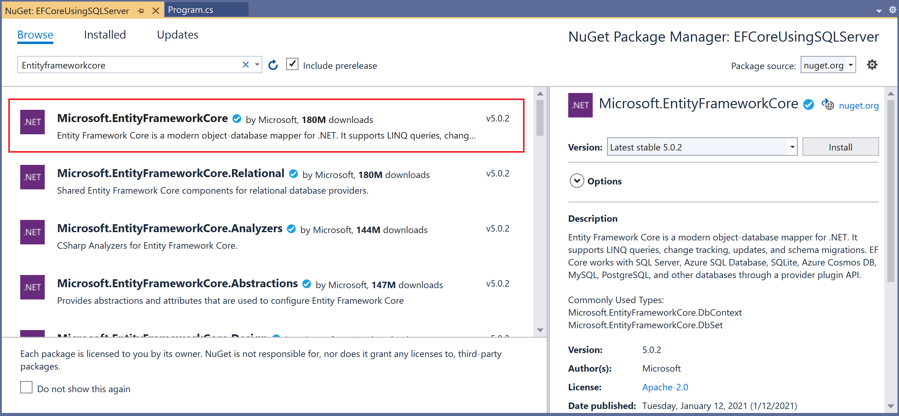
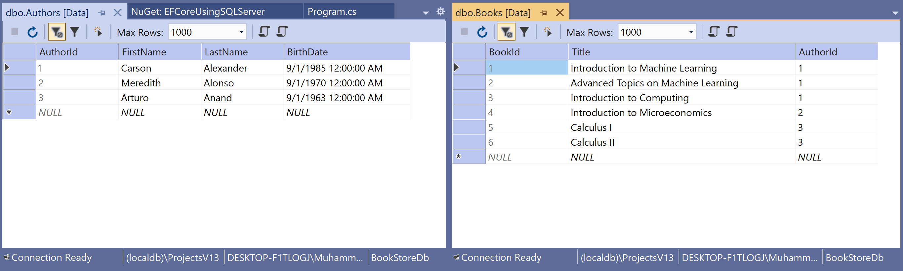

# Getting Started

## SQL Server Provider

Microsoft SQL Server is a relational database management system (RDBMS) that supports various transaction processing, business intelligence, and analytic applications in corporate IT environments.

 - You can install SQL Server provider by installing the [Microsoft.EntityFrameworkCore.SqlServer](https://www.nuget.org/packages/Microsoft.EntityFrameworkCore.SqlServer/) NuGet package.
 - It allows Entity Framework Core to be used with Microsoft SQL Server (including SQL Azure).

## Install Entity Framework Core

Let's create a new application using the **Console App (.NET Core)** template and install the following NuGet package. 

In the **Package Manager Console** window, enter the following command.

```csharp
PM> Install-Package Microsoft.EntityFrameworkCore
```

You can also install this NuGet package by right-clicking on your project in Solution Explorer and select **Manage Nuget Packages...**. 



Search for **Microsoft.EntityFrameworkCore** and install the latest version by pressing the install button.

## Register EF Core Provider

For SQL Server LocalDB, which is installed with Visual Studio, we need to install [Microsoft.EntityFrameworkCore.SqlServer](https://www.nuget.org/packages/Microsoft.EntityFrameworkCore.SqlServer) and will get all the packages required for EF Core.

```csharp
PM> Install-Package Microsoft.EntityFrameworkCore.SqlServer
```

Now, you are ready to start your application.
 
 ## Create Data Model
 
 Model is a collection of classes to interact with the database.

 - A model stores data that is retrieved according to the commands from the Controller and displayed in the View.
 - It can also be used to manipulate the data to implement the business logic.

To create a data model for our application, we will start with the following two entities.

```csharp
public class Author
{
    public int AuthorId { get; set; }
    public string FirstName { get; set; }
    public string LastName { get; set; }
    public DateTime BirthDate { get; set; }
    public List<Book> Books { get; set; }
}

public class Book
{
    public int BookId { get; set; }
    public string Title { get; set; }
    public Author Author { get; set; }
}
```

There's a one-to-many relationship between `Author` and `Book` entities. In other words, an author can write any number of books, and only one author can write a book.

## Create Database Context

The database context class provides the main functionality to coordinate Entity Framework with a given data model. 

 - You create this class by deriving from the `System.Data.Entity.DbContext` class. 
 - In your code, you specify which entities are included in the data model. 
 - You can also customize certain Entity Framework behaviors. 

So, let's add a new `BookStore` class that will inherit the `DbContext` class.

```csharp
public class BookStore : DbContext
{
    protected override void OnConfiguring(DbContextOptionsBuilder optionsBuilder)
    {
        optionsBuilder.UseSqlServer(@"Data Source=(localdb)\ProjectsV13;Initial Catalog=BookStoreDb;");
    }
        
    public DbSet<Author> Authors { get; set; }
    public DbSet<Book> Books { get; set; }
}
```
In EF Core, the `DbContext` has a virtual method called `OnConfiguring` that will get called internally by EF Core. 

 - It will pass in an `DbContextOptionsBuilder` instance, which can be used to configure options for the `DbContext`.
 - The `DbContextOptionsBuilder` has the `UseSqlServer` method, which expects a connection string as a parameter. 

## Create Database

Now, to create a database using migrations from your model, install the following packages

```csharp
PM> Install-Package Microsoft.EntityFrameworkCore.Tools
PM> Install-Package Microsoft.EntityFrameworkCore.Design
```

Once these packages are installed, run the following command in **Package Manager Console**.

```csharp
Add-Migration Initial
```

This command scaffold a migration to create the initial set of tables for your model. When it is executed successfully, then run the following command.

```csharp
Update-Database
```

This command applies the new migration to the database and creates the database before applying migrations.

You can also create a database on run time using the following code.

```csharp
using (var context = new BookStore())
{
    context.Database.EnsureCreated();
    // more 
}
```

Now, we are done with the required classes and database creation, let's add some authors and book records to the database and then retrieve them.

```csharp
using (var context = new BookStore())
{
    context.Database.EnsureDeleted();
    context.Database.EnsureCreated();
    var authors = new List<Author>
    {
        new Author
        {
            FirstName ="Carson",
            LastName ="Alexander",
            BirthDate = DateTime.Parse("1985-09-01"),
            Books = new List<Book>()
            {
                new Book { Title = "Introduction to Machine Learning"},
                new Book { Title = "Advanced Topics on Machine Learning"},
                new Book { Title = "Introduction to Computing"}
            }
        },
        new Author
        {
            FirstName ="Meredith",
            LastName ="Alonso",
            BirthDate = DateTime.Parse("1970-09-01"),
            Books = new List<Book>()
            {
                new Book { Title = "Introduction to Microeconomics"}
            }
        },
        new Author
        {
            FirstName ="Arturo",
            LastName ="Anand",
            BirthDate = DateTime.Parse("1963-09-01"),
            Books = new List<Book>()
            {
                new Book { Title = "Calculus I"},
                new Book { Title = "Calculus II"}
            }
        }
    };

    context.Authors.AddRange(authors);
    context.SaveChanges();
}

using (var context = new BookStore())
{
    var list = context.Authors
        .Include(a => a.Books)
        .ToList();

    foreach (var author in list)
    {
        Console.WriteLine(author.FirstName + " " + author.LastName);

        foreach (var book in author.Books)
        {
            Console.WriteLine("\t" + book.Title);
        }
    }
}
```

If you run the application, you will see that authors and books are successfully inserted into the database and also printed on the console.

```csharp
Carson Alexander
        Introduction to Machine Learning
        Advanced Topics on Machine Learning
        Introduction to Computing
Meredith Alonso
        Introduction to Microeconomics
Arturo Anand
        Calculus I
        Calculus II
```

You can also view the inserted data in the database in **SQL Server Object Explorer**.


