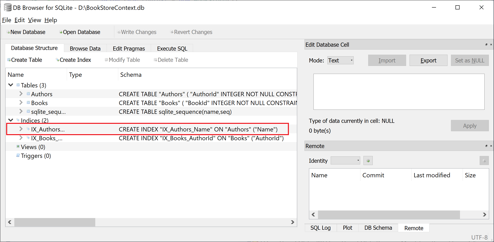
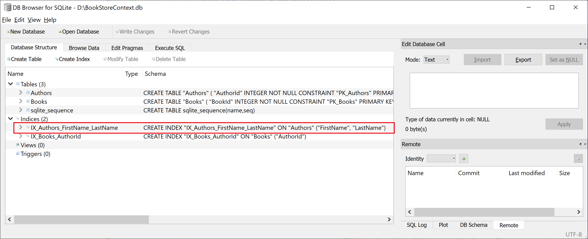

# Indexes

Indexes are a common concept across many data stores, and data is stored in the form of records. Every record has a key field, which helps it to be recognized uniquely.

 - Indexing is a way to optimize a database's performance by minimizing the number of disk accesses required when a query is processed.
 - It is a data structure technique used to quickly locate and access the data in a database.

## Indexing in EF Core

By convention, an index is created in each property or set of properties used as a foreign key.

 - EF Core only supports one index per distinct set of properties. 
 - If you use the Fluent API to configure an index on a set of properties that already have an index defined, either by convention or previous configuration, then you will be changing the definition of that index. 
 - This is useful if you want to further configure an index that was created by convention.

Indexes cannot be created using data annotations. Instead, you can use the Fluent API to specify an index on one or more columns.

The following example specifies an index on a single column.

```csharp
protected override void OnModelCreating(ModelBuilder modelBuilder)
{
    modelBuilder.Entity<Author>()
        .HasIndex(a => a.Name);
}
```

After database creation, open it in SQLite viewer and you will see an index is created.



You can also specify an index over more than one column.

```csharp
protected override void OnModelCreating(ModelBuilder modelBuilder)
{
    modelBuilder.Entity<Author>()
        .HasIndex(a => new { a.FirstName, a.LastName });
}
```



### Unique Index

By default, indexes are not unique, multiple rows are allowed to have the same value(s) for the index's column set. You can make an index unique, as shown below.

```csharp
protected override void OnModelCreating(ModelBuilder modelBuilder)
{
    modelBuilder.Entity<Author>()
        .HasIndex(a => a.Name)
        .IsUnique();
}

```

When you insert more than one entity with the same values for the index's column set, it will throw an exception.

### Index Name

By convention, indexes created in a relational database are named `IX_<type name>_<property name>`. For composite indexes, `<property name>` becomes an underscore separated list of property names.

You can use the Fluent API to set the name of the index created in the database.

```csharp
protected override void OnModelCreating(ModelBuilder modelBuilder)
{
    modelBuilder.Entity<Author>()
        .HasIndex(a => a.Name)
        .HasDatabaseName("Index_Name");
}
```

### Index Filter

In some relational databases, you can specify a filtered or partial index to index only a subset of a column's values, reduce the index's size, and improve performance and disk space usage.

```csharp
protected override void OnModelCreating(ModelBuilder modelBuilder)
{
    modelBuilder.Entity<Book>()
        .HasIndex(a => a.Title)
        .HasFilter("[Url] IS NOT NULL");
}
```

In SQLite provider, EF Core adds an `IS NOT NULL` filter for all nullable columns that are part of a unique index. To override this convention you can supply a `null` value as shown below.

```csharp
protected override void OnModelCreating(ModelBuilder modelBuilder)
{
    modelBuilder.Entity<Book>()
        .HasIndex(a => a.Title)
        .IsUnique()
        .HasFilter(null);
}
```

