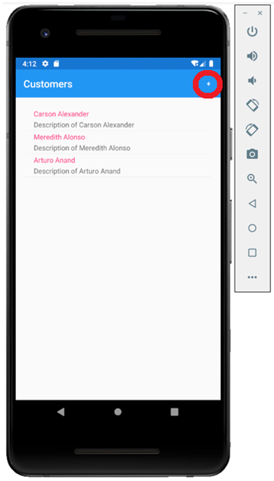
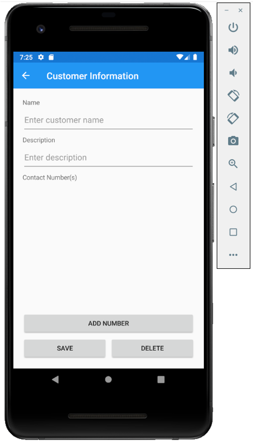
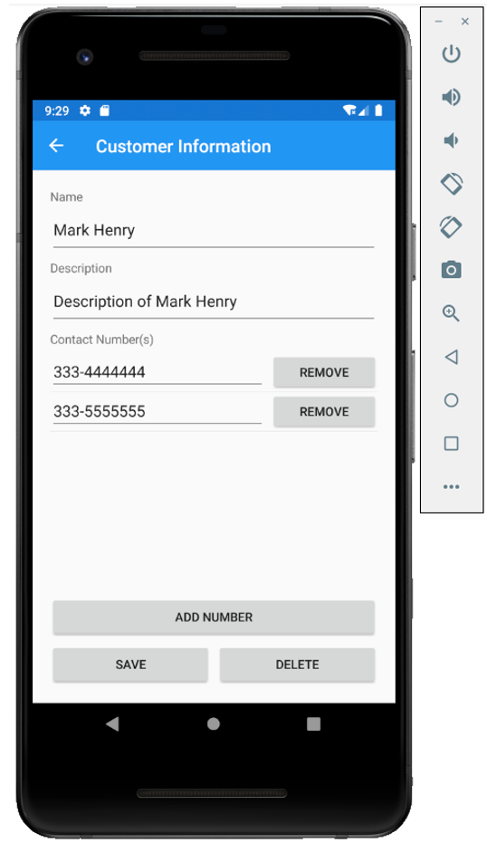
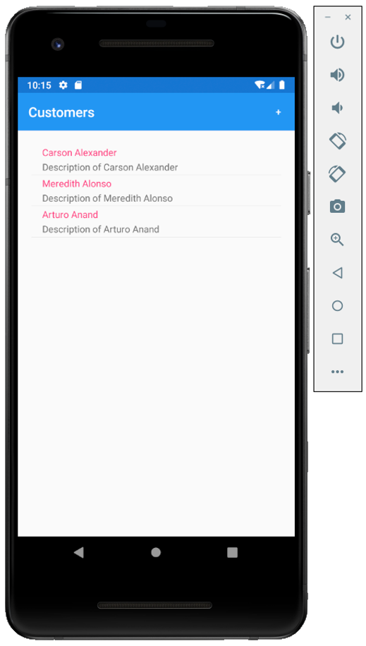

# Add CRUD Functionality 

CRUD operations are the four basic functions in the SQLite storage. Although, whatever the storage is, you have to perform these basic operations. Let’s see how to implement these operations in Xamarin.Forms using simple steps.

## Add Customer

To add a new customer to the database, the user needs to click on the “+” symbol mentioned on the top right corner on the toolbar and it should open a new view so that the user can enter the customer detail.



Let’s add a content page in the **Views** folder and call it **CustomerDetail.xaml**


Enter the name in the Name field and click the **Add** button.

In the **CustomerList.xaml** file, we have already defined the toolbar item for adding a new customer. 

```csharp
<ToolbarItem Text="+" Clicked="OnCustomerAddedClicked" />
```

Now we need to implement the **OnCustomerAddedClicked** event so that when a user taps this item it will open the customer detail page.

```csharp
async void OnCustomerAddedClicked(object sender, EventArgs e)
{
    await Navigation.PushAsync(new CustomerDetail
    {
        BindingContext = new Customer()
    });
}
```

Open the **CustomerDetail.xaml** file and replace the template code with the following code.

```csharp
<?xml version="1.0" encoding="utf-8" ?>
<ContentPage xmlns="http://xamarin.com/schemas/2014/forms"
             xmlns:x="http://schemas.microsoft.com/winfx/2009/xaml"
             xmlns:d="http://xamarin.com/schemas/2014/forms/design"
             xmlns:mc="http://schemas.openxmlformats.org/markup-compatibility/2006"
             mc:Ignorable="d"
             Title="Customer Information"
             x:Class="EFWithXamarin.Views.CustomerDetail">
    <ContentPage.Content>
        <StackLayout Margin="20">
            <Label Text="Name"/>
            <Editor Placeholder="Enter customer name"
                Text="{Binding Name}"
                HeightRequest="50" />
            <Label Text="Description"/>
            <Editor Placeholder="Enter description"
                Text="{Binding Description}"
                HeightRequest="50" />

            <Label Text="Contact Number(s)"/>
            <ListView x:Name="PhoneContactListView" HeightRequest="100" 
                ItemsSource="{Binding PhoneContacts}">
                <ListView.ItemTemplate>
                    <DataTemplate>
                        <ViewCell>
                            <Grid>
                                <Grid.ColumnDefinitions>
                                    <ColumnDefinition Width="2*" />
                                    <ColumnDefinition Width="*" />
                                </Grid.ColumnDefinitions>
                                <Editor Text="{Binding PhoneNumber}"
                                    Placeholder="Enter phone number"/>
                                <Button Grid.Column="1" Text="Remove" 
                                    Clicked="OnRemovePhoneNumberButtonClicked"/>
                            </Grid>

                        </ViewCell>
                    </DataTemplate>
                </ListView.ItemTemplate>
            </ListView>
            <Button Grid.Column="1"
                Text="Add Number" 
                Clicked="OnAddPhoneNumberButtonClicked"/>

            <Grid>
                <Grid.ColumnDefinitions>
                    <ColumnDefinition Width="*" />
                    <ColumnDefinition Width="*" />
                </Grid.ColumnDefinitions>
                <Button Text="Save" 
                    Clicked="OnSaveButtonClicked" />
                <Button Grid.Column="1"
                    Text="Delete" 
                    Clicked="OnDeleteButtonClicked"/>
            </Grid>
        </StackLayout>
    </ContentPage.Content>
</ContentPage>
```

The detail view contains different information such as customer name, description and contact numbers. In the end, it also contains two buttons, **Save** and **Delete**. When the user clicks on the **Save** button after specifying the customer then it will save a new customer to the database.

So, let’s implete the **OnSaveButtonClicked** in **CustomerDetail.xaml.cs**

```csharp
async void OnSaveButtonClicked(object sender, EventArgs e)
{
    var customer = (Customer)BindingContext;

    if (customer != null)
    {
        EntityFrameworkService entityFrameworkService = new EntityFrameworkService();
        entityFrameworkService.InsertOrUpdate(customer);
    }

    await Navigation.PopAsync();
}
```
It will get the selected customer record from the **BindingContext** of the **CustomerDetail** page and insert or update it to the database using **EntityFrameworkService.InsertOrUpdate()** function. 

Let’s run your application and press the **“+”** symbol.



You can see **Name** and **Description** fields but there is no field for **Contacts** right now. The **Customer** and **PhoneContact** have a one-to-many relationship. So, the **Add Number** button is provided and when the user presses the button it will create a field for typing a phone number.


Users can provide multiple phone numbers for a customer. Let’s enter the information for a customer you want to add to the database.


Press the **Save** button and you will see a new customer is added and displayed at the end on the main page.


## Update Customer

To update the existing customer record, the user will need to tap the customer record from the list view on the main page and it will open the **CustomerDetail** view by displaying the customer information.  

Now, we need to add that functionality, by implementing **OnListViewItemSelected** event which is specified for **ItemSelected** of list view in **CustomerList.xaml** file.

```csharp
<ListView x:Name="listView"
          Margin="20"
          ItemSelected="OnListViewItemSelected">
    <ListView.ItemTemplate>
        <DataTemplate>
            <TextCell Text="{Binding Name}"
                  Detail="{Binding Description}" />
        </DataTemplate>
    </ListView.ItemTemplate>
</ListView> 
```

Add the following code in CustomerList.xaml.cs file.

```csharp
async void OnListViewItemSelected(object sender, SelectedItemChangedEventArgs e)
{
    if (e.SelectedItem != null)
    {
        await Navigation.PushAsync(new CustomerDetail
        {
            BindingContext = e.SelectedItem as Customer
        });
    }
}
```

It will assign the selected customer record to the **BindingContext** of the **CustomerDetail page. 

Let’s run your application and tap the last record we added to the database and you will see the same information that we have entered earlier. 


Now let’s change the name from **Mark** to **Mark Henry** in both **Name** and **Description** fields.



The **Save** button functionality is already implemented which will insert in case of new customer record and update if the customer record is already available in the database. Now press the **Save** button and you will see the updated customer record.


## Delete Customer

To delete the existing customer, the user will need to tap that customer on the main page which will open the customer information page.


Now by pressing the **Delete** button, it should then delete the customer record from the database. To add this functionality, we will implement the **OnDeleteButtonClicked** event specified for the **Delete** button **Clicked** event in **CustomerDetail.xaml** file.

```csharp
<Button Grid.Column="1"
    Text="Delete" 
    Clicked="OnDeleteButtonClicked"/>
```

Add the following code in **CustomerDetail.xaml.cs** file.

```csharp
async void OnDeleteButtonClicked(object sender, EventArgs e)
{
    var customer = (Customer)BindingContext;

    if (customer != null)
    {
        EntityFrameworkService entityFrameworkService = new EntityFrameworkService();
        entityFrameworkService.Remove(customer);
    }

    await Navigation.PopAsync();
}
```

It will get the selected customer record from the **BindingContext** of the **CustomerDetail** page and remove it from the database using **EntityFrameworkService.Remove()** function.

Let’s run your application and tap the last record we updated to the database and you will see the same information that we have entered earlier.


To delete this customer record, press the **Delete** button and you will no longer see the record on the main page.


