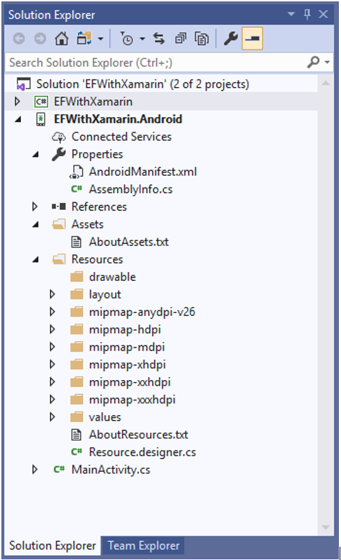

# Android Application Folder Structure

In the following picture, we have the complete folder structure of a Xamarin.Android application. We will go through every folder and describe the contents of it, as to get a bit more familiarized with the structure of a Xamarin.Android app.

Let’s look at the items inside the Project to see each folder and its purpose.

## Properties
 - It contains the AndroidManifest.xml file that describes all the requirements for the Xamarin.Android application, including name, version number, and permissions. 
 - The Properties folder also contains AssemblyInfo.cs, a .NET assembly metadata file. It is a good practice to fill this file with some basic information about your application.

## References 
 - It contains the assemblies required to build and run the application. 
 - If you expand the References folder, you'll see references to .NET assemblies such as System, System.Core, and System.Xml, as well as a reference to Xamarin's Mono.Android assembly.

## Assets 
 - It contains the files the application needs to run including fonts, local data files, and text files. 
 - Files included here are accessible through the generated Assets class. 

## Resources 
 - It contains application resources such as strings, images, and layouts. 
 - You can access these resources in code through the generated Resource class. 

The Resources directory contains the following folders and a file name.

### drawable
 - The drawable directories house drawable resources such as images and bitmaps.

### mipmap 
 - The mipmap directory holds drawable files for different launcher icon densities. 
 - In the default template, the drawable directory houses the application icon file, Icon.png.

### layout
 - The layout directory contains Android designer files (.axml) that define the user interface for each screen or Activity. 
 - The template creates a default layout called activity_main.axml.

### values
 - This directory houses XML files that store simple values such as strings, integers, and colors. 
 - The template creates a file to store string values called Strings.xml.

### Resource.designer.cs
 - It is also known as the Resource class; this file is a partial class that holds the unique IDs assigned to each resource. 
 - It is automatically created by the Xamarin.Android tools and is regenerated as necessary. 
 - This file should not be manually edited, as Xamarin.Android will overwrite any manual changes made to it.
