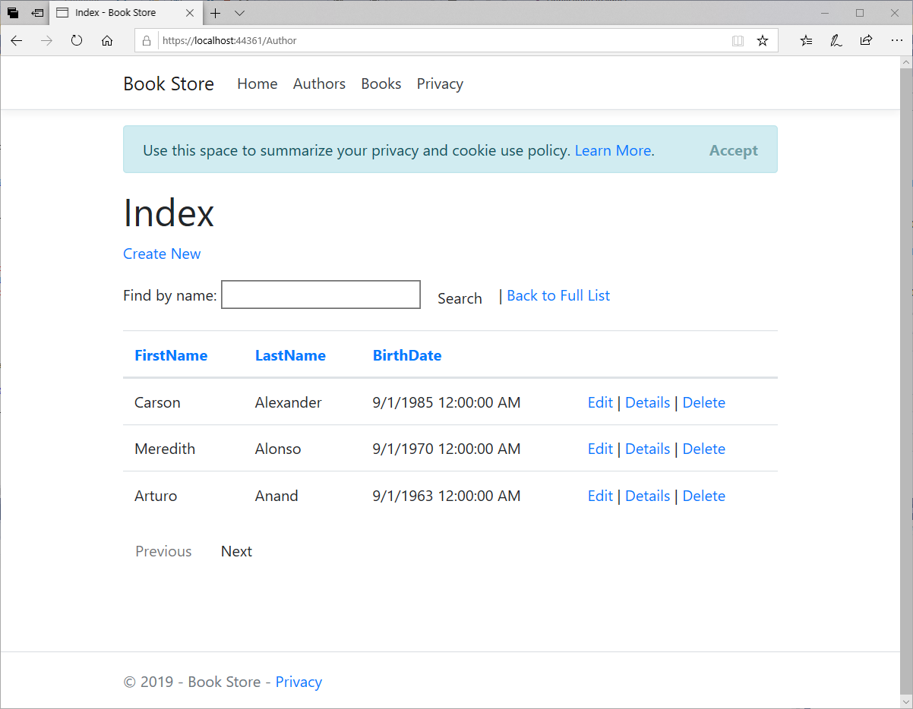
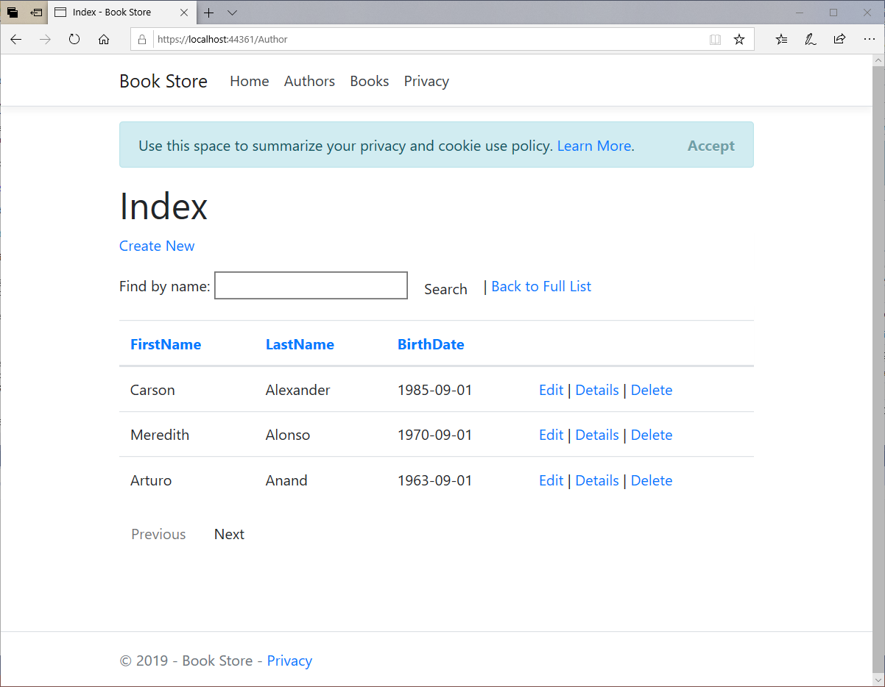

# Formatting & Validation

In this article, we will discuss how to customize the data model by using attributes that specify formatting, validation, and database mapping rules.

## DataType Attribute

In the `Author` entity, we have `BirthDate` property, and all of the web pages currently display the time along with the date. 



In this field, we only need the date instead of date and time. We can use data annotation attributes and make one code change that will fix the display format in every view that shows the birth date.

In ***Models\Author.cs***, add a `using` statement for the `System.ComponentModel.DataAnnotations` namespace and add `DataType` and `DisplayFormat` attributes to the `BirthDate` property, as shown below.

```csharp
using System;
using System.Collections.Generic;
using System.ComponentModel.DataAnnotations;

namespace MvcWithEFCoreDemo.Models
{
    public class Author
    {
        public int AuthorId { get; set; }
        public string FirstName { get; set; }
        public string LastName { get; set; }
        [DataType(DataType.Date)]
        [DisplayFormat(DataFormatString = "{0:yyyy-MM-dd}", ApplyFormatInEditMode = true)]
        public DateTime BirthDate { get; set; }
        public virtual ICollection<Book> Books { get; set; }
    }
}
```

The `DataType` attribute is used to specify a data type that is more specific than the database intrinsic type. 

 - In this case, we only want to keep track of the date, not the date and time.
 - The `DataType.Date` does not specify the format of the date that is displayed. 
 - By default, the data field is displayed according to the default formats based on the server's `CultureInfo`. 
 - The DisplayFormat attribute is used to explicitly specify the date format.

Let's run your application and go to the author `Index` page again and you will see that times are no longer displayed for the birth dates. 



The same will be true for any view that uses the `Author` model.

## StringLength Attribute

You can also specify data validation rules and validation error messages using attributes. 

 - The `StringLength` attribute sets the maximum length in the database and provides the client-side and server-side validation for ASP.NET MVC. 
 - For example, you want to ensure that users don't enter more than 20 characters for a name. 
 
To add this limitation, add `StringLength` attributes to the `LastName` and `FirstName` properties as shown below.

```csharp
using System;
using System.Collections.Generic;
using System.ComponentModel.DataAnnotations;

namespace MvcWithEFCoreDemo.Models
{
    public class Author
    {
        public int AuthorId { get; set; }

        [StringLength(20)]
        public string FirstName { get; set; }

        [StringLength(20)]
        public string LastName { get; set; }

        [DataType(DataType.Date)]
        [DisplayFormat(DataFormatString = "{0:yyyy-MM-dd}", ApplyFormatInEditMode = true)]
        public DateTime BirthDate { get; set; }
        
        public virtual ICollection<Book> Books { get; set; }
    }
}
```

We can also specify the `ErrorMessage` which will be shown on the webpage when the user enters more than 20 characters in the name field.

```csharp
[StringLength(20, ErrorMessage = "Name cannot be longer than 20 characters.")]
```

The database model has changed in a way that requires a change in the database schema. In the `Package Manager Console`, enter the following commands in `Package Manager Console`.
.

```csharp
Add-Migration MaxLengthOnNames
Update-Database
```

The `add-migration` command creates a file named `<timeStamp>_MaxLengthOnNames.cs`. 

```csharp
using Microsoft.EntityFrameworkCore.Migrations;

namespace MvcWithEFCoreDemo.Migrations
{
    public partial class MaxLengthOnNames : Migration
    {
        protected override void Up(MigrationBuilder migrationBuilder)
        {
            migrationBuilder.AlterColumn<string>(
                name: "LastName",
                table: "Authors",
                maxLength: 20,
                nullable: true,
                oldClrType: typeof(string),
                oldNullable: true);

            migrationBuilder.AlterColumn<string>(
                name: "FirstName",
                table: "Authors",
                maxLength: 20,
                nullable: true,
                oldClrType: typeof(string),
                oldNullable: true);
        }

        protected override void Down(MigrationBuilder migrationBuilder)
        {
            migrationBuilder.AlterColumn<string>(
                name: "LastName",
                table: "Authors",
                nullable: true,
                oldClrType: typeof(string),
                oldMaxLength: 20,
                oldNullable: true);

            migrationBuilder.AlterColumn<string>(
                name: "FirstName",
                table: "Authors",
                nullable: true,
                oldClrType: typeof(string),
                oldMaxLength: 20,
                oldNullable: true);
        }
    }
}
```

It contains the code in the `Up` method that will update the database to match the current data model. The `update-database` command ran that code.

## NotMapped Attribute

The `NotMapped` attribute is used to specify an entity or property that is not to be mapped to a table or column in the database.

 - In EF, the default Code First conventions create a column for every property that is of a supported data type and which includes getters and setters.
 - The `NotMapped` attribute overrides this default convention, and the entity or property will not be mapped to a table or column in the database.

In the following example, the `FullName` property will not be mapped to a column in the `Authors` table in the database.

```csharp
using System;
using System.Collections.Generic;
using System.ComponentModel.DataAnnotations;
using System.ComponentModel.DataAnnotations.Schema;

namespace MvcWithEFCoreDemo.Models
{
    public class Author
    {
        public int AuthorId { get; set; 

        [StringLength(20, ErrorMessage = "Name cannot be longer than 20 characters.")]
        public string FirstName { get; set; }

        [StringLength(20, ErrorMessage = "Name cannot be longer than 20 characters.")]
        public string LastName { get; set; }

        [NotMapped]
        public string FullName
        {
            get
            {
                return FirstName + " " + LastName;
            }
        }

        [DataType(DataType.Date)]
        [DisplayFormat(DataFormatString = "{0:yyyy-MM-dd}", ApplyFormatInEditMode = true)]        
        public DateTime BirthDate { get; set; }

        public virtual ICollection<Book> Books { get; set; }
    }
}
```
## Display Attribute

The `Display` attribute specifies that the caption for the text boxes on views. For example, to show **First Name**, **Last Name**, **Full Name**, and **Birth Date** instead of the property name on the views, you can use the `Display` attribute.

```csharp
using System;
using System.Collections.Generic;
using System.ComponentModel.DataAnnotations;
using System.ComponentModel.DataAnnotations.Schema;

namespace MvcWithEFCoreDemo.Models
{
    public class Author
    {
        public int AuthorId { get; set; }

        [StringLength(20, ErrorMessage = "Name cannot be longer than 20 characters.")]
        public string FirstName { get; set; }

        [StringLength(20, ErrorMessage = "Name cannot be longer than 20 characters.")]
        public string LastName { get; set; }

        [DataType(DataType.Date)]
        [DisplayFormat(DataFormatString = "{0:yyyy-MM-dd}", ApplyFormatInEditMode = true)]

        [NotMapped]
        [Display(Name = "Full Name")]
        public string FullName
        {
            get
            {
                return FirstName + " " + LastName;
            }
        }

        [DataType(DataType.Date)]
        [DisplayFormat(DataFormatString = "{0:yyyy-MM-dd}", ApplyFormatInEditMode = true)]
        public DateTime BirthDate { get; set; }

        public virtual ICollection<Book> Books { get; set; }
    }
}
```

## Calculated Property

`FullName` is a calculated property that returns a value by concatenating two other properties. Therefore, it has only a get accessor, and no FullName column will be generated in the database.
