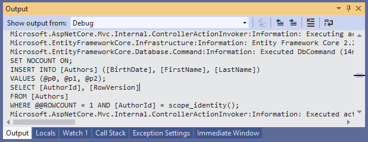

# Logging

In most of the cases, we need to log the SQL CRUD commands and queries getting executed for Debugging or Informational or troubleshooting purposes in EF Core. 

 - EF Core integrates automatically with the logging mechanisms of ASP.NET Core whenever `AddDbContext` or `AddDbContextPool` is used.
 - The .NET Core supports a logging API that works with a variety of built-in and third-party logging providers.

The following are the two basic techniques used to enable logging in Entity framework core and both these techniques can be applied to ASP.NET Core or Console or any Desktop application(based on .NET Core).

 - Logging using Configuration
 - Logging using LoggerFactory

 ## Logging using Configuration

This technique doesn't need any changes in the code and it can be easily used because Entity Framework Core has built in the logging support in .NET Core once required EF components are installed in the applications.

You can easily enable logging using the configuration in the `appsettings.json` file as shown below.

```csharp
{
  "ConnectionStrings": {
    "DefaultConnection": "Data Source=(localdb)\\ProjectsV13;Initial Catalog=NewBookStore;Trusted_Connection=True;MultipleActiveResultSets=true"
  },
  "Logging": {
    "LogLevel": {
      "Default": "Information",
      "Microsoft": "Warnings",
      "Microsoft.EntityFrameworkCore": "Information"
    }
  },
  "AllowedHosts": "*"
}
```

The above configuration can be enabled for Debug, Information or Warning, etc. Log level type as needed. Please make sure to enable your `DBContext` class using `DbContextOptions` and configurations are loaded from apps settings when using this option.

```csharp
public class BookStore : DbContext
{
    public BookStore(DbContextOptions<BookStore> options) : base(options)
    {
    }

    public DbSet<Author> Authors { get; set; }
    public DbSet<Book> Books { get; set; }
}
```

## Logging using LoggerFactory

Entity Framework Core integrates with the .NET Core logging to log SQL and change tracking information to the various output targets. But first, we need to install the Nuget package for logging provider of your choice and then tie up the `DbContext` to `ILoggerFactory`.

To display the logs on the console, let's install the `Microsoft.Extensions.Logging.Console` NuGet package from the **NuGet Package Manager** or simply run the following command in the **Package Manager Console**.

```csharp
PM> Install-Package Microsoft.Extensions.Logging.Console
```

Once the NuGet package is installed, we will create a static instance of LoggerFactory class and pass it in the `OnConfiguring` method and call the `UseLoggerFactory()`.

```csharp
public class EntityContext : DbContext
{
    public static readonly Microsoft.Extensions.Logging.ILoggerFactory _loggerFactory = LoggerFactory.Create(builder =>
    {
        builder.AddConsole();
    });

    public BookStore(DbContextOptions<BookStore> options) : base(options)
    {
    }
    
    protected override void OnConfiguring(DbContextOptionsBuilder optionsBuilder)
    {
        optionsBuilder.UseLoggerFactory(_loggerFactory);
        optionsBuilder.EnableSensitiveDataLogging();

        optionsBuilder.UseSqlServer(new SqlConnection(@"Data Source=(localdb)\ProjectsV13;Initial Catalog=TestDB;Integrated Security=True"));
    }

    public DbSet<Author> Authors { get; set; }
    public DbSet<Book> Books { get; set; }
}
```

Let's run the application and insert a new author, you will see the `INSERT` statement and all the log information.

