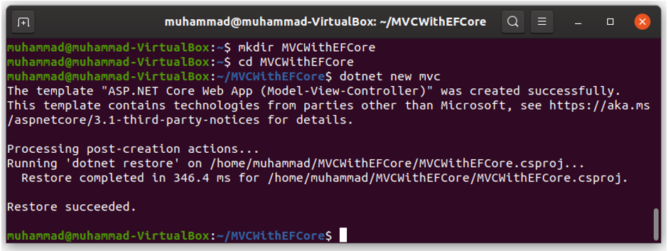
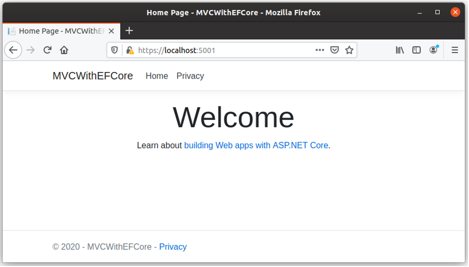

# Create ASP.NET Core Application

Now that you have Visual Studio Code installed, let’s create an ASP.NET Core MVC application by opening the Terminal and run the following commands. 

```csharp
mkdir MVCWithEFCore
cd MVCWithEFCore
dotnet new mvc
```



|Command	             |Description                                    |
|:---------------------|:----------------------------------------------|
|mkdir MVCWithEFCore	 |Create a new folder “MVCWithEFCore”            |
|cd MVCWithEFCore	     |Go to the MVCWithEFCore directory              |
|dotnet new mvc	       |Create a new MVC application using CLI command |

Now let’s run the application using the following commands.

```csharp
dotnet restore
dotnet run
```


You can see the application runs successfully, let’s open the browser and enter the following URL.

https://localhost:5001/


