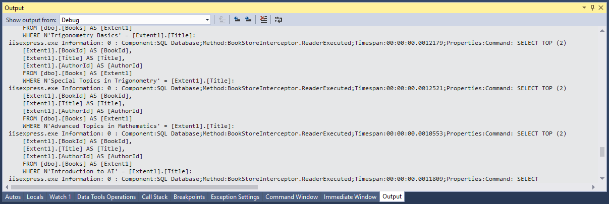

# Command Interception

The high-level goal for the interception feature is to allow external code to observe and potentially intercept EF operations. 

 - Anytime Entity Framework sends a command to the database this command can be intercepted by application code.
 - Using this approach you can capture a lot more information transiently without having to untidy your code.
 - EF6 provides a dedicated logging API that can make it easier to do logging. 
 - In this article, we will cover how to use the Entity Framework's interception feature directly for logging.

## Create Logging Interface

Let's create a folder and call it ***Logging*** and then create a class file named `ILogger.cs`, and replace the following code.

```csharp
using System;

namespace MvcWithEF6Demo.Logging
{
    public interface ILogger
    {
        void Information(string message);
        void Information(string fmt, params object[] vars);
        void Information(Exception exception, string fmt, params object[] vars);

        void Warning(string message);
        void Warning(string fmt, params object[] vars);
        void Warning(Exception exception, string fmt, params object[] vars);

        void Error(string message);
        void Error(string fmt, params object[] vars);
        void Error(Exception exception, string fmt, params object[] vars);

        void TraceApi(string componentName, string method, TimeSpan timespan);
        void TraceApi(string componentName, string method, TimeSpan timespan, string properties);
        void TraceApi(string componentName, string method, TimeSpan timespan, string fmt, params object[] vars);
    }
}
```

The interface provides three tracing levels to indicate the relative importance of logs, and one designed to provide latency information for external service calls such as database queries. 

 - The logging methods have overloads that let you pass in an exception. 
 - The exception information including stack trace and inner exceptions is logged by the class that implements the interface.
 - The TraceApi methods enable you to track the latency of each call to an external service such as SQL Database.

## Implement Logging Interface

In the **Logging** folder, create a class file named `Logger.cs`, which will implement the `ILogger` interface as shown below.

```csharp
using System;
using System.Diagnostics;
using System.Text;

namespace MvcWithEF6Demo.Logging
{
    public class Logger : ILogger
    {
        public void Information(string message)
        {
            Trace.TraceInformation(message);
        }

        public void Information(string fmt, params object[] vars)
        {
            Trace.TraceInformation(fmt, vars);
        }

        public void Information(Exception exception, string fmt, params object[] vars)
        {
            Trace.TraceInformation(FormatExceptionMessage(exception, fmt, vars));
        }

        public void Warning(string message)
        {
            Trace.TraceWarning(message);
        }

        public void Warning(string fmt, params object[] vars)
        {
            Trace.TraceWarning(fmt, vars);
        }

        public void Warning(Exception exception, string fmt, params object[] vars)
        {
            Trace.TraceWarning(FormatExceptionMessage(exception, fmt, vars));
        }

        public void Error(string message)
        {
            Trace.TraceError(message);
        }

        public void Error(string fmt, params object[] vars)
        {
            Trace.TraceError(fmt, vars);
        }

        public void Error(Exception exception, string fmt, params object[] vars)
        {
            Trace.TraceError(FormatExceptionMessage(exception, fmt, vars));
        }

        public void TraceApi(string componentName, string method, TimeSpan timespan)
        {
            TraceApi(componentName, method, timespan, "");
        }

        public void TraceApi(string componentName, string method, TimeSpan timespan, string fmt, params object[] vars)
        {
            TraceApi(componentName, method, timespan, string.Format(fmt, vars));
        }
        public void TraceApi(string componentName, string method, TimeSpan timespan, string properties)
        {
            string message = String.Concat("Component:", componentName, ";Method:", method, ";Timespan:", timespan.ToString(), ";Properties:", properties);
            Trace.TraceInformation(message);
        }

        private static string FormatExceptionMessage(Exception exception, string fmt, object[] vars)
        {
            // Simple exception formatting: for a more comprehensive version see 
            // http://code.msdn.microsoft.com/windowsazure/Fix-It-app-for-Building-cdd80df4
            var sb = new StringBuilder();
            sb.Append(string.Format(fmt, vars));
            sb.Append(" Exception: ");
            sb.Append(exception.ToString());
            return sb.ToString();
        }
    }
}
```

The implementation uses the `System.Diagnostics` to do the tracing. This is a built-in feature of .NET which makes it easy to generate and use tracing information.

## Create Interceptor

To implement command interception, we need to create a custom interceptor and register it accordingly. Entity Framework will call into every time it is going to send a query to the database.

Let's create a new class `BookStoreInterceptorLogging` in the ***DAL*** folder that implements `DbCommandInterceptor` interface.

```csharp
using System.Diagnostics;
using System.Data.Common;
using System.Data.Entity.Infrastructure.Interception;
using MvcWithEF6Demo.Logging;

namespace MvcWithEF6Demo.DAL
{
    public class BookStoreInterceptorLogging : DbCommandInterceptor
    {
        private ILogger _logger = new Logger();
        private readonly Stopwatch _stopwatch = new Stopwatch();

        public override void ScalarExecuting(DbCommand command, DbCommandInterceptionContext<object> interceptionContext)
        {
            base.ScalarExecuting(command, interceptionContext);
            _stopwatch.Restart();
        }

        public override void ScalarExecuted(DbCommand command, DbCommandInterceptionContext<object> interceptionContext)
        {
            _stopwatch.Stop();
            if (interceptionContext.Exception != null)
            {
                _logger.Error(interceptionContext.Exception, "Error executing command: {0}", command.CommandText);
            }
            else
            {
                _logger.TraceApi("SQL Database", "BookStoreInterceptor.ScalarExecuted", _stopwatch.Elapsed, "Command: {0}: ", command.CommandText);
            }
            base.ScalarExecuted(command, interceptionContext);
        }

        public override void NonQueryExecuting(DbCommand command, DbCommandInterceptionContext<int> interceptionContext)
        {
            base.NonQueryExecuting(command, interceptionContext);
            _stopwatch.Restart();
        }

        public override void NonQueryExecuted(DbCommand command, DbCommandInterceptionContext<int> interceptionContext)
        {
            _stopwatch.Stop();
            if (interceptionContext.Exception != null)
            {
                _logger.Error(interceptionContext.Exception, "Error executing command: {0}", command.CommandText);
            }
            else
            {
                _logger.TraceApi("SQL Database", "BookStoreInterceptor.NonQueryExecuted", _stopwatch.Elapsed, "Command: {0}: ", command.CommandText);
            }
            base.NonQueryExecuted(command, interceptionContext);
        }

        public override void ReaderExecuting(DbCommand command, DbCommandInterceptionContext<DbDataReader> interceptionContext)
        {
            base.ReaderExecuting(command, interceptionContext);
            _stopwatch.Restart();
        }
        public override void ReaderExecuted(DbCommand command, DbCommandInterceptionContext<DbDataReader> interceptionContext)
        {
            _stopwatch.Stop();
            if (interceptionContext.Exception != null)
            {
                _logger.Error(interceptionContext.Exception, "Error executing command: {0}", command.CommandText);
            }
            else
            {
                _logger.TraceApi("SQL Database", "BookStoreInterceptor.ReaderExecuted", _stopwatch.Elapsed, "Command: {0}: ", command.CommandText);
            }
            base.ReaderExecuted(command, interceptionContext);
        }
    }
}
```

For successful queries or commands, this code writes an Information log with latency information. For exceptions, it creates an Error log.

## Register Interceptor

Once a class that implements one or more of the interception interfaces has been created it can be registered with EF using the `DbInterception` class as shown below. 

```csharp
DbInterception.Add(new BookStoreInterceptorLogging());
```

In `Global.asax`, replace the following code. 

```csharp
using System.Web.Mvc;
using System.Web.Optimization;
using System.Web.Routing;
using MvcWithEF6Demo.DAL;
using System.Data.Entity.Infrastructure.Interception;

namespace MvcWithEF6Demo
{
    public class MvcApplication : System.Web.HttpApplication
    {
        protected void Application_Start()
        {
            AreaRegistration.RegisterAllAreas();
            FilterConfig.RegisterGlobalFilters(GlobalFilters.Filters);
            RouteConfig.RegisterRoutes(RouteTable.Routes);
            BundleConfig.RegisterBundles(BundleTable.Bundles);
            DbInterception.Add(new BookStoreInterceptorLogging());
        }
    }
}
```

Let's run your application in debug mode, and then click the **Authors** tab. Now if you look at the **Output** window, you will see the tracing output.



