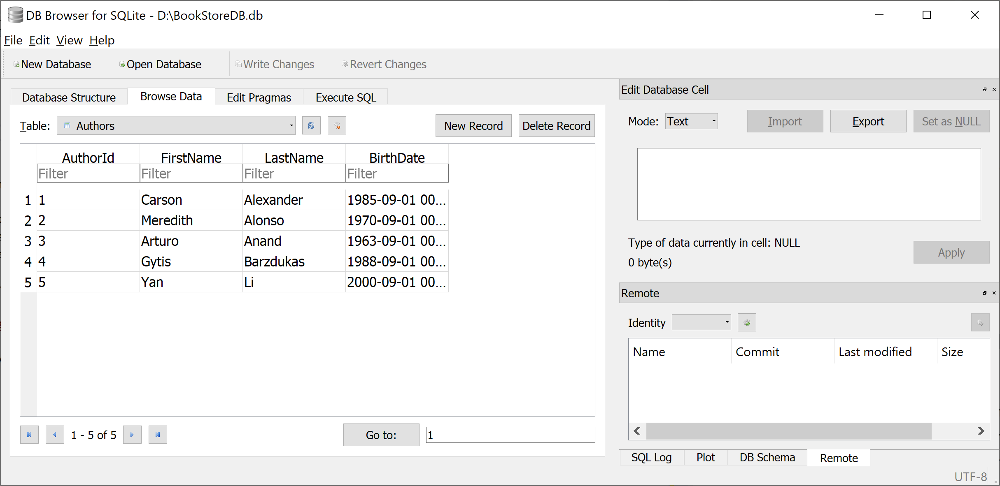

# Database Setup

## Create Data Model

Model is a collection of classes to interact with the database.

 - A model stores data retrieved according to the commands from the Controller and displayed in the View.
 - It can also be used to manipulate the data to implement the business logic.

To create a data model for our application, we will start with the following two entities.

 - Book
 - Author

There's a one-to-many relationship between `Author` and `Book` entities. In other words, an author can write any number of books, and a book can be written by only one author.

## Create Author Entity

In Solution Explorer, right-click on the Models folder and choose **Add > Class**. Enter a class file name **Author.cs** and add the following code.

```csharp
using System;
using System.Collections.Generic;
using System.Linq;
using System.Threading.Tasks;

namespace EFCoreConfigurationManagerDemo.Models
{
    public class Author
    {
        public int AuthorId { get; set; }
        public string FirstName { get; set; }
        public string LastName { get; set; }
        public DateTime BirthDate { get; set; }
        public virtual ICollection<Book> Books { get; set; }
    }
}
```

The `AuthorId` property will become the primary key column of the database table that corresponds to this class. By default, Entity Framework interprets a property that's named `Id` or `<classname>Id` as the primary key.

 - The `Books` property is a navigation property, navigation properties hold other entities related to this entity. 
 - In this case, the `Books` property of an `Auth` entity will hold all of the `Book` entities related to that `Author` entity. 
 - In other words, if a given `Author` row in the database has two related `Book` rows, that `Author` entity's `Books` navigation property will contain those two `Book` entities.

## Create Book Entity

Now let's add another entity class `Book`, and replace the following code.

```csharp
using System;
using System.Collections.Generic;
using System.Linq;
using System.Threading.Tasks;

namespace EFCoreConfigurationManagerDemo.Models
{
    public class Book
    {
        public int Id { get; set; }
        public string Title { get; set; }
        public int AuthorId { get; set; }
        public Author Author { get; set; }
    }
}
```

 - The `Id` property will be the primary key; this entity uses the `Id` pattern instead of `<classname>Id` by itself, as you saw in the `Author` entity. 
 - Usually, you would choose one pattern and use it throughout your data model. 
 - Here, the variation illustrates that you can use either pattern. 

## Create Database Context

The database context class provides the main functionality to coordinate Entity Framework with a given data model. 

 - You can create this class by deriving from the `Microsoft.EntityFrameworkCore.DbContext` class. 
 - In your code, you can specify which entities are included in the data model. 
 - You can also customize certain Entity Framework behavior. 

So let's create a folder in your project by right-clicking on your project in Solution Explorer and click **Add > New Folder**. Name the folder DAL (Data Access Layer). In that folder, create a new class file named **BookStore.cs**, and replace the following code.

```csharp
using EFCoreConfigurationManagerDemo.Models;
using Microsoft.EntityFrameworkCore;
using System;
using System.Collections.Generic;
using System.Linq;
using System.Threading.Tasks;

namespace EFCoreConfigurationManagerDemo.DAL
{
    public class BookStore : DbContext
    {
        public BookStore(DbContextOptions<BookStore> options) : base(options)
        {
        }
        public DbSet<Author> Authors { get; set; }
        public DbSet<Book> Books { get; set; }
    }
}
```

This code creates a `DbSet` property for each entity set. In Entity Framework terminology, an entity set typically corresponds to a database table, and an entity corresponds to a row in the table.

## Register Context Class

ASP.NET Core implements dependency injection by default, and EF database context and other services are registered with dependency injection during application startup. Components that require these services (such as MVC controllers) are provided these services via constructor parameters. You'll see the controller constructor code that gets a context instance later in this tutorial.

To register `BookStore` as a service, open Startup.cs, and add the following code to the `ConfigureServices` method.

```csharp
public void ConfigureServices(IServiceCollection services)
{
    services.AddControllersWithViews();
    services.AddDbContext<BookStore>(
        options => options.UseSqlite("Data Source=D:\\BookStoreDB.db"));

}
```

### Initialize Database

The Entity Framework will create an empty database for you. So we need to write a method that's called after the database is created in order to populate it with test data.

In the DAL folder, add a new class `BookStoreInitializer` and replace the following code.

```csharp
using EFCoreConfigurationManagerDemo.Models;
using System;
using System.Collections.Generic;
using System.Linq;
using System.Threading.Tasks;

namespace EFCoreConfigurationManagerDemo.DAL
{
    public class BookStoreInitializer
    {
        public static void Initialize(BookStore context)
        {

            context.Database.EnsureCreated();

            // Look for any authors.
            if (context.Authors.Any())
            {
                return;   // DB has been seeded
            }

            var authors = new List<Author>
            {
                new Author { FirstName="Carson", LastName="Alexander", BirthDate = DateTime.Parse("1985-09-01")},
                new Author { FirstName="Meredith", LastName="Alonso", BirthDate = DateTime.Parse("1970-09-01")},
                new Author { FirstName="Arturo", LastName="Anand", BirthDate = DateTime.Parse("1963-09-01")},
                new Author { FirstName="Gytis", LastName="Barzdukas", BirthDate = DateTime.Parse("1988-09-01")},
                new Author { FirstName="Yan", LastName="Li", BirthDate = DateTime.Parse("2000-09-01")},
            };

            authors.ForEach(a => context.Authors.Add(a));
            context.SaveChanges();

            var books = new List<Book>
            {
                new Book { Title = "Introduction to Machine Learning", AuthorId = 1 },
                new Book { Title = "Advanced Topics in Machine Learning", AuthorId = 1 },
                new Book { Title = "Introduction to Computing", AuthorId = 1 },
                new Book { Title = "Introduction to Microeconomics", AuthorId = 2 },
                new Book { Title = "Calculus I", AuthorId = 3 },
                new Book { Title = "Calculus II", AuthorId = 3 },
                new Book { Title = "Trigonometry Basics", AuthorId = 4 },
                new Book { Title = "Special Topics in Trigonometry", AuthorId = 4 },
                new Book { Title = "Advanced Topics in Mathematics", AuthorId = 4 },
                new Book { Title = "Introduction to AI", AuthorId = 4 },
            };

            books.ForEach(b => context.Books.Add(b));
            context.SaveChanges();
        }
    }
}
```

 - The above code creates a database when needed and loads test data into the new database.
 - It also checks if there are any authors in the database, and if not, it assumes the database is new and needs to be seeded with test data. 

In `Program.cs` file, replace the following code in the `Main` method.

```csharp
using EFCoreConfigurationManagerDemo.DAL;
using Microsoft.AspNetCore.Hosting;
using Microsoft.Extensions.Configuration;
using Microsoft.Extensions.DependencyInjection;
using Microsoft.Extensions.Hosting;
using Microsoft.Extensions.Logging;
using System;
using System.Collections.Generic;
using System.Linq;
using System.Threading.Tasks;

namespace EFCoreConfigurationManagerDemo
{
    public class Program
    {
        public static void Main(string[] args)
        {
            var host = CreateHostBuilder(args).Build();

            using (var scope = host.Services.CreateScope())
            {
                var services = scope.ServiceProvider;
                try
                {
                    var context = services.GetRequiredService<BookStore>();
                    BookStoreInitializer.Initialize(context);
                }
                catch (Exception ex)
                {
                    var logger = services.GetRequiredService<ILogger<Program>>();
                    logger.LogError(ex, "An error occurred while seeding the database.");
                }
            }

            host.Run();
        }

        public static IHostBuilder CreateHostBuilder(string[] args) =>
            Host.CreateDefaultBuilder(args)
                .ConfigureWebHostDefaults(webBuilder =>
                {
                    webBuilder.UseStartup<Startup>();
                });
    }
}
```

On application startup, the `Main` method does the following operations.

 - Get a database context instance from the dependency injection container.
 - Call the seed method, passing to it the context.
 - Dispose the context when the seed method is done.

When you run your application for the first time, the database will be created and seeded with test data.



So far, whenever you change your data model, you can delete the database, update your seed method, and start afresh with a new database the same way.
