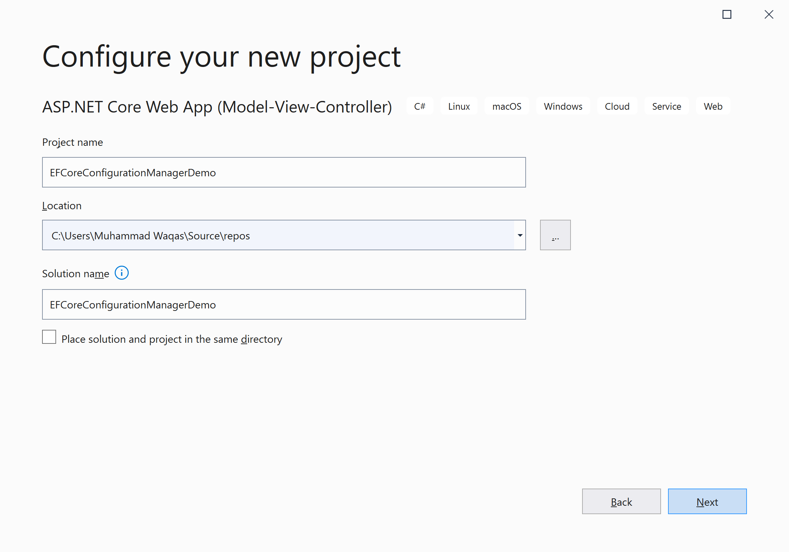
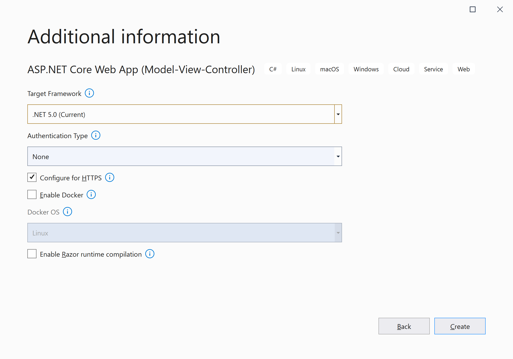
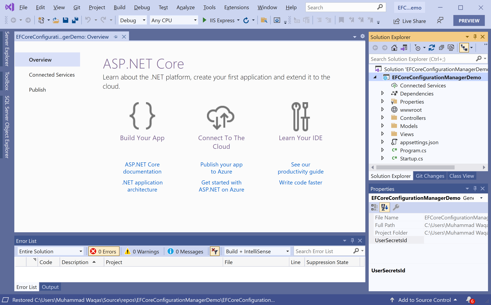
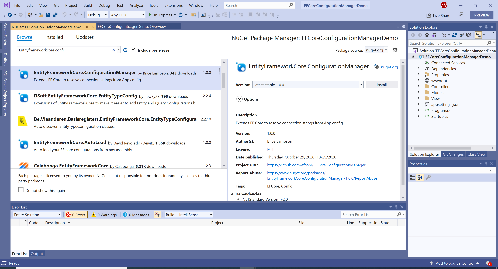
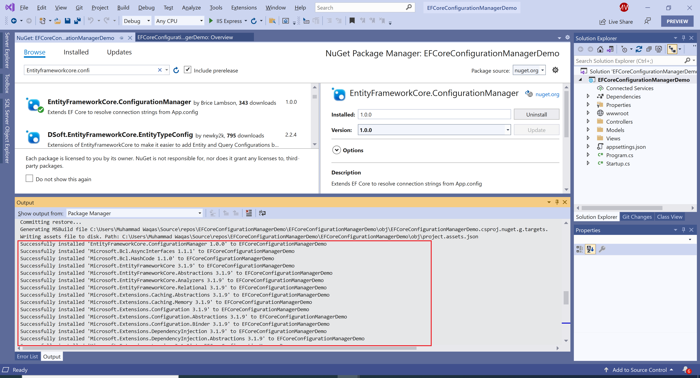

# Getting Started

**EntityFrameworkCore.ConfigurationManager** is a NuGet library for **Microsoft.EntityFrameworkCore** that extends EF Core to resolve connection strings from the configuration file.

## Installation

You can easily install it from the **Package Manager Console** window by running the following command.

```csharp
PM> Install-Package EntityFrameworkCore.ConfigurationManager
```

## Environment Setup

To start using the **EntityFrameworkCore.ConfigurationManager** in your application, you will need to install the [EntityFrameworkCore.ConfigurationManager](https://www.nuget.org/packages/EntityFrameworkCore.ConfigurationManager) NuGet package.

Let's open the Visual Studio and create a new project.


Select the **Create a new project** option.


Choose **C#** as language, **Windows** as a platform, and **Web** as the project type. In the template pane, select **ASP.NET Core Web App (Model-View-Controller)** and click the **Next** button.



Enter the project name, you can change the location and solution name, but we will leave it and click on the **Next** button.  



On the **Additional Information** dialog, select the target framework and then click on the **Create** button.  



You can see a new web application project is created. Now to install an **EntityFrameworkCore.ConfigurationManager**, right-click on the project in **Solution Explorer**, and select **Manage NuGet Packages...**



Select the **Browse** tab and search for **EntityFrameworkCore.ConfigurationManager** and install the latest version by pressing the **Install** button. 



Once **EntityFrameworkCore.ConfigurationManager** has been successfully installed. Let's add the database provider that you want to target. We will use SQL Server, and the provider package is [Microsoft.EntityFrameworkCore.Sqlite](https://www.nuget.org/packages/Microsoft.EntityFrameworkCore.Sqlite). We can easily install that NuGet package by executing the following command in **Package Manager Console**. 

```csharp
PM> Install-Package Microsoft.EntityFrameworkCore.Sqlite
```

You are now ready to start your application.
