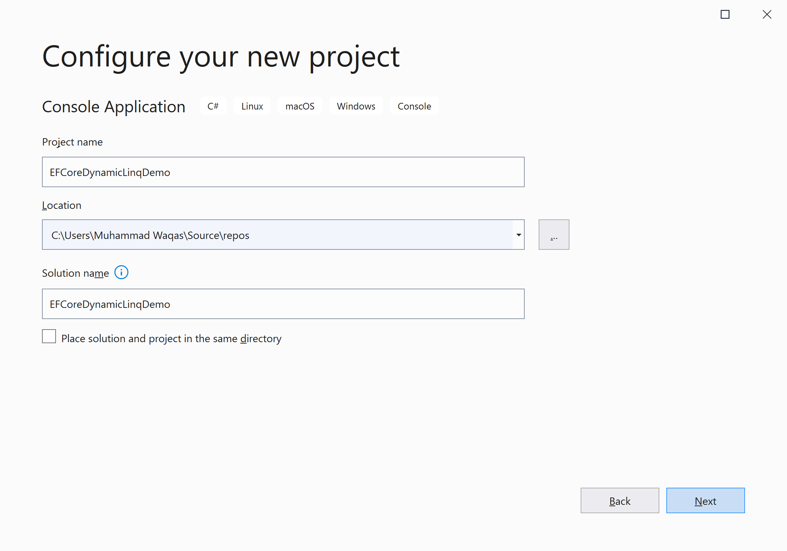
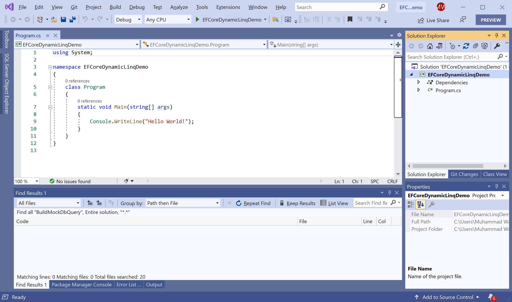
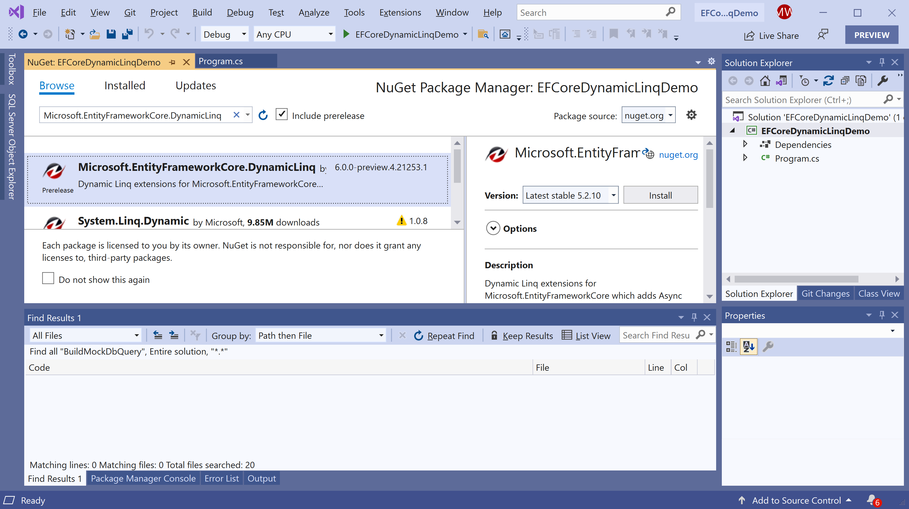
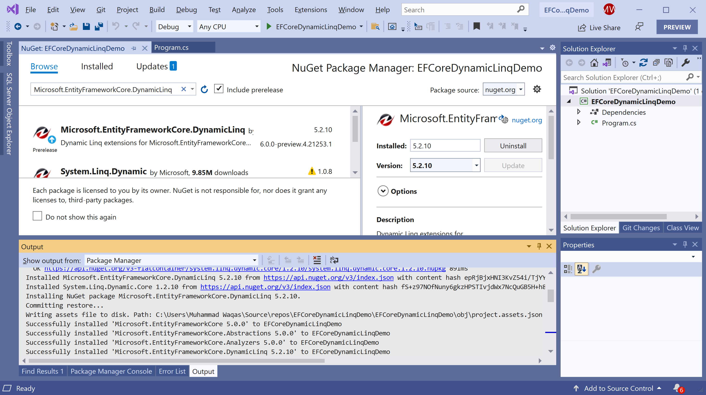

# Getting Started

**Microsoft.EntityFrameworkCore.DynamicLinq** is a NuGet library that is a Dynamic Linq extension for **Microsoft.EntityFrameworkCore** which adds Async support. 

## Why Dynamic LINQ

Most of the database applications use dynamic SQL queries that can be created at run-time through program logic. **DynamicLinq** supports similar capabilities and allows you to write string-based dynamic LINQ queries on an `IQueryable`.

 - It relies on a simple expression language for formulating expressions and queries in strings.
 - It provides you with string-based extension methods that you can pass any string expression into instead of using language operators or type-safe lambda extension methods.
 - It is simple and easy to use and is particularly useful in scenarios where queries are entirely dynamic, and you want to provide an end-user UI to help build them.
 
## Installation

You can easily install it from the **Package Manager Console** window by running the following command.

```csharp
PM> Install-Package Microsoft.EntityFrameworkCore.DynamicLinq
```

## Environment Setup

To start using the **Microsoft.EntityFrameworkCore.DynamicLinq** in your application, you will need to install the [Microsoft.EntityFrameworkCore.DynamicLinq](https://www.nuget.org/packages/Microsoft.EntityFrameworkCore.DynamicLinq) NuGet package.

Let's open the Visual Studio and create a new project.


Select the **Create a new project** option.


Choose **C#** as language, **Windows** as a platform, and **Console** as the project type. In the template pane, select **Console Application** and click the **Next** button.



Enter the project name, you can change the location and solution name, but we will leave it and click on the **Next** button.  


On the **Additional Information** dialog, select the target framework and then click on the **Create** button.  



You can see a new console application project is created. Now, to install a **Microsoft.EntityFrameworkCore.DynamicLinq**, right-click on the project in **Solution Explorer**, and select **Manage NuGet Packages...**



Select the **Browse** tab and search for **Microsoft.EntityFrameworkCore.DynamicLinq** and install the latest version by pressing the **Install** button. 



Once **Microsoft.EntityFrameworkCore.DynamicLinq** has been successfully installed. Let's add the database provider that you want to target. We will use SQL Server, and the provider package is [Microsoft.EntityFrameworkCore.SqlServer](https://www.nuget.org/packages/Microsoft.EntityFrameworkCore.SqlServer). We can easily install that NuGet package by executing the following command in **Package Manager Console**. 

```csharp
PM> Install-Package Microsoft.EntityFrameworkCore.SqlServer
```

You are now ready to start your application.
