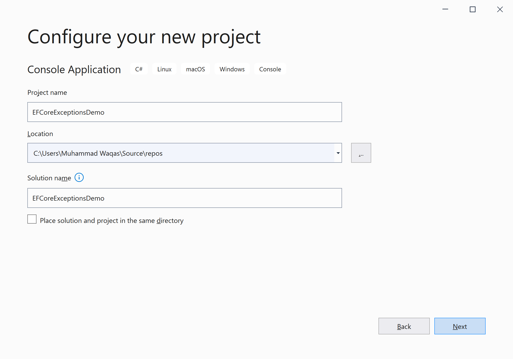
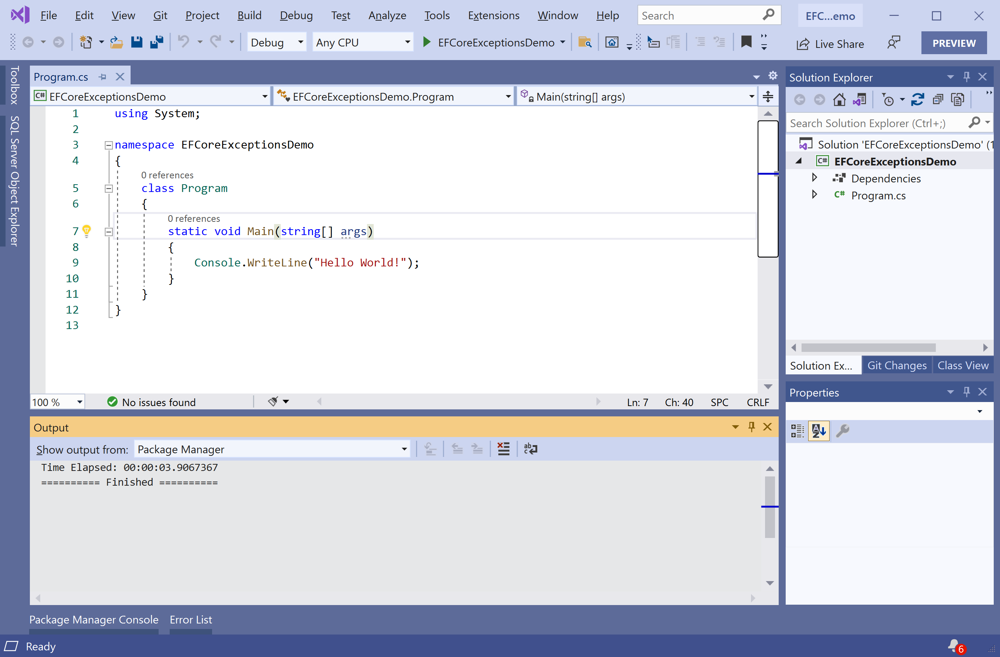
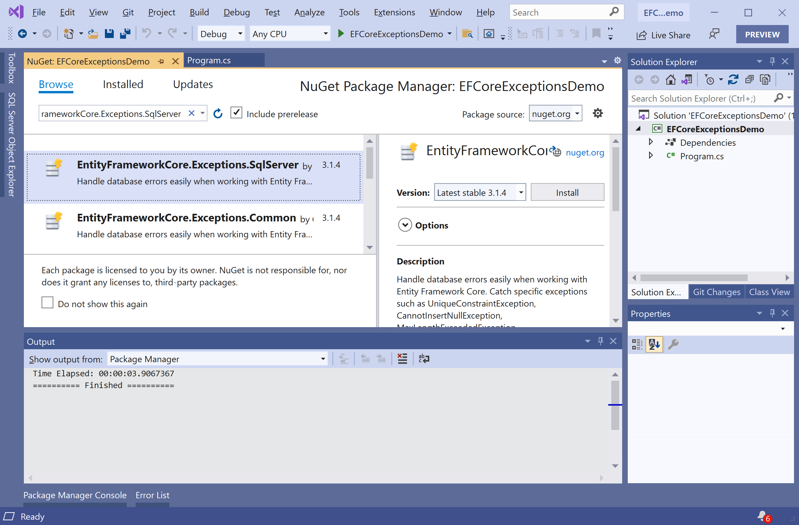
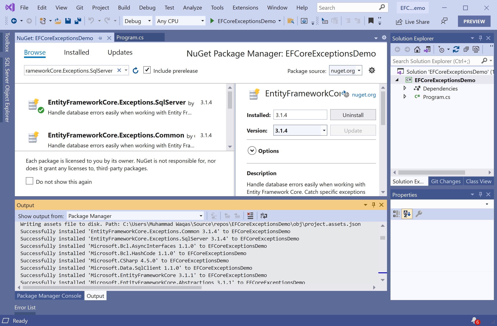

# Getting Started

**EntityFrameworkCore.Exceptions.SqlServer** is a NuGet library that handle database errors easily when working with Entity Framework Core. 

 - When using Entity Framework Core for data access all database exceptions are wrapped in `DbUpdateException`. 
 - If you need to find whether the exception was caused by a unique constraint, value being too long or value missing for a required column you need to dig into the concrete DbException subclass instance and check the error code to determine the exact cause.
 - You can catch specific exceptions such as `UniqueConstraintException`, `CannotInsertNullException`, `MaxLengthExceededException`, `NumericOverflowException` or `ReferenceConstraintException` instead of generic `DbUpdateException`.

## Installation

You can easily install it from the **Package Manager Console** window by running the following command.

```csharp
PM> Install-Package EntityFrameworkCore.Exceptions.SqlServer
```

## Environment Setup

To start using the **EntityFrameworkCore.Exceptions.SqlServer** in your application, you will need to install the [EntityFrameworkCore.Exceptions.SqlServer](https://www.nuget.org/packages/EntityFrameworkCore.Exceptions.SqlServer) NuGet package.

Let's open the Visual Studio and create a new project.


Select the **Create a new project** option.


Choose **C#** as language, **Windows** as a platform, and **Console** as the project type. In the template pane, select **Console Application** and click the **Next** button.



Enter the project name, you can change the location and solution name, but we will leave it and click on the **Next** button.  


On the **Additional Information** dialog, select the target framework and then click on the **Create** button.  



You can see a new console application project is created. Now to install a **EntityFrameworkCore.Exceptions.SqlServer**, right-click on the project in **Solution Explorer**, and select **Manage NuGet Packages...**



Select the **Browse** tab and search for **EntityFrameworkCore.Exceptions.SqlServer** and install the latest version by pressing the **Install** button. 



Once **EntityFrameworkCore.Exceptions.SqlServer** has been successfully installed. Let's add the database provider that you want to target. We will use SQL Server, and the provider package is [Microsoft.EntityFrameworkCore.SqlServer](https://www.nuget.org/packages/Microsoft.EntityFrameworkCore.SqlServer). We can easily install that NuGet package by executing the following command in **Package Manager Console**. 

```csharp
PM> Install-Package Microsoft.EntityFrameworkCore.SqlServer
```

You are now ready to start your application.
