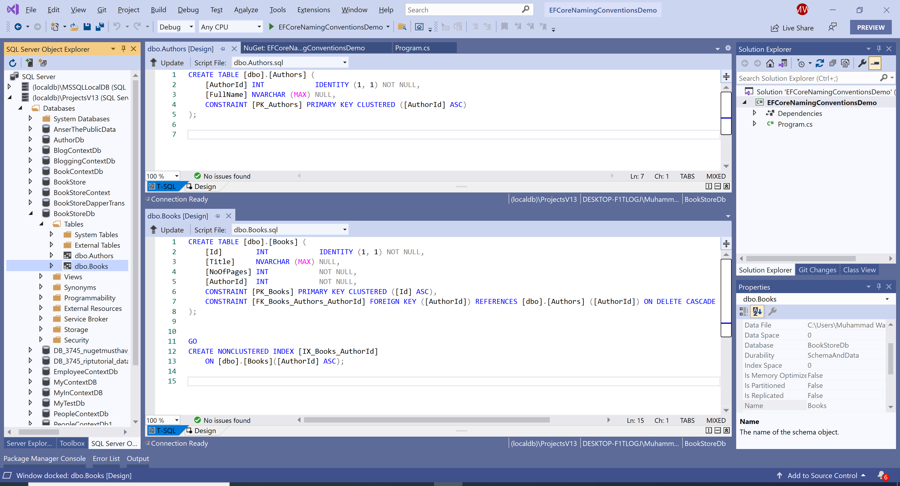

# Database Setup

## Create Data Model

Model is a collection of classes to interact with the database.

 - A model stores data retrieved according to the commands from the Controller and displayed in the View.
 - It can also be used to manipulate the data to implement the business logic.

To create a data model for our application, we will start with the following two entities.

 - Book
 - Author

There's a one-to-many relationship between `Author` and `Book` entities. In other words, an author can write any number of books, and a book can be written by only one author.

## Create Author Entity

We will create a class called `Author` and add the following code.

```csharp
public class Author
{
    public int AuthorId { get; set; }
    public string Name { get; set; }
    public virtual ICollection<Book> Books { get; set; }
}
```

The `AuthorId` property will become the primary key column of the database table that corresponds to this class. By default, Entity Framework interprets a property that's named `Id` or `<classname>Id` as the primary key.

 - The `Books` property is a navigation property. Navigation properties hold other entities related to this entity. 
 - In this case, the `Books` property of an `Author` entity will hold all of the `Book` entities related to that `Author` entity. 
 - In other words, if a given `Author` row in the database has two related `Book` rows, that `Author` entity's `Books` navigation property will contain those two `Book` entities.

## Create Book Entity

Now let's add another entity class `Book`, and replace the following code.

```csharp
public class Book
{
    public int Id { get; set; }
    public string Title { get; set; }
    public int NoOfPages { get; set; }
    public int AuthorId { get; set; }
    public Author Author { get; set; }
}
```

 - The `Id` property will be the primary key; this entity uses the `Id` pattern instead of `<classname>Id` by itself, as you saw in the `Author` entity. 
 - Usually, you would choose one pattern and use it throughout your data model. 
 - Here, the variation illustrates that you can use either pattern. 

## Create Database Context

The database context class provides the main functionality to coordinate Entity Framework with a given data model. 

 - You can create this class by deriving from the `Microsoft.EntityFrameworkCore.DbContext` class. 
 - In your code, you can specify which entities are included in the data model. 
 - You can also customize certain Entity Framework behavior. 

So let's create a folder in your project by right-clicking your project in Solution Explorer and clicking **Add > New Folder**. Name the folder DAL (Data Access Layer). In that folder, create a new class file named **BookStore.cs**, and replace the following code.

```csharp
public class BookStore : DbContext
{
    protected override void OnConfiguring(DbContextOptionsBuilder optionsBuilder)
    {
        optionsBuilder.UseSqlServer(@"Data Source=(localdb)\ProjectsV13;Initial Catalog=BookStoreDb;");
    }

    public DbSet<Author> Authors { get; set; }
    public DbSet<Book> Books { get; set; }
}
```

This code creates a `DbSet` property for each entity set. In Entity Framework terminology, an entity set typically corresponds to a database table, and an entity corresponds to a row in the table.

### Initialize Database

The Entity Framework will create an empty database for you. So we need to write a method called after the database is created to populate it with test data.

```csharp
public static void Initialize()
{
    using (BookStore context = new BookStore())
    {
        context.Database.EnsureDeleted();
        context.Database.EnsureCreated();
    }
}
```

 - The above code creates a database when needed and loads test data into the new database.
 - It also checks if there are any authors in the database, and if not, it assumes the database is new and needs to be seeded with test data. 

In the `Main` method, replace the following code.

```csharp
static void Main(string[] args)
{
    Initialize();
}
```

When you run your application for the first time, the database will be created containing the following tables and columns with the default naming conventions.


